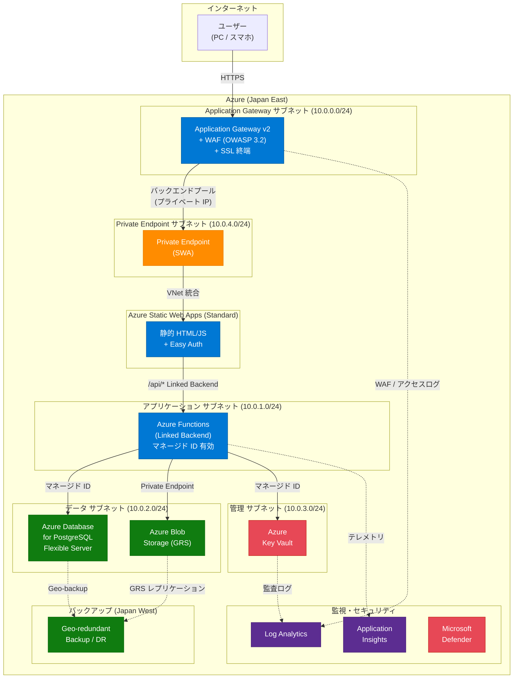

# Azure ハンズオン: 業務システム非機能要件の実装体験

> **対象**: サンプル業務システムのクラウド関連非機能要件をAzure上で体験する  
> **前提知識**: Azure の基本的な概念（リソースグループ、サブスクリプション等）  
> **所要時間**: 各Lab 30～60分（全体で約1日）  
> **要件定義書との対応**: [cloud-requirements.md](cloud-requirements.md) を参照

---

## 前提条件

### 必要な権限

本ハンズオンでは以下の操作を行うため、**十分な権限を持つ Azure アカウント**が必要です。  
社内の Azure 環境を使用する場合は、事前に管理者へ権限付与を依頼してください。

#### Azure RBAC (サブスクリプション/リソースグループ)

| 必要な権限 | 対象スコープ | 使用する Lab | 操作内容 |
|-----------|-------------|-------------|---------|
| **共同作成者** (Contributor) | サブスクリプション | 全 Lab | リソースグループ・各種リソースの作成・削除 |
| **ユーザーアクセス管理者** (User Access Administrator) | リソースグループ | Lab03 | RBAC ロールの割り当て (Key Vault, Functions 等) |

#### Microsoft Entra ID (ディレクトリロール)

| 必要な権限 | 使用する Lab | 操作内容 |
|-----------|-------------|---------|
| **アプリケーション登録が可能**であること | Lab08 (オプション) | `az ad app create` (カスタム認証プロバイダー用 Entra ID アプリ登録) |
| **アプリケーション開発者** (Application Developer) | Lab05 (任意) | `az ad app create`, `az ad sp create`, `az ad app federated-credential create` |

> **Lab08 の補足**: テナント設定で「ユーザーはアプリケーションを登録できる」が「はい」(デフォルト) であれば追加ロール不要です。「いいえ」の場合は **アプリケーション管理者** または **クラウドアプリケーション管理者** ロールが必要です。  
> 確認方法: Azure Portal → Microsoft Entra ID → ユーザー設定 → 「アプリの登録」  
> **注意**: Lab08 はオプションのため、Entra ID 権限がなくても Lab00〜Lab07 は問題なく実施できます。

### 推定コスト

| リソース | 概算コスト (1日) | 備考 |
|---------|----------------|------|
| Application Gateway WAF_v2 | **約 $8.64** | 最もコストが高い (約 $0.36/時間) |
| SWA Standard | 約 $0.30 | 月額 $9 の日割り |
| Functions (Consumption) | ほぼ $0 | 実行時間のみ課金 |
| PostgreSQL (Burstable B1ms) | 約 $0.50 | |
| Log Analytics | 約 $0.10 | データ量に依存 |
| Key Vault | ほぼ $0 | 操作回数に依存 |
| Storage (GRS) | ほぼ $0 | 少量データ |
| VNet, NSG, PE | $0 | 無料 |
| **合計** | **約 $10 (約 1,500 円)** | ハンズオン完了後に即削除した場合 |

> **重要**: ハンズオン完了後は必ず `az group delete --name rg-handson-v4 --yes` でリソースを削除してください。  
> 特に Application Gateway は放置すると**月額約 $260** かかります。

### ツール・アカウント

| ツール | バージョン | 用途 |
|--------|-----------|------|
| [Azure CLI](https://learn.microsoft.com/ja-jp/cli/azure/install-azure-cli) | 2.60+ | Azure リソースの操作 |
| [Bicep CLI](https://learn.microsoft.com/ja-jp/azure/azure-resource-manager/bicep/install) | 0.28+ | IaC テンプレート |
| [Node.js](https://nodejs.org/) | 22 LTS | SWA CLI・Functions API |
| [SWA CLI](https://azure.github.io/static-web-apps-cli/) | 最新版 | SWA ローカル開発・デプロイ |
| [VS Code](https://code.visualstudio.com/) | 最新版 | エディタ |
| [Git](https://git-scm.com/) | 最新版 | ソース管理 |
| [GitHub アカウント](https://github.com/) | - | CI/CD (Lab05) |

> 詳細なセットアップ手順は [Lab 00: 事前準備](labs/lab00-setup.md) を参照してください。

---

## ハンズオン構成

要件定義書のクラウド関連非機能要件を、7つの Lab に分けて Azure 上で実装・体験します。  
本ハンズオンは **2日間** で実施します。1日目に構築したリソースのログやバックアップが蓄積された状態で、2日目に運用系の Lab を体験します。

### スケジュール

#### 1日目: 14:00～18:00 (構築フェーズ)

| 時間 | Lab | 所要時間 | 内容 |
|------|-----|---------|------|
| 14:00 | Lab00 | 15分 | 事前準備 (Azure CLI, ログイン, リソースグループ作成) |
| 14:15 | Lab01 | 45分 | Bicep 基盤構築 (VNet, Log Analytics, App Insights) |
| 15:00 | 休憩 | 10分 | |
| 15:10 | Lab02 | 60分 | SWA + Linked Backend (Functions, マネージド ID) |
| 16:10 | 休憩 | 10分 | |
| 16:20 | Lab03 | 75分 | AppGW + WAF + Private Endpoint + Key Vault |
| 17:35 | 振り返り | 25分 | 1日目のまとめ、質疑応答 |


#### 2日目: 9:30～12:00 (運用フェーズ)

| 時間 | Lab | 所要時間 | 内容 |
|------|-----|---------|------|
| 9:30 | Lab04 | 45分 | 監視・可用性 (前日の蓄積ログで KQL 実行、アラート設定) |
| 10:15 | Lab05 | 30分 | SWA 組込み CI/CD (GitHub 連携, プレビュー環境) |
| 10:45 | 休憩 | 10分 | |
| 10:55 | Lab06 | 45分 | バックアップ & DR (PostgreSQL PITR, GRS) |
| 11:40 | Lab07 | 30分 | コスト管理 (前日のコストデータで分析) |
| 12:10 | まとめ | 20分 | リソースのクリーンアップ、全体振り返り |


### Lab 一覧

| Lab | タイトル | 対応する非機能要件 | 主な Azure サービス | 対応する AWS サービス |
|-----|----------|-------------------|-------------------|---------------------|
| [00](labs/lab00-setup.md) | 事前準備 | - | Azure CLI, Bicep, VS Code | AWS CLI, CloudFormation, VS Code |
| [01](labs/lab01-iac-bicep.md) | Bicep による基盤構築 | IaC, 稼働環境 | Bicep, Resource Group, VNet | CloudFormation, Resource Groups, VPC |
| [02](labs/lab02-swa-serverless.md) | Static Web Apps & サーバレス API | クラウドネイティブ, 拡張性 | Static Web Apps, Azure Functions | Amplify Hosting, Lambda |
| [03](labs/lab03-security.md) | ゼロトラスト セキュリティ | セキュリティ | **Application Gateway + WAF**, Key Vault, NSG, Entra ID, Defender | **ALB + AWS WAF**, Secrets Manager, Security Groups, IAM Identity Center, GuardDuty |
| [04](labs/lab04-monitoring.md) | 監視・可用性・自動復旧 | 信頼性, 性能 | Monitor, Log Analytics, Application Insights, Alerts | CloudWatch, CloudWatch Logs, X-Ray, CloudWatch Alarms |
| [05](labs/lab05-cicd.md) | SWA 組込み CI/CD | CI/CD | SWA CLI, GitHub Actions | Amplify CLI, GitHub Actions |
| [06](labs/lab06-backup-dr.md) | バックアップ & DR | 継続性 | Azure Backup, Geo-replication, PITR | AWS Backup, Cross-Region Replication, RDS PITR |
| [07](labs/lab07-cost-management.md) | コスト管理・最適化 | コスト管理 | Cost Management, Advisor, Budgets | Cost Explorer, Trusted Advisor, AWS Budgets |
| [08](labs/lab08-auth-optional.md) | Entra ID 認証 (オプション) | セキュリティ (認証) | Entra ID, SWA カスタム認証, AppGW Rewrite Rule | Cognito, ALB 認証 |

---

## アーキテクチャ全体図

本ハンズオンで構築するシステムの全体構成:



---

## クイックスタート

```bash
# 1. リポジトリのクローン
git clone <repository-url>
cd Azure-Handson-002

# 2. 事前準備 (Lab00)
# → labs/lab00-setup.md を参照

# 3. 各Labを順番に実施
# → labs/lab01-iac-bicep.md から開始
```

---

## リソースのクリーンアップ

全Labの完了後、以下のコマンドで作成したリソースを一括削除できます。

```bash
# リソースグループごと削除
az group delete --name rg-handson-v4 --yes --no-wait
```
