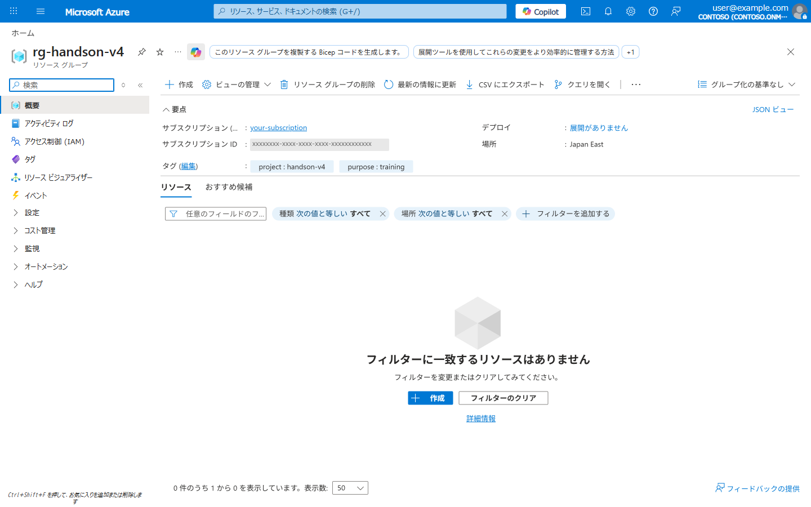
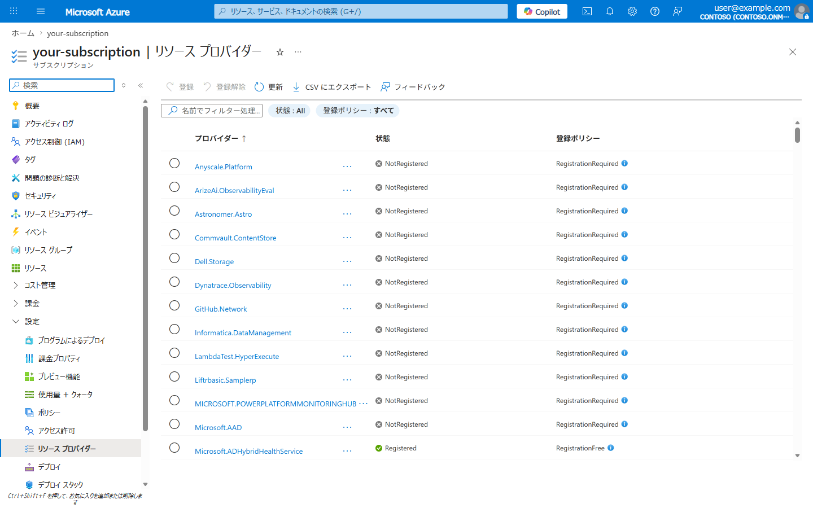

# Lab 00: 事前準備

> **所要時間**: 15分  
> **目的**: ハンズオンに必要なツールと Azure 環境をセットアップする

---

## アジェンダ

- [必要なツール](#必要なツール)
- [Step 1: Azure CLI のインストール確認](#step-1-azure-cli-のインストール確認)
- [Step 2: Azure にログイン](#step-2-azure-にログイン)
- [Step 3: 共通変数の設定](#step-3-共通変数の設定)
- [Step 4: リソースグループの作成](#step-4-リソースグループの作成)
- [Step 5: リソースプロバイダーの登録確認](#step-5-リソースプロバイダーの登録確認)
- [確認チェックリスト](#確認チェックリスト)

---

## 推奨環境

本ハンズオンのコマンドはすべて **bash** 前提で記述されています。以下のいずれかの環境で実施できます。

| 環境 | 対応状況 | 備考 |
|------|----------|------|
| **WSL (Ubuntu)** | 推奨 | Linux コマンドがネイティブで動作。パス変換問題が起きない |
| **Git Bash (Windows)** | 対応 | MSYS パス変換に注意 (`MSYS_NO_PATHCONV=1` が必要な箇所あり) |
| **macOS / Linux** | 対応 | そのまま実行可能 |

> **WSL を使用する場合**: VS Code の **Remote - WSL 拡張** (`ms-vscode-remote.remote-wsl`) をインストールすると、WSL 内のファイルを直接編集できます。`az login` は WSL からでも Windows 側のブラウザが起動します。

---

## 必要なツール

| ツール | バージョン | 用途 |
|--------|-----------|------|
| [Azure CLI](https://learn.microsoft.com/ja-jp/cli/azure/install-azure-cli) | 2.60+ | Azure リソースの操作 |
| [Bicep CLI](https://learn.microsoft.com/ja-jp/azure/azure-resource-manager/bicep/install) | 0.28+ | IaC テンプレートの作成・デプロイ |
| [Node.js](https://nodejs.org/) | 22 LTS | SWA CLI ・ Functions API の実行 |
| [SWA CLI](https://azure.github.io/static-web-apps-cli/) | 最新版 | Static Web Apps のローカル開発・デプロイ |
| [VS Code](https://code.visualstudio.com/) | 最新版 | エディタ |
| [Git](https://git-scm.com/) | 最新版 | ソース管理 |
| [GitHub アカウント](https://github.com/) | - | CI/CD パイプライン |

### VS Code 推奨拡張機能

- Bicep (ms-azuretools.vscode-bicep)
- Azure Tools (ms-vscode.vscode-node-azure-pack)
- Azure Static Web Apps (ms-azuretools.vscode-azurestaticwebapps)

---

## Step 1: Azure CLI のインストール確認

```bash
# バージョン確認
az version

# Bicep がインストールされていることを確認
az bicep version

# インストールされていない場合
az bicep install

# Node.js のバージョン確認
node --version

# SWA CLI のインストール
npm install -g @azure/static-web-apps-cli
swa --version
```

## Step 2: Azure にログイン

```bash
# ブラウザ認証でログイン
az login

# サブスクリプションの確認
az account show --query "{name:name, id:id}" -o table

# 使用するサブスクリプションを設定 (複数ある場合)
# az account set --subscription "<subscription-id>"
```

## Step 3: 共通変数の設定

以降の Lab で使用する変数をセットします。

```bash
# === 共通変数 ===
# リソースグループ名
export RG_NAME="rg-handson-v4"

# リージョン (要件: 日本国内リージョン)
export LOCATION="japaneast"

# プロジェクト名プレフィックス (小文字英数字、一意になるよう調整)
export PREFIX="sampleapp$(shuf -i 100-999 -n 1)"

echo "PREFIX: $PREFIX"
echo "RG_NAME: $RG_NAME"
echo "LOCATION: $LOCATION"
```

> **PowerShell の場合**:
> ```powershell
> $RG_NAME = "rg-handson-v4"
> $LOCATION = "japaneast"
> $PREFIX = "sampleapp$(Get-Random -Minimum 100 -Maximum 999)"
> ```

> **注意**: 変数はターミナルセッションごとにリセットされます。新しいターミナルを開いた場合や、翌日に作業を再開する場合は、上記の `export` コマンドを再実行してください。

## Step 4: リソースグループの作成

```bash
# リソースグループの作成
az group create \
  --name $RG_NAME \
  --location $LOCATION \
  --tags "project=handson-v4" "purpose=training"

# 作成確認
az group show --name $RG_NAME -o table
```

**Azure Portal での確認**: リソースグループが正しく作成されたことを Portal で確認します。



> サブスクリプション `sub-handson-002`、場所 `Japan East`、タグ `project: handson-v4` / `purpose: training` が設定されていれば OK です。

## Step 5: リソースプロバイダーの登録確認

```bash
# 必要なプロバイダーが登録済みか確認
az provider show --namespace Microsoft.Web --query "registrationState" -o tsv
az provider show --namespace Microsoft.KeyVault --query "registrationState" -o tsv
az provider show --namespace Microsoft.OperationalInsights --query "registrationState" -o tsv
az provider show --namespace Microsoft.DBforPostgreSQL --query "registrationState" -o tsv

# 未登録の場合は登録 (例: Lab06 で PostgreSQL を使用)
# az provider register --namespace Microsoft.DBforPostgreSQL --wait
```

**Azure Portal での確認**: サブスクリプションのリソースプロバイダー画面で登録状態を確認できます。



---

## 確認チェックリスト

- [ ] Azure CLI 2.60 以上がインストールされている
- [ ] Bicep CLI がインストールされている
- [ ] Node.js 22 以上がインストールされている
- [ ] `az login` で Azure にログインできた
- [ ] リソースグループ `rg-handson-v4` が作成された
- [ ] GitHub アカウントを持っている

---

**次のステップ**: [Lab 01: Bicep による基盤構築](lab01-iac-bicep.md)
