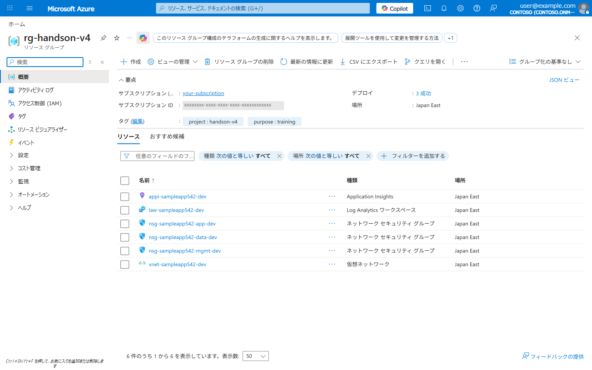
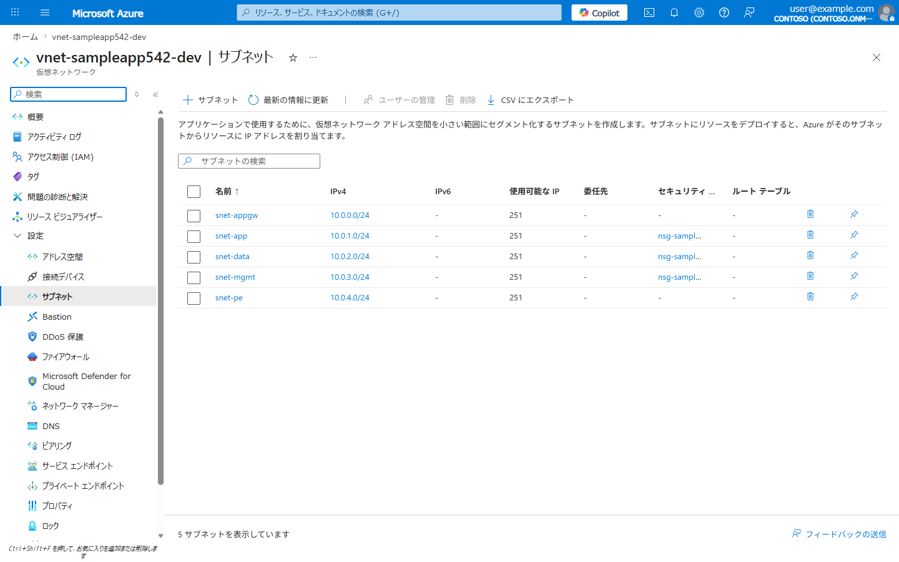

# Lab 01: Bicep による基盤構築 (Infrastructure as Code)

> **所要時間**: 45分  
> **対応する要件**: 3.2 システム方式 (IaC), 3.11 稼働環境, 3.8 中立性  
> **前提**: Lab 00 完了済み

---

## この Lab で学ぶこと

| 要件定義書の記載 | Azure での実装 |
|------------------|---------------|
| インフラの設定は IaC にて構成し、環境変更時にメンテナンスできるようにする | **Bicep** テンプレートによるインフラ定義 |
| 速やかに本番同等の環境を構築できるようにする | パラメータファイルによる**マルチ環境対応** |
| クラウド上に論理的に隔離された仮想閉域ネットワークを構築 | **VNet + サブネット + NSG** の構成 |
| 本番/テスト/開発環境を明確に分離 | Bicep の**パラメータ切り替え**による環境分離 |
| 日本国内リージョン | `japaneast` リージョンへのデプロイ |

---

## アジェンダ

- [Step 1: Bicep の基本を理解する](#step-1-bicep-の基本を理解する)
- [Step 2: ネットワーク基盤の Bicep を作成する](#step-2-ネットワーク基盤の-bicep-を作成する)
- [Step 3: Log Analytics ワークスペースの Bicep を作成する](#step-3-log-analytics-ワークスペースの-bicep-を作成する)
- [Step 4: メインテンプレートの作成](#step-4-メインテンプレートの作成)
- [Step 5: パラメータファイルの作成 (マルチ環境対応)](#step-5-パラメータファイルの作成-マルチ環境対応)
- [Step 6: デプロイを実行する](#step-6-デプロイを実行する)
- [Step 7: What-If で変更を事前確認する](#step-7-what-if-で変更を事前確認する)
- [Step 8: 作成されたリソースの確認](#step-8-作成されたリソースの確認)
- [理解度チェック](#理解度チェック)

---

## Step 1: Bicep の基本を理解する

Bicep は Azure のリソースを宣言的に定義する Domain-Specific Language (DSL) です。ARM テンプレート (JSON) の上位互換であり、可読性・保守性に優れています。

### Bicep の特徴 (要件定義との対応)

```
要件: IaC にてインフラを構成し、環境変更時にメンテナンスできるようにする
  → Bicep ファイルを Git で管理し、変更履歴を追跡可能に

要件: 速やかに本番同等の環境を構築できるようにする
  → 1コマンドで環境全体をデプロイ可能

要件: バージョン管理された IaC で構成管理
  → Bicep ファイル + Git でバージョン管理
```

## Step 2: ネットワーク基盤の Bicep を作成する

まず、ハンズオン用のリポジトリを取得します。Bicep テンプレートやサンプルアプリのソースコードが含まれています。

```bash
# Git clone で取得
git clone https://github.com/ylearning86/Azure-Handson-002.git
cd Azure-Handson-002
```

> **Git が使えない場合**: GitHub の [Code] → [Download ZIP] からダウンロードし、展開してください。  
> https://github.com/ylearning86/Azure-Handson-002/archive/refs/heads/main.zip

次に、VNet（仮想ネットワーク）を定義します。要件定義の「クラウド上に論理的に隔離された仮想閉域ネットワークを構築」に対応します。

### ファイル: `infra/modules/network.bicep`

`infra/modules/network.bicep` の内容を確認してください。以下のようにネットワーク基盤が定義されています。

```bicep
// infra/modules/network.bicep
// 要件: クラウド上に論理的に隔離された仮想閉域ネットワークを構築
// 要件: サブシステムごとに個別のネットワークアドレス空間を割り当て

@description('リソース名のプレフィックス')
param prefix string

@description('リソースのロケーション (要件: 日本国内リージョン)')
param location string

@description('環境名 (dev/test/prod)')
@allowed(['dev', 'test', 'prod'])
param env string

// --- VNet 定義 ---
// 要件: 外部/内部ネットワークを通信回線上で分離
resource vnet 'Microsoft.Network/virtualNetworks@2024-01-01' = {
  name: 'vnet-${prefix}-${env}'
  location: location
  properties: {
    addressSpace: {
      addressPrefixes: [
        '10.0.0.0/16'
      ]
    }
    subnets: [
      {
        // アプリケーション層 (Azure Container Apps 用)
        name: 'snet-app'
        properties: {
          addressPrefix: '10.0.1.0/24'
          networkSecurityGroup: {
            id: nsgApp.id
          }
          // Azure Container Apps Environment に委任
          delegations: [
            {
              name: 'Microsoft.App.environments'
              properties: {
                serviceName: 'Microsoft.App/environments'
              }
            }
          ]
        }
      }
      {
        // データ層 (PostgreSQL, Storage 用 Private Endpoint)
        name: 'snet-data'
        properties: {
          addressPrefix: '10.0.2.0/24'
          networkSecurityGroup: {
            id: nsgData.id
          }
          privateEndpointNetworkPolicies: 'Enabled'
        }
      }
      {
        // 管理層 (Key Vault 等の Private Endpoint)
        name: 'snet-mgmt'
        properties: {
          addressPrefix: '10.0.3.0/24'
          networkSecurityGroup: {
            id: nsgMgmt.id
          }
          privateEndpointNetworkPolicies: 'Enabled'
        }
      }
    ]
  }
}

// --- NSG: アプリケーション層 ---
// 要件: 必要なポート/プロトコルのみ許可
resource nsgApp 'Microsoft.Network/networkSecurityGroups@2024-01-01' = {
  name: 'nsg-${prefix}-app-${env}'
  location: location
  properties: {
    securityRules: [
      {
        name: 'AllowHTTPS'
        properties: {
          priority: 100
          direction: 'Inbound'
          access: 'Allow'
          protocol: 'Tcp'
          sourcePortRange: '*'
          destinationPortRange: '443'
          sourceAddressPrefix: '*'
          destinationAddressPrefix: '*'
        }
      }
      {
        name: 'DenyAllInbound'
        properties: {
          priority: 4096
          direction: 'Inbound'
          access: 'Deny'
          protocol: '*'
          sourcePortRange: '*'
          destinationPortRange: '*'
          sourceAddressPrefix: '*'
          destinationAddressPrefix: '*'
        }
      }
    ]
  }
}

// --- NSG: データ層 ---
// 要件: 重要なシステムコンポーネントを他の内部要素から分離
resource nsgData 'Microsoft.Network/networkSecurityGroups@2024-01-01' = {
  name: 'nsg-${prefix}-data-${env}'
  location: location
  properties: {
    securityRules: [
      {
        name: 'AllowAppSubnet'
        properties: {
          priority: 100
          direction: 'Inbound'
          access: 'Allow'
          protocol: 'Tcp'
          sourcePortRange: '*'
          destinationPortRange: '5432'  // PostgreSQL
          sourceAddressPrefix: '10.0.1.0/24'  // アプリ層からのみ許可
          destinationAddressPrefix: '*'
        }
      }
      {
        name: 'DenyAllInbound'
        properties: {
          priority: 4096
          direction: 'Inbound'
          access: 'Deny'
          protocol: '*'
          sourcePortRange: '*'
          destinationPortRange: '*'
          sourceAddressPrefix: '*'
          destinationAddressPrefix: '*'
        }
      }
    ]
  }
}

// --- NSG: 管理層 ---
resource nsgMgmt 'Microsoft.Network/networkSecurityGroups@2024-01-01' = {
  name: 'nsg-${prefix}-mgmt-${env}'
  location: location
  properties: {
    securityRules: [
      {
        name: 'DenyAllInbound'
        properties: {
          priority: 4096
          direction: 'Inbound'
          access: 'Deny'
          protocol: '*'
          sourcePortRange: '*'
          destinationPortRange: '*'
          sourceAddressPrefix: '*'
          destinationAddressPrefix: '*'
        }
      }
    ]
  }
}

// --- 出力 ---
output vnetId string = vnet.id
output vnetName string = vnet.name
output snetAppId string = vnet.properties.subnets[0].id
output snetDataId string = vnet.properties.subnets[1].id
output snetMgmtId string = vnet.properties.subnets[2].id
```

## Step 3: Log Analytics ワークスペースの Bicep を作成する

要件: 「操作ログやアクセスログ等のシステムログを取得・保管し出力可能とする。ログの保管期間は3年間」

```bicep
// infra/modules/monitoring.bicep
// 要件: ログを蓄積し3年間保管。ダッシュボード等による状況の可視化

@description('リソース名のプレフィックス')
param prefix string

@description('リソースのロケーション')
param location string

@description('環境名')
@allowed(['dev', 'test', 'prod'])
param env string

// 要件: ログ保管期間 3年 (1095日)
// ※ ハンズオンでは 90日 に設定 (コスト考慮)
@description('ログ保持期間 (日数)')
param retentionInDays int = 90

// --- Log Analytics Workspace ---
// 要件: 監視ログの一元化、セキュリティイベントアラートの一元化
resource logAnalytics 'Microsoft.OperationalInsights/workspaces@2023-09-01' = {
  name: 'law-${prefix}-${env}'
  location: location
  properties: {
    sku: {
      name: 'PerGB2018'
    }
    retentionInDays: retentionInDays
  }
}

// --- Application Insights ---
// 要件: アプリケーション処理時間の性能見積り、画面遷移・操作ログ等の分析
resource appInsights 'Microsoft.Insights/components@2020-02-02' = {
  name: 'appi-${prefix}-${env}'
  location: location
  kind: 'web'
  properties: {
    Application_Type: 'web'
    WorkspaceResourceId: logAnalytics.id
    RetentionInDays: retentionInDays
  }
}

output logAnalyticsId string = logAnalytics.id
output logAnalyticsName string = logAnalytics.name
output appInsightsId string = appInsights.id
output appInsightsConnectionString string = appInsights.properties.ConnectionString
```

## Step 4: メインテンプレートの作成

モジュールを組み合わせるメインテンプレートを作成します。

```bicep
// infra/main.bicep
// メインテンプレート: 全モジュールをオーケストレーション

// --- パラメータ ---
@description('リソース名のプレフィックス (一意の文字列)')
param prefix string

@description('リソースのロケーション (要件: 日本国内リージョン)')
param location string = 'japaneast'

@description('環境名 (要件: 本番/テスト/開発環境を明確に分離)')
@allowed(['dev', 'test', 'prod'])
param env string = 'dev'

// --- モジュール: ネットワーク ---
module network 'modules/network.bicep' = {
  name: 'deploy-network'
  params: {
    prefix: prefix
    location: location
    env: env
  }
}

// --- モジュール: 監視 ---
module monitoring 'modules/monitoring.bicep' = {
  name: 'deploy-monitoring'
  params: {
    prefix: prefix
    location: location
    env: env
    // 本番環境ではログ保持期間を延長 (要件: 3年間)
    retentionInDays: env == 'prod' ? 730 : 90
  }
}

// --- 出力 ---
output vnetName string = network.outputs.vnetName
output logAnalyticsName string = monitoring.outputs.logAnalyticsName
```

## Step 5: パラメータファイルの作成 (マルチ環境対応)

要件: 「本番/試行/テスト/開発環境を明確に分離」

```jsonc
// infra/parameters/dev.bicepparam
// 開発環境パラメータ
using '../main.bicep'

param prefix = '${readEnvironmentVariable('PREFIX', 'sampleappdev')}'
param location = 'japaneast'
param env = 'dev'
```

```jsonc
// infra/parameters/prod.bicepparam
// 本番環境パラメータ
using '../main.bicep'

param prefix = '${readEnvironmentVariable('PREFIX', 'sampleapp')}'
param location = 'japaneast'
param env = 'prod'
```

## Step 6: デプロイを実行する

```bash
DEPLOY_NAME="deploy-dev-$(date +%Y%m%d%H%M)"

# 開発環境にデプロイ
az deployment group create \
  --resource-group $RG_NAME \
  --template-file infra/main.bicep \
  --parameters prefix=$PREFIX env=dev \
  --name "$DEPLOY_NAME"

# デプロイ結果の確認
az deployment group show \
  --resource-group $RG_NAME \
  --name "$DEPLOY_NAME" \
  --query "properties.outputs" -o json
```

## Step 7: What-If で変更を事前確認する

要件: 「未承認の変更を検知した場合、アラートを発し、適切な修復措置を講じる」

Bicep の `what-if` を使うと、デプロイ前に変更内容を確認できます。

```bash
# 変更のプレビュー (ドライラン)
az deployment group what-if \
  --resource-group $RG_NAME \
  --template-file infra/main.bicep \
  --parameters prefix=$PREFIX env=dev
```

出力例:
```
Resource and property changes are indicated with these symbols:
  + Create
  ~ Modify
  - Delete

The deployment will update the following scope:
  ...
```

## Step 8: 作成されたリソースの確認

```bash
# リソースグループ内のリソース一覧
az resource list \
  --resource-group $RG_NAME \
  --output table

# VNet の詳細確認
az network vnet show \
  --resource-group $RG_NAME \
  --name "vnet-${PREFIX}-dev" \
  --query "{name:name, addressSpace:addressSpace.addressPrefixes, subnets:subnets[].name}" \
  -o json

# NSG ルールの確認
az network nsg rule list \
  --resource-group $RG_NAME \
  --nsg-name "nsg-${PREFIX}-app-dev" \
  -o table
```

**Azure Portal での確認**: デプロイ後、リソースグループに 6 つのリソースが作成されていることを確認します。



VNet のサブネット構成 (5 サブネット) も確認します。



---

## 理解度チェック

- [ ] Bicep テンプレートで VNet + サブネット + NSG を定義できた
- [ ] モジュール分割による再利用可能な IaC を体験した
- [ ] パラメータファイルで dev/prod を切り替えできることを確認した
- [ ] `what-if` で変更プレビューを確認した
- [ ] 要件定義の「IaC」「環境分離」「ネットワーク隔離」が Bicep でどう実装されるか理解した

### 要件 → Azure 実装の対応表

| 要件定義書の記載 | Bicep での実装 |
|------------------|---------------|
| IaC にてインフラ構成 | `infra/main.bicep` + モジュール |
| 本番同等の環境を迅速に構築 | パラメータファイルの切替え |
| 仮想閉域ネットワーク | `Microsoft.Network/virtualNetworks` |
| サブシステムごとにネットワーク分離 | サブネット + NSG |
| 必要なポートのみ許可 | NSG セキュリティルール |
| 構成管理をバージョン管理された IaC で | Git + Bicep |

---

**次のステップ**: [Lab 02: Static Web Apps & サーバレス API](lab02-swa-serverless.md)
