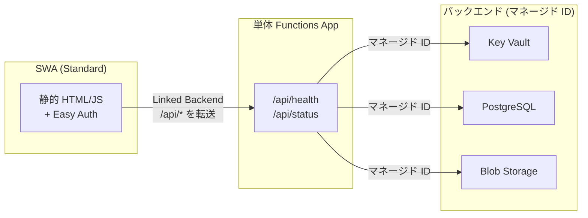
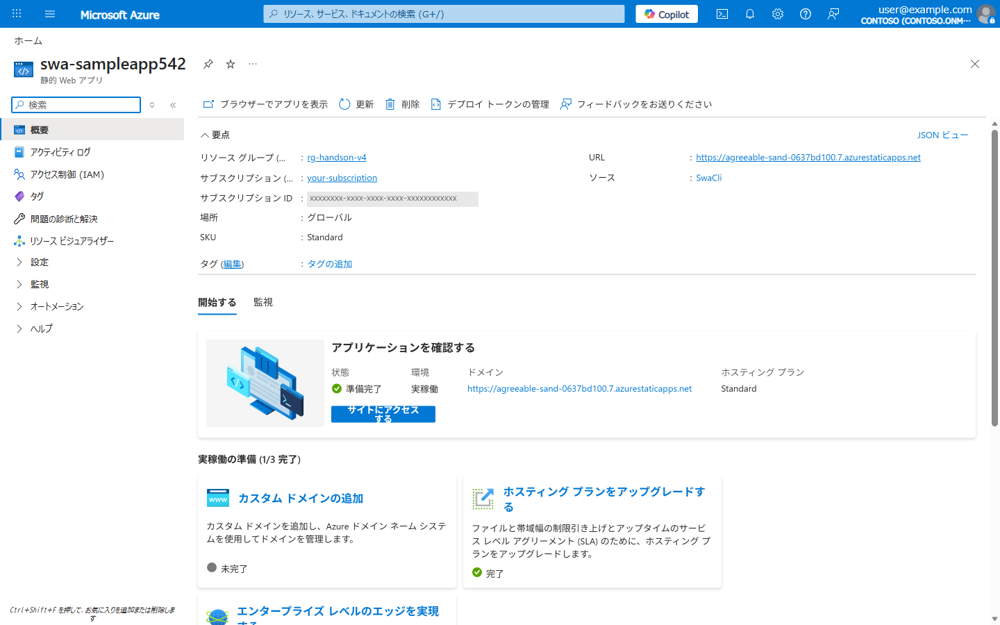
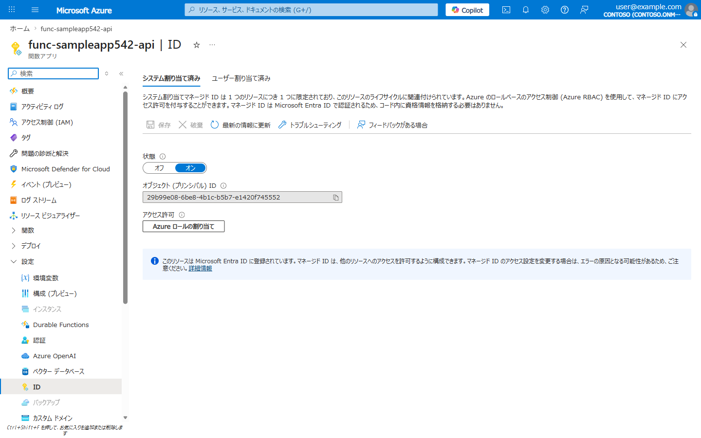
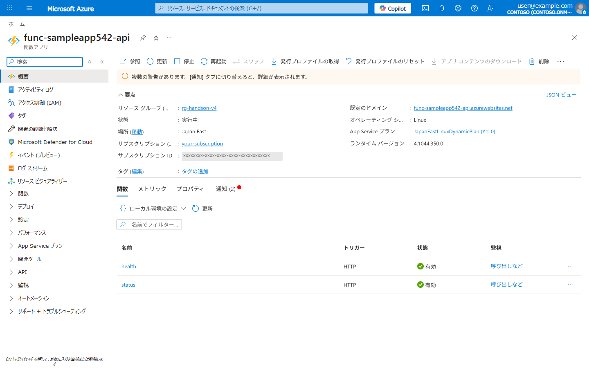
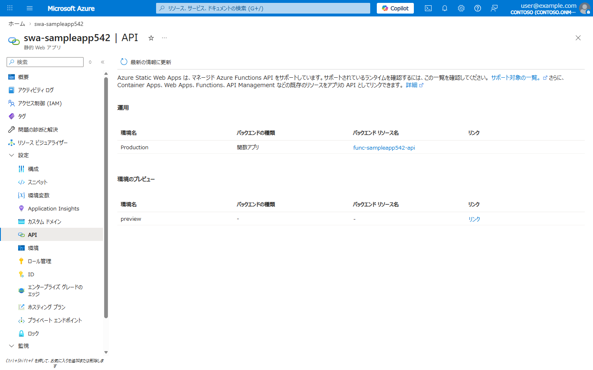
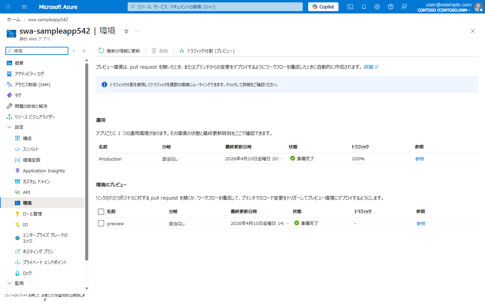

# Lab 02: Static Web Apps + Linked Backend (サーバレス構成)

> **所要時間**: 60分  
> **対応する要件**: 3.2 クラウドネイティブ, 3.6 拡張性, 3.3 サーバレス  
> **前提**: Lab 01 完了済み

---

## この Lab で学ぶこと

| 要件定義書の記載 | Azure での実装 |
|------------------|---------------|
| 原則としてサーバレスの構成 | **SWA (Standard)** + **単体 Azure Functions** (Linked Backend) |
| マネージドサービスを最大限活用 | SWA CDN、Functions マネージド ID + VNet 統合 |
| 認証はクラウドサービスが提供する機能を最大限活用 | SWA **Easy Auth** (Entra ID SSO) → [Lab08](lab08-auth-optional.md) で構成 |
| 処理能力等の動的調整を実現 | Functions の自動スケーリング |
| Webブラウザで処理を行う | 静的 HTML/JS + REST API 構成 |

---

## アジェンダ

- [Linked Backend とは](#linked-backend-とは)
- [Step 1: サンプルアプリケーションの確認](#step-1-サンプルアプリケーションの確認)
- [Step 2: Azure Static Web Apps の作成 (Standard プラン)](#step-2-azure-static-web-apps-の作成-standard-プラン)
- [Step 3: 単体 Azure Functions App の作成](#step-3-単体-azure-functions-app-の作成)
- [Step 4: Functions App に API コードをデプロイ](#step-4-functions-app-に-api-コードをデプロイ)
- [Step 5: SWA と Functions App をリンク (Linked Backend)](#step-5-swa-と-functions-app-をリンク-linked-backend)
- [Step 6: SWA にフロントエンドをデプロイ](#step-6-swa-にフロントエンドをデプロイ)
- [Step 7: Linked Backend 経由の動作確認](#step-7-linked-backend-経由の動作確認)
- [Step 8: ローカル開発 (SWA CLI + Functions) — オプション](#step-8-ローカル開発-swa-cli--functions--オプション)
- [理解度チェック](#理解度チェック)

---

## Linked Backend とは

SWA の API 統合には 2 つの方式があります。本ハンズオンでは**本番推奨の Linked Backend** を使用します。

| 方式 | Managed Functions | Linked Backend (本ハンズオン) |
|------|-------------------|------------------------------|
| API コードの配置 | `src/api/` に同梱 | 単体 Functions App を別途作成しリンク |
| マネージド ID | Key Vault 参照のみ | **フル対応** (DB, Storage 等すべて) |
| VNet 統合 | 不可 | **対応** (Private Endpoint 経由で DB 接続等) |
| プラン | Free / Standard | **Standard 必須** |
| スケール制御 | SWA 側で制御 | Functions 側で柔軟に制御可能 |



---

## Step 1: サンプルアプリケーションの確認

### フロントエンド: `src/web/index.html`

フロントエンドは前回と同じ静的 HTML です。SWA にデプロイされます。

```bash
# 確認: src/web/index.html が存在すること
ls src/web/index.html
```

### バックエンド API: `src/api/`

API コードも前回と同じですが、今回は SWA に同梱するのではなく**単体 Functions App にデプロイ**します。

```bash
# 確認: API コードが存在すること
ls src/api/health/index.js
ls src/api/status/index.js
ls src/api/host.json
```

**サンプルアプリケーションの画面**: SWA にデプロイ後、`https://<SWA のホスト名>` (例: `https://xxxxx.7.azurestaticapps.net`) にブラウザでアクセスすると以下のような画面が表示されます。SWA の URL は Step 6 のデプロイ後に確認できます。


> **インフラダッシュボードについて**: 各リソースの「デプロイ済」「接続OK」の表示はハンズオンの進捗に応じて変化します。Lab02 完了時点では Key Vault や PostgreSQL は「未デプロイ」と表示されますが、後続の Lab でリソースを作成するとステータスが更新されます。

> この時点では SWA はパブリックアクセス可能です。Lab03 で Application Gateway + WAF + Private Endpoint を構成し、ネットワークレベルでのアクセス制限を追加します。

## Step 2: Azure Static Web Apps の作成 (Standard プラン)

Linked Backend には **Standard プラン**が必要です。

```bash
# SWA の作成 (Standard プラン)
# 要件: サーバレス構成、マネージドサービス活用
az staticwebapp create \
  --name "swa-${PREFIX}" \
  --resource-group $RG_NAME \
  --location "eastasia" \
  --sku Standard
```

**Azure Portal での確認**: SWA が Standard プランで作成されたことを確認します。



## Step 3: 単体 Azure Functions App の作成

要件: 「マネージドサービスを最大限活用」「認証はクラウドサービスが提供する機能を最大限活用」

```bash
# Functions 用ストレージアカウントの作成
az storage account create \
  --name "${PREFIX}fnstore" \
  --resource-group $RG_NAME \
  --location $LOCATION \
  --sku Standard_LRS

# 単体 Function App の作成 (Consumption プラン = サーバレス)
az functionapp create \
  --name "func-${PREFIX}-api" \
  --resource-group $RG_NAME \
  --storage-account "${PREFIX}fnstore" \
  --consumption-plan-location $LOCATION \
  --runtime node \
  --runtime-version 22 \
  --functions-version 4 \
  --os-type Linux

# システム割り当てマネージド ID を有効化
# 要件: 認証はクラウドサービスが提供する機能を最大限活用
az functionapp identity assign \
  --name "func-${PREFIX}-api" \
  --resource-group $RG_NAME

# マネージド ID の確認
az functionapp identity show \
  --name "func-${PREFIX}-api" \
  --resource-group $RG_NAME \
  --query "{principalId:principalId, type:type}" -o json
```

**Azure Portal での確認**: Functions App の ID ブレードでシステム割り当てマネージド ID が「オン」になっていることを確認します。



## Step 4: Functions App に API コードをデプロイ

### API エンドポイントの役割

| エンドポイント | 役割 | 認証 |
|----------------|------|------|
| `/api/health` | 死活監視用ヘルスチェック。サービス名・タイムスタンプを返す | 不要 (anonymous) |
| `/api/status` | システム構成情報。バージョン・コンポーネント一覧を返す | 必要 (authenticated) |
| `/api/infra` | インフラダッシュボード。各 Azure リソースの接続状態を確認 | 不要 (anonymous) |

### デプロイ

```bash
# Azure Functions Core Tools でデプロイ
cd src/api
func azure functionapp publish "func-${PREFIX}-api" --javascript
cd ../..

# デプロイ確認
FUNC_URL=$(az functionapp show \
  --name "func-${PREFIX}-api" \
  --resource-group $RG_NAME \
  --query "defaultHostName" -o tsv)

echo "Functions URL: https://${FUNC_URL}"
curl -s "https://${FUNC_URL}/api/health"
```

> **WSL の場合**: Azure Functions Core Tools は WSL (Ubuntu) でも動作します。インストール: `npm install -g azure-functions-core-tools@4 --unsafe-perm true`

**Azure Portal での確認**: Functions App の関数一覧で `health`、`status`、`infra` の3つが表示されればデプロイ成功です。



### インフラダッシュボード用の環境変数設定

インフラダッシュボード API (`/api/infra`) は `APP_PREFIX` 環境変数を使って各リソース名を組み立てます。設定しない場合、デフォルト値が使われるため正しいリソースを参照できません。

```bash
# APP_PREFIX を Functions App に設定
az functionapp config appsettings set \
  --name "func-${PREFIX}-api" \
  --resource-group $RG_NAME \
  --settings "APP_PREFIX=${PREFIX}"
```

## Step 5: SWA と Functions App をリンク (Linked Backend)

要件: 「マネージド ID でバックエンドリソースに安全にアクセス」

```bash
# SWA のリソース ID を取得
SWA_ID=$(az staticwebapp show \
  --name "swa-${PREFIX}" \
  --resource-group $RG_NAME \
  --query id -o tsv)

# Functions App のリソース ID を取得
FUNC_ID=$(az functionapp show \
  --name "func-${PREFIX}-api" \
  --resource-group $RG_NAME \
  --query id -o tsv)

# Linked Backend の設定 (REST API 経由)
# これにより SWA の /api/* が Functions App に転送される
az rest --method put \
  --url "https://management.azure.com${SWA_ID}/linkedBackends/default?api-version=2022-09-01" \
  --body "{\"properties\":{\"backendResourceId\":\"${FUNC_ID}\",\"region\":\"${LOCATION}\"}}"

echo "Linked Backend を設定しました"
echo "SWA の /api/* は func-${PREFIX}-api に転送されます"
```

> **ポイント**: Linked Backend を設定すると、SWA の `/api/*` へのリクエストが自動的に単体 Functions App に転送されます。フロントエンドからは同一ドメインの `/api/health` としてアクセスでき、CORS の問題も発生しません。

**Azure Portal での確認**: SWA の API ブレードで Linked Backend が設定されていることを確認します。



## Step 6: SWA にフロントエンドをデプロイ

```bash
# デプロイトークンを取得
DEPLOY_TOKEN=$(az staticwebapp secrets list \
  --name "swa-${PREFIX}" \
  --query "properties.apiKey" -o tsv)

# SWA CLI でフロントエンドのみデプロイ (API は Linked Backend なので不要)
cd src
swa deploy \
  --app-location web \
  --deployment-token "$DEPLOY_TOKEN" \
  --env production
cd ..
```

**Azure Portal での確認**: SWA の環境画面で「実稼働」環境にデプロイされていることを確認します。



## Step 7: Linked Backend 経由の動作確認

```bash
# SWA の URL を取得
SWA_URL=$(az staticwebapp show \
  --name "swa-${PREFIX}" \
  --resource-group $RG_NAME \
  --query "defaultHostname" -o tsv)

echo "アプリ URL: https://${SWA_URL}"

# SWA 経由で API にアクセス (Linked Backend で転送)
curl -s "https://${SWA_URL}/api/health" | python -m json.tool

# Functions App に直接アクセス (比較用)
curl -s "https://${FUNC_URL}/api/health" | python -m json.tool
```

両方とも同じレスポンスが返れば Linked Backend が正常に動作しています。

**Azure Portal での確認**: SWA の API ブレードで Linked Backend のリンク状態を確認します。


> **認証設定について**: Entra ID 認証 (Easy Auth) の設定はオプションの [Lab 08: Entra ID 認証](lab08-auth-optional.md) で行います。Private Endpoint 有効化後はカスタム認証プロバイダーが必要なため、別 Lab として分離しています。

## Step 8: ローカル開発 (SWA CLI + Functions) — オプション

> **この Step はオプションです。** 時間があれば実施してください。

実務では、コード変更のたびに Azure にデプロイして確認するのは非効率です。`swa start` を使うと、Linked Backend 構成をローカルでエミュレートし、フロントエンド + API をまとめて動作確認できます。Lab05 の CI/CD と組み合わせると「ローカル開発 → push → 自動デプロイ」のフローが完成します。

```bash
# ローカルでの起動
# SWA CLI が Functions App のローカルエミュレータと連携
cd src
swa start web --api-location api

# ブラウザで http://localhost:4280 にアクセス
# API は http://localhost:4280/api/health でアクセス可能
```

> **WSL の場合**: `swa start` は WSL でも動作します。ブラウザは Windows 側で `http://localhost:4280` を開いてください。

---

## 理解度チェック

- [ ] SWA (Standard) を作成できた
- [ ] 単体 Functions App を作成しマネージド ID を有効化した
- [ ] Linked Backend で SWA と Functions App をリンクした
- [ ] SWA の `/api/*` が Functions App に転送されることを確認した

### 要件 → Azure 実装の対応表

| 要件定義書の記載 | Azure での実装 |
|------------------|---------------|
| サーバレス構成 | SWA (Standard) + Functions (Consumption) |
| マネージドサービス活用 | SWA (CDN, HTTPS, 認証) + Functions (マネージド ID, VNet 統合) |
| 認証はクラウド機能を活用 | Easy Auth (Entra ID SSO) → Lab08 で構成 |
| SSO を実現 | `/.auth/login/aad` による Entra ID 連携 → Lab08 で構成 |
| マネージド ID (パスワードレス) | Functions のシステム割り当て ID → Lab03 で Key Vault 等に接続 |
| 処理能力の動的調整 | Functions Consumption プラン (自動スケール) |
| Webブラウザで処理 | 静的 HTML/JS + REST API (Linked Backend) |

> **Linked Backend のメリット**: Lab03 以降で Functions App のマネージド ID を使って Key Vault、PostgreSQL、Blob Storage にパスワードレスでアクセスします。Managed Functions ではこれが不可能でしたが、Linked Backend 構成では**すべてのバックエンドリソースにマネージド ID で安全に接続**できます。

---

**次のステップ**: [Lab 03: ゼロトラスト セキュリティ (AppGW + WAF)](lab03-security.md)
