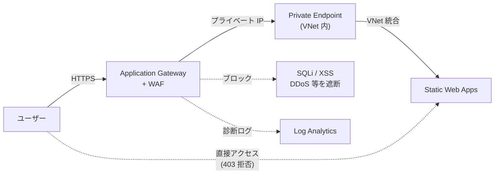
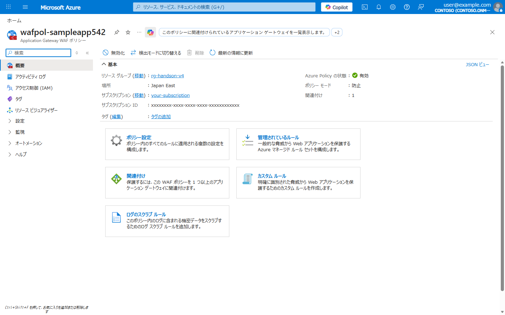
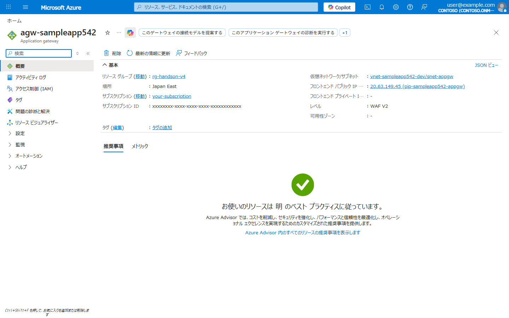
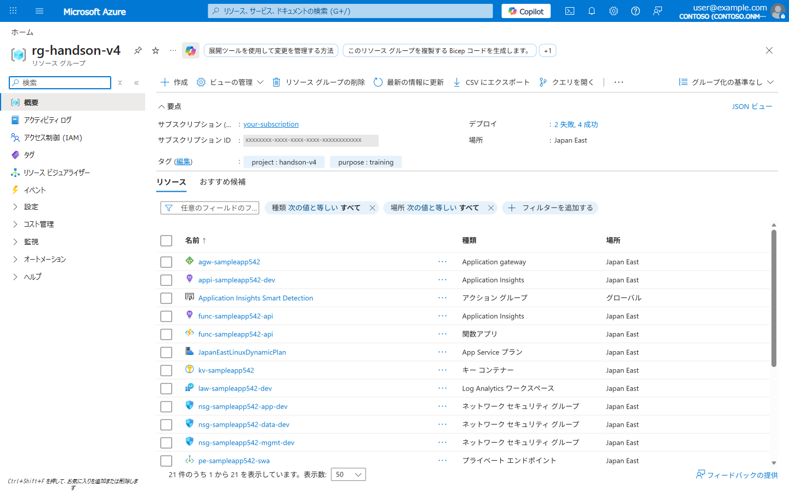

# Lab 03: ゼロトラスト セキュリティ (Application Gateway + WAF)

> **所要時間**: 75分  
> **対応する要件**: 3.10 情報セキュリティに関する事項  
> **前提**: Lab 02 完了済み

---

## この Lab で学ぶこと

| 要件定義書の記載 | Azure での実装 |
|------------------|---------------|
| L3～L7 層で対策可能な仕組みを導入 | **Application Gateway v2 + WAF ポリシー** |
| 不正侵入や Web 特有の攻撃への対策 | WAF OWASP 3.2 ルールセット (SQLi, XSS 等) |
| サービス不能化の防止 (DDoS) | WAF **レートリミット** ルール |
| 暗号鍵の安全な保管、定期ローテーション | **Azure Key Vault** |
| 保存情報の暗号化 (平文アクセス不可) | Key Vault シークレット + **CMK暗号化** |
| RBAC / 最小特権の原則 | **Azure RBAC** + **Key Vault アクセスポリシー** |
| JIT（ジャストインタイム）権限付与 | **Microsoft Entra PIM** (概念説明) |
| 脆弱性スキャン | **Microsoft Defender for Cloud** |
| SIEM 導入 | **Microsoft Sentinel** (概念説明) |

---

## Part A: Application Gateway + WAF → SWA (Private Endpoint)

### 構成概要

Application Gateway を SWA の前段に配置し、**プライベートエンドポイント経由**でバックエンド接続します。SWA のパブリックアクセスはプライベートエンドポイント有効化により自動的に遮断されます。

> **参考**: [Static Web Apps におけるネットワークアクセス制限 (Azure PaaS サポートチームブログ)](https://azure.github.io/jpazpaas/2023/01/20/Static-web-apps-how-to-restrict-access.html)



## Step 1: SWA を Standard プランにアップグレード

Private Endpoint は **Standard プラン**で利用可能です。

```bash
# SWA を Standard にアップグレード (PE と networking 設定に必要)
az staticwebapp update \
  --name "swa-${PREFIX}" \
  --resource-group $RG_NAME \
  --sku Standard
```

## Step 2: SWA の Private Endpoint を作成

要件: 「パブリックインターネットからの直接アクセスを遮断」

```bash
# Private Endpoint 用サブネットの作成
az network vnet subnet create \
  --resource-group $RG_NAME \
  --vnet-name "vnet-${PREFIX}-dev" \
  --name "snet-pe" \
  --address-prefix "10.0.4.0/24"

# SWA のリソース ID を取得
SWA_ID=$(az staticwebapp show \
  --name "swa-${PREFIX}" \
  --resource-group $RG_NAME \
  --query id -o tsv)

# Private Endpoint の作成
az network private-endpoint create \
  --name "pe-${PREFIX}-swa" \
  --resource-group $RG_NAME \
  --location $LOCATION \
  --vnet-name "vnet-${PREFIX}-dev" \
  --subnet "snet-pe" \
  --private-connection-resource-id "$SWA_ID" \
  --group-id "staticSites" \
  --connection-name "swa-pe-connection"

# Private DNS ゾーンの作成と VNet リンク
az network private-dns zone create \
  --resource-group $RG_NAME \
  --name "privatelink.azurestaticapps.net"

az network private-dns link vnet create \
  --resource-group $RG_NAME \
  --zone-name "privatelink.azurestaticapps.net" \
  --name "swa-dns-link" \
  --virtual-network "vnet-${PREFIX}-dev" \
  --registration-enabled false

# DNS ゾーングループの作成 (PE と DNS の自動連携)
az network private-endpoint dns-zone-group create \
  --resource-group $RG_NAME \
  --endpoint-name "pe-${PREFIX}-swa" \
  --name "swa-dns-zone-group" \
  --private-dns-zone "privatelink.azurestaticapps.net" \
  --zone-name "staticSites"
```

**Azure Portal での確認**: Private Endpoint が作成されたことを確認します。


> **重要**: Private Endpoint を有効化すると、SWA のパブリックインターネット経由のアクセスは**自動的に 403 エラー**になります。これ以降、SWA へのアクセスは VNet 内 (= AppGW 経由) のみとなります。

## Step 3: SWA の networking.allowedIpRanges を設定

AppGW サブネットからのアクセスを許可します。

`src/web/staticwebapp.config.json` に以下を追加:

```json
{
  "networking": {
    "allowedIpRanges": ["10.0.0.0/24"]
  },
  "forwardingGateway": {
    "allowedForwardedHosts": ["agw-YOURPREFIX.japaneast.cloudapp.azure.com"]
  },
  "routes": [
    {
      "route": "/api/*",
      "allowedRoles": ["authenticated"]
    }
  ],
  "responseOverrides": {
    "401": {
      "redirect": "/.auth/login/aad",
      "statusCode": 302
    }
  },
  "navigationFallback": {
    "rewrite": "/index.html"
  }
}
```

```bash
# 設定を反映して再デプロイ
DEPLOY_TOKEN=$(az staticwebapp secrets list \
  --name "swa-${PREFIX}" \
  --query "properties.apiKey" -o tsv)

cd src && swa deploy --app-location web --api-location api --deployment-token "$DEPLOY_TOKEN"
cd ..
```

## Step 4: Application Gateway 用サブネットとパブリック IP の作成

```bash
# Lab01 で作成した VNet に AppGW 用サブネットを追加
# (Lab01 の Bicep で既に作成済みの場合はスキップ)
az network vnet subnet create \
  --resource-group $RG_NAME \
  --vnet-name "vnet-${PREFIX}-dev" \
  --name "snet-appgw" \
  --address-prefix "10.0.0.0/24" 2>/dev/null || echo "既に作成済み"

# パブリック IP の作成 (Application Gateway のフロントエンド)
az network public-ip create \
  --resource-group $RG_NAME \
  --name "pip-${PREFIX}-appgw" \
  --location $LOCATION \
  --sku Standard \
  --allocation-method Static
```

## Step 5: WAF ポリシーの作成

要件: 「不正侵入や Web 特有の攻撃への対策」「OWASP Top 10 対応」

```bash
# WAF ポリシーの作成
# 要件: L3～L7 層で対策可能な仕組み
az network application-gateway waf-policy create \
  --name "wafpol-${PREFIX}" \
  --resource-group $RG_NAME \
  --location $LOCATION

# OWASP 3.2 マネージドルールセットを設定
# 要件: SQLi, XSS 等の Web 攻撃を検知・遮断
az network application-gateway waf-policy managed-rule rule-set add \
  --policy-name "wafpol-${PREFIX}" \
  --resource-group $RG_NAME \
  --type OWASP \
  --version 3.2

# WAF ポリシーを Prevention モードに設定
# Detection = 検知のみ、Prevention = 検知 + 遮断
az network application-gateway waf-policy policy-setting update \
  --policy-name "wafpol-${PREFIX}" \
  --resource-group $RG_NAME \
  --state Enabled \
  --mode Prevention \
  --request-body-check true \
  --max-request-body-size-in-kb 128 \
  --file-upload-limit-in-mb 100
```

### WAF が防御する主な攻撃 (OWASP Top 10 対応)

| OWASP カテゴリ | 攻撃例 | WAF ルール |
|---------------|-------|-----------|
| A01: アクセス制御の不備 | パストラバーサル | LFI/RFI ルール |
| A02: 暗号化の失敗 | - | SSL 終端で対応 |
| A03: インジェクション | SQL インジェクション, XSS | SQLi / XSS ルール |
| A05: セキュリティ設定ミス | 不正ヘッダー | プロトコル違反ルール |
| A06: 脆弱なコンポーネント | ボットスキャン | Bot Protection |

**Azure Portal での確認**: WAF ポリシーの概要画面で Prevention モードと OWASP 3.2 ルールセットが設定されていることを確認します。



## Step 6: カスタムルールの作成 (レートリミット)

要件: 「負荷がしきい値を超えた場合に通信遮断や処理量の抑制」

```bash
# レートリミットルール: 1分間に100リクエスト超でブロック
# 要件: サービス不能化の防止
az network application-gateway waf-policy custom-rule create \
  --policy-name "wafpol-${PREFIX}" \
  --resource-group $RG_NAME \
  --name "RateLimitRule" \
  --priority 100 \
  --rule-type RateLimitRule \
  --rate-limit-threshold 100 \
  --rate-limit-duration FiveMins \
  --action Block \
  --group-by-user-session "[{\"groupByVariables\":[{\"variableName\":\"ClientAddr\"}]}]"

# 日本国外からのアクセスをログに記録するルール (任意)
# 要件: 日本国外への情報持ち出し防止の監視
az network application-gateway waf-policy custom-rule create \
  --policy-name "wafpol-${PREFIX}" \
  --resource-group $RG_NAME \
  --name "GeoFilterLog" \
  --priority 200 \
  --rule-type MatchRule \
  --action Log \
  --match-condition "[{\"matchVariables\":[{\"variableName\":\"RemoteAddr\"}],\"operator\":\"GeoMatch\",\"negationCondition\":true,\"matchValues\":[\"JP\"]}]"
```

## Step 7: Application Gateway の作成 (バックエンド = SWA Private Endpoint)

```bash
# SWA の Private Endpoint IP を取得 (NIC 経由)
PE_NIC_ID=$(az network private-endpoint show \
  --name "pe-${PREFIX}-swa" \
  --resource-group $RG_NAME \
  --query "networkInterfaces[0].id" -o tsv)

PE_IP=$(az network nic show \
  --ids "$PE_NIC_ID" \
  --query "ipConfigurations[0].privateIPAddress" -o tsv)

echo "SWA Private Endpoint IP: $PE_IP"

# SWA のデフォルトホスト名を取得
SWA_HOSTNAME=$(az staticwebapp show \
  --name "swa-${PREFIX}" \
  --resource-group $RG_NAME \
  --query "defaultHostname" -o tsv)

# Application Gateway v2 + WAF の作成
# バックエンドプールに SWA の Private Endpoint IP を指定
# ※ 作成に 5-10 分かかります
az network application-gateway create \
  --name "agw-${PREFIX}" \
  --resource-group $RG_NAME \
  --location $LOCATION \
  --sku WAF_v2 \
  --capacity 1 \
  --vnet-name "vnet-${PREFIX}-dev" \
  --subnet "snet-appgw" \
  --public-ip-address "pip-${PREFIX}-appgw" \
  --waf-policy "wafpol-${PREFIX}" \
  --servers "$PE_IP" \
  --priority 100 \
  --http-settings-port 443 \
  --http-settings-protocol Https \
  --frontend-port 80

echo "Application Gateway の作成には 5-10 分かかります..."

# バックエンド HTTP 設定でホスト名を上書き
# (AppGW → PE 経由で SWA にアクセスするために SWA のホスト名が必要)
az network application-gateway http-settings update \
  --gateway-name "agw-${PREFIX}" \
  --resource-group $RG_NAME \
  --name "appGatewayBackendHttpSettings" \
  --host-name-from-backend-pool false \
  --host-name "$SWA_HOSTNAME" \
  --protocol Https \
  --port 443
```

**Azure Portal での確認**: Application Gateway の概要画面で WAF_v2 SKU とバックエンド設定を確認します。



> **コスト注意**: Application Gateway WAF_v2 は固定コストが発生します（約 $0.36/時間）。ハンズオン完了後は必ず削除してください。

> **構成のポイント**:
> - バックエンドプールには SWA の **Private Endpoint の IP** を指定
> - HTTP 設定で `host-name` に **SWA のホスト名**を指定（Host ヘッダーの転送に必要）
> - SWA 側は `allowedIpRanges` で AppGW サブネットのみ許可

## Step 8: Application Gateway の診断ログ有効化

要件: 「監査ログとして記録・監視」「WAF ログの分析」

```bash
# AppGW のリソース ID を取得
AGW_ID=$(az network application-gateway show \
  --name "agw-${PREFIX}" \
  --resource-group $RG_NAME \
  --query id -o tsv)

# Log Analytics のリソース ID を取得
LAW_RESOURCE_ID=$(az monitor log-analytics workspace show \
  --resource-group $RG_NAME \
  --workspace-name "law-${PREFIX}-dev" \
  --query id -o tsv)

# 診断設定を有効化 (WAF ログ + アクセスログ + メトリクス)
az monitor diagnostic-settings create \
  --name "agw-diagnostics" \
  --resource "$AGW_ID" \
  --workspace "$LAW_RESOURCE_ID" \
  --logs '[
    {"category":"ApplicationGatewayAccessLog","enabled":true},
    {"category":"ApplicationGatewayFirewallLog","enabled":true},
    {"category":"ApplicationGatewayPerformanceLog","enabled":true}
  ]' \
  --metrics '[{"category":"AllMetrics","enabled":true}]'
```

## Step 9: WAF ログの確認

```bash
# WAF ログを KQL でクエリ (ポータルの Log Analytics で実行)
echo "=== Azure Portal → Log Analytics → ログ で以下のクエリを実行 ==="
cat << 'EOF'
// WAF でブロックされたリクエストの確認
AzureDiagnostics
| where ResourceType == "APPLICATIONGATEWAYS"
| where Category == "ApplicationGatewayFirewallLog"
| where action_s == "Blocked"
| project TimeGenerated, clientIp_s, requestUri_s, ruleId_s, message_s, action_s
| order by TimeGenerated desc
| take 50

// レートリミットの発動状況
AzureDiagnostics
| where Category == "ApplicationGatewayFirewallLog"
| where ruleGroup_s == "RateLimitRule"
| summarize BlockCount = count() by bin(TimeGenerated, 5m), clientIp_s
| render timechart
EOF
```

## Step 10: WAF ルールと Private Endpoint のテスト

```bash
# AppGW のパブリック IP を取得
AGW_IP=$(az network public-ip show \
  --name "pip-${PREFIX}-appgw" \
  --resource-group $RG_NAME \
  --query ipAddress -o tsv)

echo "Application Gateway IP: $AGW_IP"

# --- AppGW 経由のアクセス (正常) ---
curl -s "http://${AGW_IP}/" -o /dev/null -w "AppGW 経由: HTTP %{http_code}\n"
# → 200 OK が返れば AppGW → PE → SWA の経路が正常

# --- SQLi テスト (WAF でブロックされるべき) ---
curl -s "http://${AGW_IP}/?id=1%20OR%201=1" -o /dev/null -w "SQLi テスト: HTTP %{http_code}\n"
# → 403 Forbidden が返れば WAF が正常に動作

# --- XSS テスト ---
curl -s "http://${AGW_IP}/?q=<script>alert(1)</script>" -o /dev/null -w "XSS テスト: HTTP %{http_code}\n"
# → 403 Forbidden が返れば WAF が正常に動作

# --- SWA への直接アクセス (Private Endpoint で過断) ---
SWA_HOSTNAME=$(az staticwebapp show \
  --name "swa-${PREFIX}" \
  --resource-group $RG_NAME \
  --query "defaultHostname" -o tsv)

curl -s "https://${SWA_HOSTNAME}/" -o /dev/null -w "SWA 直接アクセス: HTTP %{http_code}\n"
# → 403 Forbidden が返れば Private Endpoint が正常に動作
# (パブリックインターネットからの直接アクセスは過断)
```

期待される結果:

| テスト | 経路 | 期待値 | 説明 |
|------|------|--------|------|
| 正常リクエスト | AppGW → PE → SWA | **200** | WAF 通過、PE 経由で SWA に到達 |
| SQLi | AppGW (WAF) | **403** | WAF がブロック |
| XSS | AppGW (WAF) | **403** | WAF がブロック |
| 直接アクセス | インターネット → SWA | **403** | PE 有効化でパブリック過断 |

**Azure Portal での確認**: リソースグループの概要画面で、Lab03 で作成した全リソースを確認します。



---

## Part B: Key Vault & シークレット管理

要件: 「暗号化に使用した鍵は保護されたストレージで安全に保管し、定期的なローテーション」

## Step 11: Key Vault の作成

```bash
# Key Vault の作成
# 要件: ソフトウェア方式の認証、RBAC でアクセス制御
az keyvault create \
  --name "kv-${PREFIX}" \
  --resource-group $RG_NAME \
  --location $LOCATION \
  --enable-rbac-authorization true \
  --enable-purge-protection true \
  --retention-days 90 \
  --sku standard

# 確認
az keyvault show --name "kv-${PREFIX}" \
  --query "{name:name, vaultUri:properties.vaultUri, rbac:properties.enableRbacAuthorization}" \
  -o json
```

**Azure Portal での確認**: Key Vault の概要画面で RBAC が有効化されていることを確認します。


**ポイント**:
- `--enable-rbac-authorization true`: Azure RBAC でアクセス制御 (要件: ロールベースアクセス制御)
- `--enable-purge-protection true`: 削除からの保護 (要件: データの減失防止)

## Step 12: シークレットの保存と RBAC の設定

要件: 「利用者の職務に応じてアクセス権を制御する機能」「最小特権の原則」

```bash
# 現在のユーザーの Object ID を取得
USER_OBJECT_ID=$(az ad signed-in-user show --query id -o tsv)

# Key Vault Secrets Officer ロールを付与 (シークレットの読み書き)
az role assignment create \
  --role "Key Vault Secrets Officer" \
  --assignee "$USER_OBJECT_ID" \
  --scope "/subscriptions/$(az account show --query id -o tsv)/resourceGroups/${RG_NAME}/providers/Microsoft.KeyVault/vaults/kv-${PREFIX}"

# データベース接続文字列をシークレットとして保存
# 要件: 保護すべき情報を暗号化して保存
az keyvault secret set \
  --vault-name "kv-${PREFIX}" \
  --name "db-connection-string" \
  --value "Host=pgserver.postgres.database.azure.com;Database=sampledb;Username=appuser" \
  --content-type "text/plain"

# シークレットの取得確認
az keyvault secret show \
  --vault-name "kv-${PREFIX}" \
  --name "db-connection-string" \
  --query "{name:name, created:attributes.created}" -o json
```

**Azure Portal での確認**: Key Vault のシークレット画面で `db-connection-string` が保存されていることを確認します。


## Step 13: RBAC ロールの確認と最小特権の原則

```bash
# Key Vault に定義済みのビルトインロール一覧
az role definition list \
  --query "[?contains(roleName, 'Key Vault')].{roleName:roleName, description:description}" \
  -o table

# 現在のロール割り当ての確認
az role assignment list \
  --scope "/subscriptions/$(az account show --query id -o tsv)/resourceGroups/${RG_NAME}/providers/Microsoft.KeyVault/vaults/kv-${PREFIX}" \
  --query "[].{principalName:principalName, roleDefinitionName:roleDefinitionName}" \
  -o table
```

### 要件対応: 主なロールと権限の対応

| 役割 (要件定義) | Azure RBAC ロール | 権限 |
|----------------|-------------------|------|
| システム管理者 | Key Vault Administrator | 鍵/シークレット/証明書の完全管理 |
| アプリケーション | Key Vault Secrets User | シークレットの読み取りのみ |
| 運用保守事業者 | Key Vault Secrets Officer | シークレットの読み書き |
| 監査担当 | Key Vault Reader | メタデータの読み取りのみ |

## Step 14: マネージド ID でアプリからシークレットにアクセス

要件: 「認証機能はクラウドサービスが提供する機能を最大限活用」

Lab02 で作成した単体 Functions App (Linked Backend) のマネージド ID を使って、Key Vault にパスワードレスでアクセスします。

```bash
# Lab02 で作成した Functions App のマネージド ID の Object ID を取得
APP_IDENTITY=$(az functionapp identity show \
  --name "func-${PREFIX}-api" \
  --resource-group $RG_NAME \
  --query "principalId" -o tsv)

echo "Functions App マネージド ID: $APP_IDENTITY"

# Key Vault Secrets User ロールを付与 (読み取りのみ = 最小特権)
az role assignment create \
  --role "Key Vault Secrets User" \
  --assignee "$APP_IDENTITY" \
  --scope "/subscriptions/$(az account show --query id -o tsv)/resourceGroups/${RG_NAME}/providers/Microsoft.KeyVault/vaults/kv-${PREFIX}"

echo "マネージド ID に Key Vault の読み取り権限を付与しました"
```

**Linked Backend 構成のメリット**: この Functions App は SWA の `/api/*` として Linked Backend 経由でアクセスされます。マネージド ID は Key Vault だけでなく、PostgreSQL や Blob Storage へのパスワードレス接続にも活用できます。

```
SWA (/api/*) → Functions App (マネージド ID) → Key Vault   ✓
                                              → PostgreSQL ✓
                                              → Blob Storage ✓
```

## Step 15: Key Vault の診断ログ有効化

要件: 「利用記録、例外的事象のログを蓄積し3年間保管」「監査ログとして記録・監視」

```bash
# Key Vault のリソース ID を取得
KV_ID=$(az keyvault show --name "kv-${PREFIX}" --query id -o tsv)

# Log Analytics のリソース ID を取得
LAW_RESOURCE_ID=$(az monitor log-analytics workspace show \
  --resource-group $RG_NAME \
  --workspace-name "law-${PREFIX}-dev" \
  --query id -o tsv)

# 診断設定を有効化 (監査ログ + メトリクス)
az monitor diagnostic-settings create \
  --name "kv-diagnostics" \
  --resource "$KV_ID" \
  --workspace "$LAW_RESOURCE_ID" \
  --logs '[{"category":"AuditEvent","enabled":true,"retentionPolicy":{"enabled":true,"days":365}}]' \
  --metrics '[{"category":"AllMetrics","enabled":true}]'
```

## Step 16: Microsoft Defender for Cloud の確認

要件: 「脆弱性の有無を確認」「自動化された脆弱性スキャン」

```bash
# Defender for Cloud の状態を確認
az security pricing list \
  --query "[].{name:name, pricingTier:pricingTier}" -o table

# セキュリティ推奨事項の確認 (既存のものがあれば)
az security assessment list \
  --query "[?resourceDetails.source=='Azure'].{name:displayName, status:status.code}" \
  -o table 2>/dev/null || echo "推奨事項はポータルで確認してください"
```

> **ポータル確認**: Azure Portal → Microsoft Defender for Cloud → 推奨事項  
> Key Vault、ストレージ、Static Web Apps 等のセキュリティ推奨事項が表示されます。

## Step 17: ネットワークセキュリティの確認

要件: 「通信回線を暗号化する機能」「不正アクセス対策」

```bash
# Key Vault のネットワーク設定確認
az keyvault show --name "kv-${PREFIX}" \
  --query "{publicNetworkAccess:properties.publicNetworkAccess, networkAcls:properties.networkAcls}" \
  -o json

# (任意) Key Vault を Private Endpoint 経由のみに制限
# これにより、VNet 外からのアクセスが遮断される
# az keyvault update --name "kv-${PREFIX}" --default-action Deny

# NSG ルールの確認 (Lab01 で作成済み)
az network nsg rule list \
  --resource-group $RG_NAME \
  --nsg-name "nsg-${PREFIX}-data-dev" \
  -o table
```

---

## 補足: JIT 権限付与の概念

要件: 「JIT（ジャストインタイム）権限付与で一時的な昇格、ワークフロー承認必須」

Azure では **Microsoft Entra Privileged Identity Management (PIM)** でこれを実現します:

```
通常時                    JIT 昇格時
┌────────────┐           ┌────────────┐
│ ユーザー    │  承認要求  │ ユーザー    │
│ (閲覧権限)  │ ────────▶ │ (管理権限)  │ ← 時限付き (例: 8時間)
└────────────┘  承認者が   └────────────┘
                 承認
```

> PIM は Entra ID P2 ライセンスが必要なため、本ハンズオンでは概念説明のみとします。

---

## 理解度チェック

- [ ] SWA の Private Endpoint を作成し、パブリックアクセスが過断されることを確認した
- [ ] Application Gateway + WAF を作成し、バックエンドに SWA PE を設定した
- [ ] WAF が SQLi / XSS をブロックすることを確認した
- [ ] Key Vault を作成しシークレットを保存できた
- [ ] RBAC でロールを割り当て、最小特権の原則を体験した
- [ ] マネージド ID でパスワードレスなアクセスを設定した
- [ ] 診断ログを Log Analytics に送信する設定を行った

### 要件 → Azure 実装の対応表

| 要件定義書の記載 | Azure での実装 |
|------------------|---------------|
| L3～L7 層での攻撃対策 | Application Gateway v2 + WAF (OWASP 3.2) |
| DDoS / サービス不能化防止 | WAF レートリミットルール |
| Web 特有の攻撃対策 | WAF マネージドルール (SQLi, XSS) |
| 暗号鍵の安全な保管 | Azure Key Vault (purge protection 有効) |
| RBAC / 最小特権 | Azure RBAC ビルトインロール |
| 認証はクラウド機能を活用 | マネージド ID (パスワードレス) + SWA Easy Auth |
| JIT 権限付与 | Microsoft Entra PIM |
| 監査ログの蓄積 | 診断設定 → Log Analytics |
| 脆弱性スキャン | Microsoft Defender for Cloud |
| パブリックアクセス過断 | SWA Private Endpoint + networking.allowedIpRanges |
| 通信経路の暗号化 | TLS 1.2+ (AppGW SSL 終端), Private Endpoint |
| SIEM | Microsoft Sentinel (Log Analytics 連携) |

---

**次のステップ**: [Lab 04: 監視・可用性・自動復旧](lab04-monitoring.md)
