# Lab 03: ゼロトラスト セキュリティ (Application Gateway + WAF)

> **所要時間**: 75分  
> **対応する要件**: 3.10 情報セキュリティに関する事項  
> **前提**: Lab 02 完了済み

---

## この Lab で学ぶこと

| 要件定義書の記載 | Azure での実装 |
|------------------|---------------|
| L3～L7 層で対策可能な仕組みを導入 | **Application Gateway v2 + WAF ポリシー** |
| 不正侵入や Web 特有の攻撃への対策 | WAF **DRS 2.1** ルールセット (SQLi, XSS 等) |
| サービス不能化の防止 (DDoS) | WAF **レートリミット** ルール |
| 暗号鍵の安全な保管、定期ローテーション | **Azure Key Vault** |
| 保存情報の暗号化 (平文アクセス不可) | Key Vault シークレット + **CMK暗号化** |
| RBAC / 最小特権の原則 | **Azure RBAC** + **Key Vault RBAC 認可** |
| JIT（ジャストインタイム）権限付与 | **Microsoft Entra PIM** (概念説明) |
| 脆弱性スキャン | **Microsoft Defender for Cloud** |
| SIEM 導入 | **Microsoft Sentinel** (概念説明) |

---

## アジェンダ

### Part A: Application Gateway + WAF

- [Step 1: SWA の Private Endpoint を作成](#step-1-swa-の-private-endpoint-を作成)
- [Step 2: SWA の networking.allowedIpRanges を設定](#step-2-swa-の-networkingallowedipranges-を設定)
- [Step 3: Application Gateway 用サブネットとパブリック IP の作成](#step-3-application-gateway-用サブネットとパブリック-ip-の作成)
- [Step 4: WAF ポリシーの作成](#step-4-waf-ポリシーの作成)
- [Step 5: カスタムルールの作成 (レートリミット)](#step-5-カスタムルールの作成-レートリミット)
- [Step 6: Application Gateway の作成](#step-6-application-gateway-の作成-バックエンド--swa-private-endpoint)
- [Step 7: Application Gateway の診断ログ有効化](#step-7-application-gateway-の診断ログ有効化)
- [Step 8: WAF ルールと Private Endpoint のテスト](#step-8-waf-ルールと-private-endpoint-のテスト)
- [Step 9: WAF ログの確認](#step-9-waf-ログの確認)
- [Step 10: Entra ID カスタム認証 → Lab 08 (オプション)](#step-10-entra-id-カスタム認証の構成--lab-08-オプション-へ移動)

### Part B: Key Vault & シークレット管理

- [Step 11: Key Vault の作成](#step-11-key-vault-の作成)
- [Step 12: シークレットの保存と RBAC の設定](#step-12-シークレットの保存と-rbac-の設定)
- [Step 13: RBAC ロールの確認と最小特権の原則](#step-13-rbac-ロールの確認と最小特権の原則)
- [Step 14: マネージド ID でアプリからシークレットにアクセス](#step-14-マネージド-id-でアプリからシークレットにアクセス)
- [Step 15: Key Vault の診断ログ有効化](#step-15-key-vault-の診断ログ有効化)
- [Step 16: Microsoft Defender for Cloud の確認](#step-16-microsoft-defender-for-cloud-の確認)
- [Step 17: ネットワークセキュリティの確認](#step-17-ネットワークセキュリティの確認)

### まとめ

- [補足: JIT 権限付与の概念](#補足-jit-権限付与の概念)
- [理解度チェック](#理解度チェック)

---

## Part A: Application Gateway + WAF → SWA (Private Endpoint)

### 構成概要

Application Gateway を SWA の前段に配置し、**プライベートエンドポイント経由**でバックエンド接続します。SWA のパブリックアクセスはプライベートエンドポイント有効化により自動的に遮断されます。

> **参考**: [Static Web Apps におけるネットワークアクセス制限 (Azure PaaS サポートチームブログ)](https://azure.github.io/jpazpaas/2023/01/20/Static-web-apps-how-to-restrict-access.html)

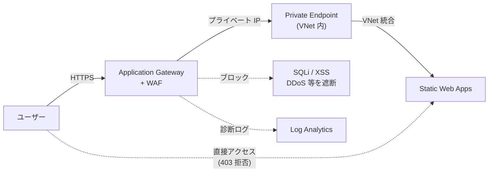
```mermaid
graph LR
    User["ユーザー"] -->|HTTPS| AGW["Application Gateway<br/>+ WAF"]
    AGW -->|"プライベート IP"| PE["Private Endpoint<br/>(VNet 内)"]
    PE -->|"VNet 統合"| SWA["Static Web Apps"]
    AGW -.->|"ブロック"| Block["SQLi / XSS<br/>DDoS 等を遮断"]
    AGW -.->|"診断ログ"| LAW["Log Analytics"]
    User -.->|"直接アクセス<br/>(403 拒否)"| SWA
```

## Step 1: SWA の Private Endpoint を作成

要件: 「パブリックインターネットからの直接アクセスを遮断」

Private Endpoint (PE) は VNet 内に NIC (プライベート IP) を作成し、PaaS サービスへの接続を VNet 内に閉じる仕組みです。PE へのアクセスは **IP アドレス直接ではなく FQDN** で行う必要があるため、FQDN → PE のプライベート IP に名前解決する**プライベート DNS ゾーン**を作成し、VNet にリンクします。

```
VNet 内のリソース (AppGW など)
  ↓ DNS クエリ: swa-xxx.azurestaticapps.net
  ↓
Azure パブリック DNS
  ↓ CNAME → swa-xxx.privatelink.azurestaticapps.net
  ↓
プライベート DNS ゾーン (privatelink.azurestaticapps.net)  ← VNet にリンク済み
  ↓ A レコード: swa-xxx → 10.0.4.x (PE の IP)
  ↓
Private Endpoint → SWA
```

> **ポイント**: プライベート DNS ゾーンは VNet にリンクされているため、**VNet 内からの DNS クエリのみ**が PE の IP に解決されます。VNet 外からはパブリック IP に解決されますが、PE 有効化後は SWA 側が 403 で拒否します。

```bash
# Private Endpoint 用サブネットの作成
az network vnet subnet create \
  --resource-group $RG_NAME \
  --vnet-name "vnet-${PREFIX}-dev" \
  --name "snet-pe" \
  --address-prefix "10.0.4.0/24"

# SWA のリソース ID を取得
SWA_ID=$(az staticwebapp show \
  --name "swa-${PREFIX}" \
  --resource-group $RG_NAME \
  --query id -o tsv)

# Private Endpoint の作成
# Git Bash の場合、リソース ID のパスが変換されるため MSYS_NO_PATHCONV=1 を付与
MSYS_NO_PATHCONV=1 az network private-endpoint create \
  --name "pe-${PREFIX}-swa" \
  --resource-group $RG_NAME \
  --location $LOCATION \
  --vnet-name "vnet-${PREFIX}-dev" \
  --subnet "snet-pe" \
  --private-connection-resource-id "$SWA_ID" \
  --group-id "staticSites" \
  --connection-name "swa-pe-connection"

# Private DNS ゾーンの作成と VNet リンク
az network private-dns zone create \
  --resource-group $RG_NAME \
  --name "privatelink.azurestaticapps.net"

az network private-dns link vnet create \
  --resource-group $RG_NAME \
  --zone-name "privatelink.azurestaticapps.net" \
  --name "swa-dns-link" \
  --virtual-network "vnet-${PREFIX}-dev" \
  --registration-enabled false

# DNS ゾーングループの作成 (PE と DNS の自動連携)
az network private-endpoint dns-zone-group create \
  --resource-group $RG_NAME \
  --endpoint-name "pe-${PREFIX}-swa" \
  --name "swa-dns-zone-group" \
  --private-dns-zone "privatelink.azurestaticapps.net" \
  --zone-name "staticSites"
```

**Azure Portal での確認**: Private Endpoint が作成されたことを確認します。

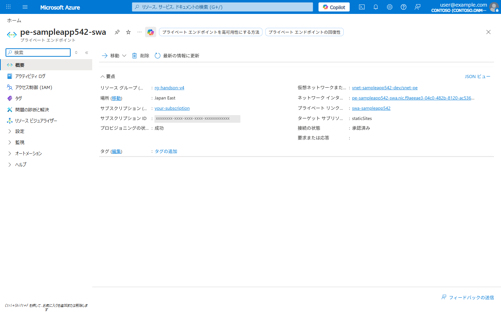

> **重要**: Private Endpoint を有効化すると、SWA のパブリックインターネット経由のアクセスは**自動的に 403 エラー**になります。これ以降、SWA へのアクセスは VNet 内 (= AppGW 経由) のみとなります。

**PE 有効化前** (Lab02 時点): SWA に直接アクセスでき、サンプル業務システムが表示される

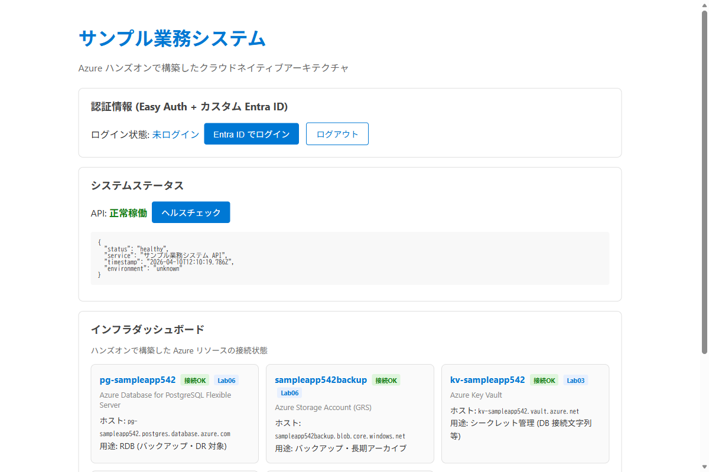

> **注意**: インフラダッシュボードの「デプロイ済」「接続OK」の表示はハンズオンの進捗に応じて変化します。スクリーンショットと実際の表示が異なる場合があります。

**PE 有効化後**: SWA に直接アクセスすると 403 Forbidden になる

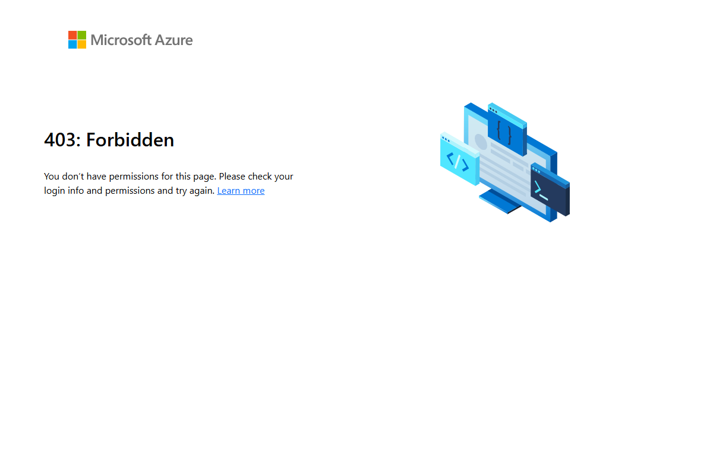

## Step 2: SWA の networking.allowedIpRanges を設定

AppGW サブネットからのアクセスを許可します。

`src/web/staticwebapp.config.json` に `networking` を追加します:

```json
{
  "networking": {
    "allowedIpRanges": ["10.0.0.0/24"]
  },
  "routes": [
    {
      "route": "/api/*",
      "allowedRoles": ["anonymous", "authenticated"]
    }
  ],
  "navigationFallback": {
    "rewrite": "/index.html"
  }
}
```

> **`forwardingGateway` について**: Entra ID 認証を構成する場合は `forwardingGateway` の設定も必要です。詳しくは [Lab 08 (オプション)](lab08-auth-optional.md) を参照してください。

```bash
# 設定を反映して再デプロイ
DEPLOY_TOKEN=$(az staticwebapp secrets list \
  --name "swa-${PREFIX}" \
  --query "properties.apiKey" -o tsv)

cd src && swa deploy --app-location web --api-location api --deployment-token "$DEPLOY_TOKEN"
cd ..
```

## Step 3: Application Gateway 用サブネットとパブリック IP の作成

```bash
# Lab01 で作成した VNet に AppGW 用サブネットを追加
# (Lab01 の Bicep で既に作成済みの場合はスキップ)
az network vnet subnet create \
  --resource-group $RG_NAME \
  --vnet-name "vnet-${PREFIX}-dev" \
  --name "snet-appgw" \
  --address-prefix "10.0.0.0/24" 2>/dev/null || echo "既に作成済み"

# パブリック IP の作成 (Application Gateway のフロントエンド)
# DNS ラベルも設定し、FQDN でアクセスできるようにする
az network public-ip create \
  --resource-group $RG_NAME \
  --name "pip-${PREFIX}-appgw" \
  --location $LOCATION \
  --sku Standard \
  --allocation-method Static \
  --dns-name "${PREFIX}"

# FQDN を確認 (${PREFIX}.japaneast.cloudapp.azure.com)
az network public-ip show \
  --name "pip-${PREFIX}-appgw" \
  --resource-group $RG_NAME \
  --query "{ip:ipAddress, fqdn:dnsSettings.fqdn}" -o json
```

> **FQDN**: `${PREFIX}.japaneast.cloudapp.azure.com` でアクセスできます。IP アドレス直接ではなく FQDN を使うことで、証明書のホスト名検証や DNS 切り替えにも対応しやすくなります。

**Azure Portal での確認**: パブリック IP の構成画面で、DNS 名ラベルに `${PREFIX}` が設定され、FQDN (`${PREFIX}.japaneast.cloudapp.azure.com`) でアクセスできることを確認します。

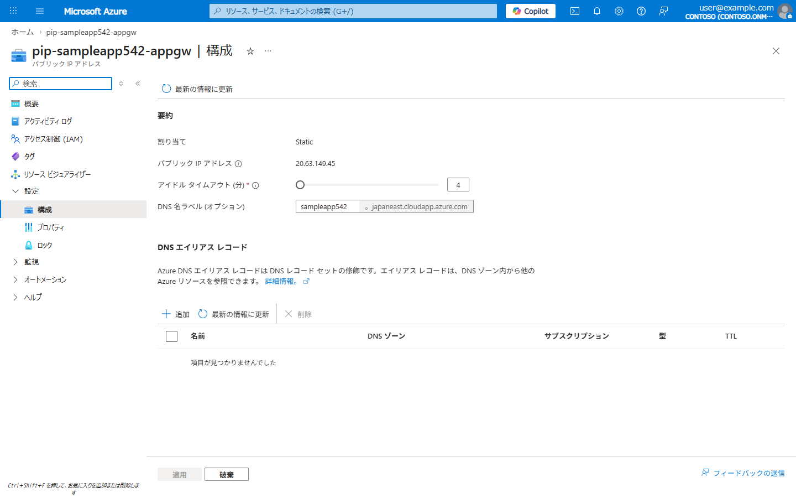

## Step 4: WAF ポリシーの作成

要件: 「不正侵入や Web 特有の攻撃への対策」「OWASP Top 10 対応」

```bash
# WAF ポリシーの作成
# 要件: L3～L7 層で対策可能な仕組み
# ※ デフォルトで Microsoft_DefaultRuleSet (DRS) 2.1 が適用されます
#   DRS 2.1 は OWASP CRS ベースの Microsoft 推奨ルールセットです
az network application-gateway waf-policy create \
  --name "wafpol-${PREFIX}" \
  --resource-group $RG_NAME \
  --location $LOCATION

# WAF ポリシーを Prevention モードに設定
# Detection = 検知のみ、Prevention = 検知 + 遮断
az network application-gateway waf-policy policy-setting update \
  --policy-name "wafpol-${PREFIX}" \
  --resource-group $RG_NAME \
  --state Enabled \
  --mode Prevention \
  --request-body-check true \
  --max-request-body-size-in-kb 128 \
  --file-upload-limit-in-mb 100
```

### WAF が防御する主な攻撃 (OWASP Top 10 対応)

| OWASP カテゴリ | 攻撃例 | WAF ルール |
|---------------|-------|-----------|
| A01: アクセス制御の不備 | パストラバーサル | LFI/RFI ルール |
| A02: 暗号化の失敗 | - | SSL 終端で対応 |
| A03: インジェクション | SQL インジェクション, XSS | SQLi / XSS ルール |
| A05: セキュリティ設定ミス | 不正ヘッダー | プロトコル違反ルール |
| A06: 脆弱なコンポーネント | ボットスキャン | Bot Protection |

**Azure Portal での確認**: WAF ポリシー → 管理されているルール 画面で **Microsoft_DefaultRuleSet_2.1 (190ルール)** が適用されていることを確認します。行をクリックすると LFI, RFI, RCE, SQLi, XSS 等のルール一覧が展開されます。

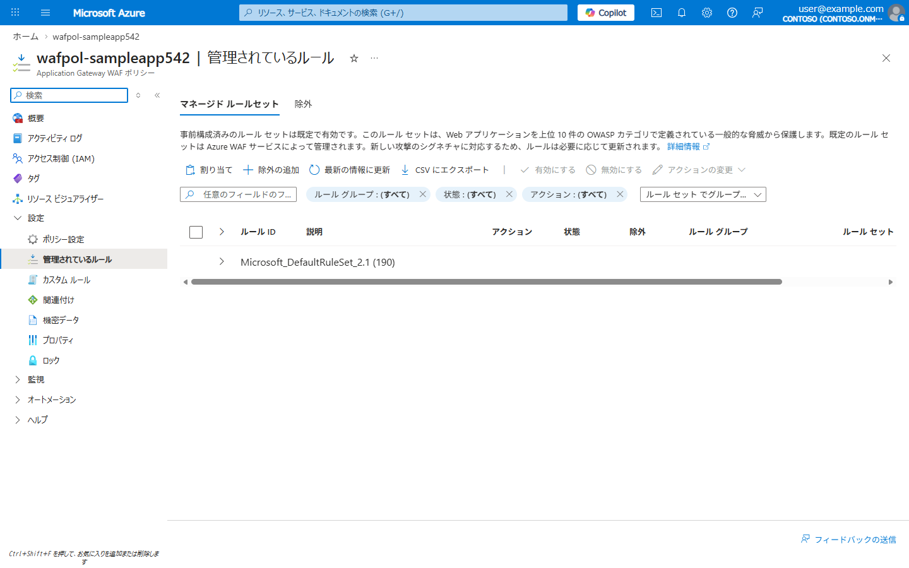

## Step 5: カスタムルールの作成 (レートリミット)

要件: 「負荷がしきい値を超えた場合に通信遮断や処理量の抑制」

```bash
# レートリミットルール: 1分間に100リクエスト超でブロック
# 要件: サービス不能化の防止
az network application-gateway waf-policy custom-rule create \
  --policy-name "wafpol-${PREFIX}" \
  --resource-group $RG_NAME \
  --name "RateLimitRule" \
  --priority 10 \
  --rule-type RateLimitRule \
  --rate-limit-threshold 100 \
  --rate-limit-duration FiveMins \
  --action Block \
  --group-by-user-session "[{\"group-by-variables\":[{\"variable-name\":\"ClientAddr\"}]}]"

# 日本国外からのアクセスをログに記録するルール (任意)
# 要件: 日本国外への情報持ち出し防止の監視
az network application-gateway waf-policy custom-rule create \
  --policy-name "wafpol-${PREFIX}" \
  --resource-group $RG_NAME \
  --name "GeoFilterLog" \
  --priority 20 \
  --rule-type MatchRule \
  --action Log \
  --match-conditions "[{\"match-variables\":[{\"variable-name\":\"RemoteAddr\"}],\"operator\":\"GeoMatch\",\"negation-condition\":true,\"match-values\":[\"JP\"]}]"
```

> **CLI バージョンによる注意**: Azure CLI 2.80 以降では `--match-conditions` の JSON フィールド名が変更され、上記コマンドが `Model 'AAZObjectArg' has no field named 'match-variables'` エラーで失敗する場合があります。その場合は以下の **REST API 方式**で作成してください。

<details>
<summary>回避策: REST API でカスタムルールを作成する</summary>

```bash
# REST API で WAF カスタムルール (レートリミット + Geo フィルタ) を一括設定
MSYS_NO_PATHCONV=1 az rest --method put \
  --url "https://management.azure.com/subscriptions/$(az account show --query id -o tsv)/resourceGroups/${RG_NAME}/providers/Microsoft.Network/ApplicationGatewayWebApplicationFirewallPolicies/wafpol-${PREFIX}?api-version=2024-03-01" \
  --body "{
    \"location\": \"${LOCATION}\",
    \"properties\": {
      \"policySettings\": {
        \"state\": \"Enabled\",
        \"mode\": \"Prevention\",
        \"requestBodyCheck\": true,
        \"maxRequestBodySizeInKb\": 128,
        \"fileUploadLimitInMb\": 100
      },
      \"customRules\": [
        {
          \"name\": \"RateLimitRule\",
          \"priority\": 10,
          \"ruleType\": \"RateLimitRule\",
          \"rateLimitThreshold\": 100,
          \"rateLimitDuration\": \"FiveMins\",
          \"action\": \"Block\",
          \"matchConditions\": [{
            \"matchVariables\": [{\"variableName\": \"RemoteAddr\"}],
            \"operator\": \"IPMatch\",
            \"matchValues\": [\"0.0.0.0/0\",\"::/0\"]
          }],
          \"groupByUserSession\": [{
            \"groupByVariables\": [{\"variableName\": \"ClientAddr\"}]
          }]
        },
        {
          \"name\": \"GeoFilterLog\",
          \"priority\": 20,
          \"ruleType\": \"MatchRule\",
          \"action\": \"Log\",
          \"matchConditions\": [{
            \"matchVariables\": [{\"variableName\": \"RemoteAddr\"}],
            \"operator\": \"GeoMatch\",
            \"negationConditon\": true,
            \"matchValues\": [\"JP\"]
          }]
        }
      ],
      \"managedRules\": {
        \"managedRuleSets\": [{
          \"ruleSetType\": \"Microsoft_DefaultRuleSet\",
          \"ruleSetVersion\": \"2.1\"
        }]
      }
    }
  }"
```

</details>

**Azure Portal での確認**: WAF ポリシーのカスタムルール画面でレートリミットルールと Geo フィルタルールが作成されていることを確認します。

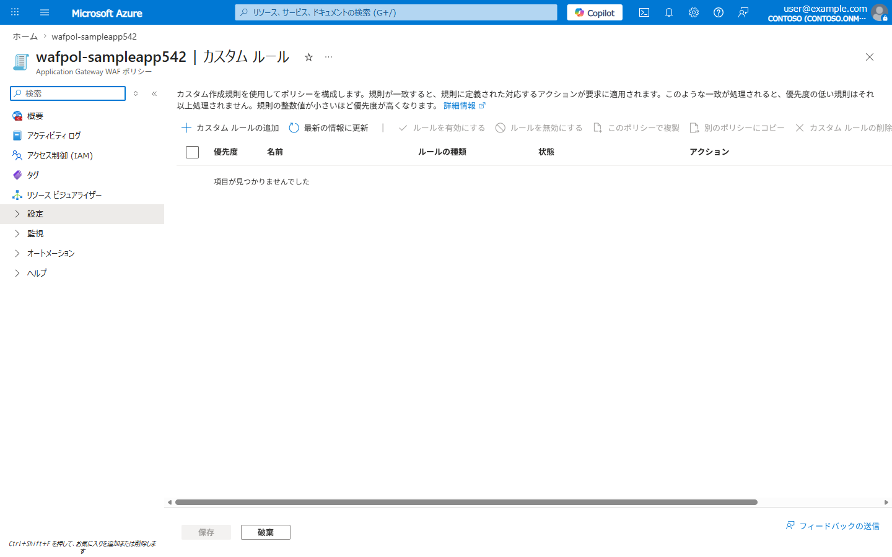

## Step 6: Application Gateway の作成 (バックエンド = SWA Private Endpoint)

> **所要時間**: Application Gateway の作成には **15-20 分程度**かかります。作成コマンド実行後、完了を待つ間に次の Step の説明を読み進めておくことをお勧めします。

```bash
# SWA の Private Endpoint IP を取得 (NIC 経由)
PE_NIC_ID=$(az network private-endpoint show \
  --name "pe-${PREFIX}-swa" \
  --resource-group $RG_NAME \
  --query "networkInterfaces[0].id" -o tsv)

PE_IP=$(az network nic show \
  --ids "$PE_NIC_ID" \
  --query "ipConfigurations[0].privateIPAddress" -o tsv)

echo "SWA Private Endpoint IP: $PE_IP"

# SWA のデフォルトホスト名を取得
SWA_HOSTNAME=$(az staticwebapp show \
  --name "swa-${PREFIX}" \
  --resource-group $RG_NAME \
  --query "defaultHostname" -o tsv)

# Application Gateway v2 + WAF の作成
# バックエンドプールに SWA の Private Endpoint IP を指定
# ※ 作成に 5-10 分かかります
az network application-gateway create \
  --name "agw-${PREFIX}" \
  --resource-group $RG_NAME \
  --location $LOCATION \
  --sku WAF_v2 \
  --capacity 1 \
  --vnet-name "vnet-${PREFIX}-dev" \
  --subnet "snet-appgw" \
  --public-ip-address "pip-${PREFIX}-appgw" \
  --waf-policy "wafpol-${PREFIX}" \
  --servers "$PE_IP" \
  --priority 100 \
  --http-settings-port 443 \
  --http-settings-protocol Https \
  --frontend-port 80

echo "Application Gateway の作成には 5-10 分かかります..."

# バックエンド HTTP 設定でホスト名を上書き
# (AppGW → PE 経由で SWA にアクセスするために SWA のホスト名が必要)
az network application-gateway http-settings update \
  --gateway-name "agw-${PREFIX}" \
  --resource-group $RG_NAME \
  --name "appGatewayBackendHttpSettings" \
  --host-name-from-backend-pool false \
  --host-name "$SWA_HOSTNAME" \
  --protocol Https \
  --port 443
```

**Azure Portal での確認**:

**バックエンドプール**: SWA の Private Endpoint IP (10.0.4.4) がターゲットとして設定されています。AppGW はこの IP 経由で SWA にアクセスします。

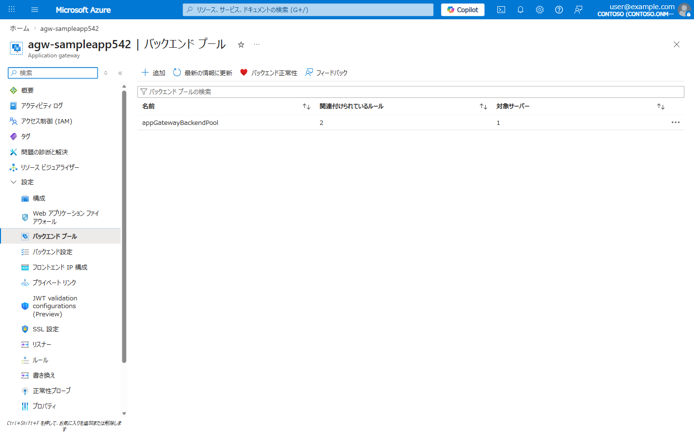

**バックエンド設定**: ポート 443、プロトコル HTTPS で SWA の PE に接続します。ホスト名を SWA のデフォルトホスト名に上書きし、Host ヘッダーを正しく転送します。

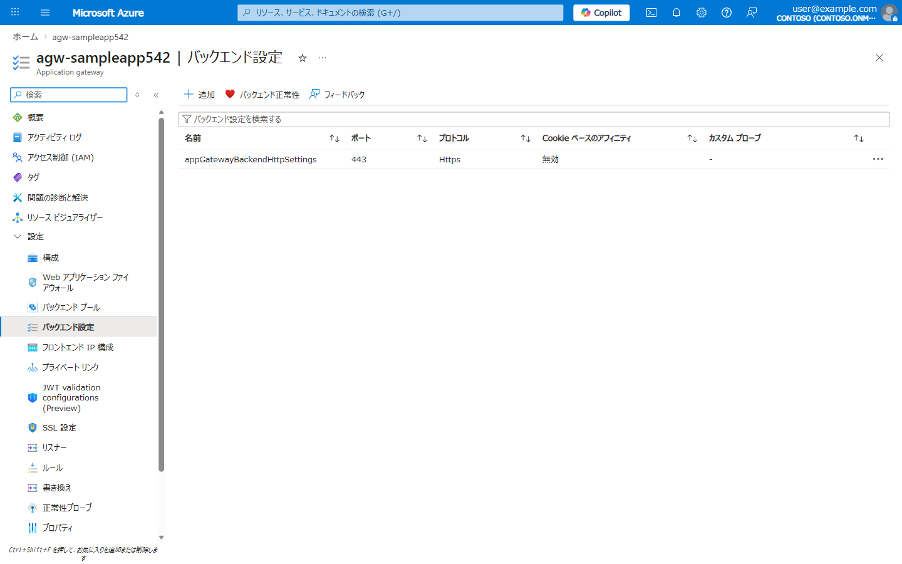

**フロントエンド IP 構成**: パブリック IP (FQDN 付き) がフロントエンドに割り当てられ、リスナーと紐づいています。

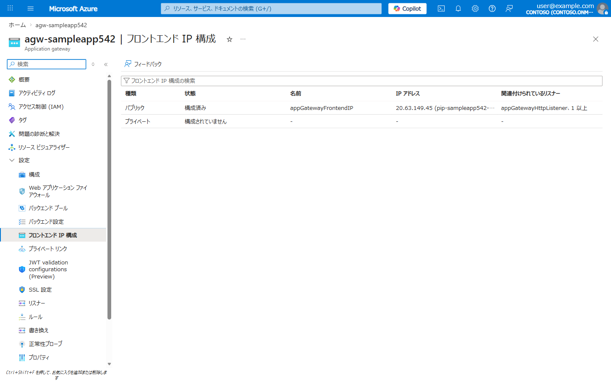

> **コスト注意**: Application Gateway WAF_v2 は固定コストが発生します（約 $0.36/時間）。ハンズオン完了後は必ず削除してください。

### HTTPS リスナーの追加 (SSL 終端)

要件: 「通信回線を暗号化する機能」

自己署名証明書を使用して、AppGW で HTTPS (SSL 終端) を有効化します。

```bash
# 自己署名証明書の作成 (PFX 形式)
# Git Bash の場合、-subj のパスが変換されるため MSYS_NO_PATHCONV=1 を付与
MSYS_NO_PATHCONV=1 openssl req -x509 -nodes -days 365 -newkey rsa:2048 \
  -keyout appgw.key -out appgw.crt \
  -subj "/CN=agw-${PREFIX}"

openssl pkcs12 -export -out appgw.pfx \
  -inkey appgw.key -in appgw.crt \
  -passout pass:HandsonPass123!

# AppGW に SSL 証明書をアップロード
az network application-gateway ssl-cert create \
  --gateway-name "agw-${PREFIX}" \
  --resource-group $RG_NAME \
  --name "self-signed-cert" \
  --cert-file appgw.pfx \
  --cert-password "HandsonPass123!"

# HTTPS フロントエンドポートを追加
az network application-gateway frontend-port create \
  --gateway-name "agw-${PREFIX}" \
  --resource-group $RG_NAME \
  --name "httpsPort" \
  --port 443

# HTTPS リスナーを作成
az network application-gateway http-listener create \
  --gateway-name "agw-${PREFIX}" \
  --resource-group $RG_NAME \
  --name "httpsListener" \
  --frontend-port "httpsPort" \
  --frontend-ip "appGatewayFrontendIP" \
  --ssl-cert "self-signed-cert"

# HTTPS ルーティングルールを作成
az network application-gateway rule create \
  --gateway-name "agw-${PREFIX}" \
  --resource-group $RG_NAME \
  --name "httpsRule" \
  --priority 200 \
  --http-listener "httpsListener" \
  --address-pool "appGatewayBackendPool" \
  --http-settings "appGatewayBackendHttpSettings"

# 一時ファイルの削除
rm -f appgw.key appgw.crt appgw.pfx

# HTTPS 動作確認 (-k: 自己署名証明書のため)
AGW_FQDN="${PREFIX}.japaneast.cloudapp.azure.com"

curl -sk "https://${AGW_FQDN}/" -o /dev/null -w "HTTPS: HTTP %{http_code}\n"
```

> **Note**: 自己署名証明書のため、ブラウザでアクセスすると「接続はプライベートではありません」の警告が表示されます。ハンズオンでは警告を無視してアクセスしてください。本番環境では Let's Encrypt や Azure Key Vault 統合の証明書を使用します。

<details>
<summary>openssl が使えない場合の代替手段 (Key Vault で証明書生成)</summary>

社内ポリシー (AppLocker 等) で `openssl` コマンドの実行が制限されている場合は、Lab03 Part B で作成する **Azure Key Vault を先に作成**し、Key Vault 上で自己署名証明書を生成できます。

```bash
# Key Vault を先に作成 (Step 11 を先行実施)
az keyvault create --name "kv-${PREFIX}" --resource-group $RG_NAME \
  --location $LOCATION --enable-rbac-authorization true --sku standard

# 自分のユーザーに証明書管理ロールを付与
USER_OID=$(az ad signed-in-user show --query id -o tsv)
MSYS_NO_PATHCONV=1 az role assignment create \
  --role "Key Vault Certificates Officer" --assignee "$USER_OID" \
  --scope "/subscriptions/$(az account show --query id -o tsv)/resourceGroups/${RG_NAME}/providers/Microsoft.KeyVault/vaults/kv-${PREFIX}"

# Key Vault で自己署名証明書を生成
az keyvault certificate create --vault-name "kv-${PREFIX}" \
  --name "agw-cert" --policy "$(az keyvault certificate get-default-policy)"

# PFX としてダウンロード
az keyvault secret download --vault-name "kv-${PREFIX}" \
  --name "agw-cert" --file appgw.pfx --encoding base64

# 以降は通常手順と同じ: AppGW に SSL 証明書をアップロード
az network application-gateway ssl-cert create \
  --gateway-name "agw-${PREFIX}" --resource-group $RG_NAME \
  --name "self-signed-cert" --cert-file appgw.pfx --cert-password ""
```

</details>

**リスナー**: HTTP (ポート 80) と HTTPS (ポート 443) の 2 つのリスナーが構成されています。各リスナーに対応するルーティングルール (`rule1`, `httpsRule`) が紐づいています。SSL ポリシーは TLSv1.2 以上が適用されています。

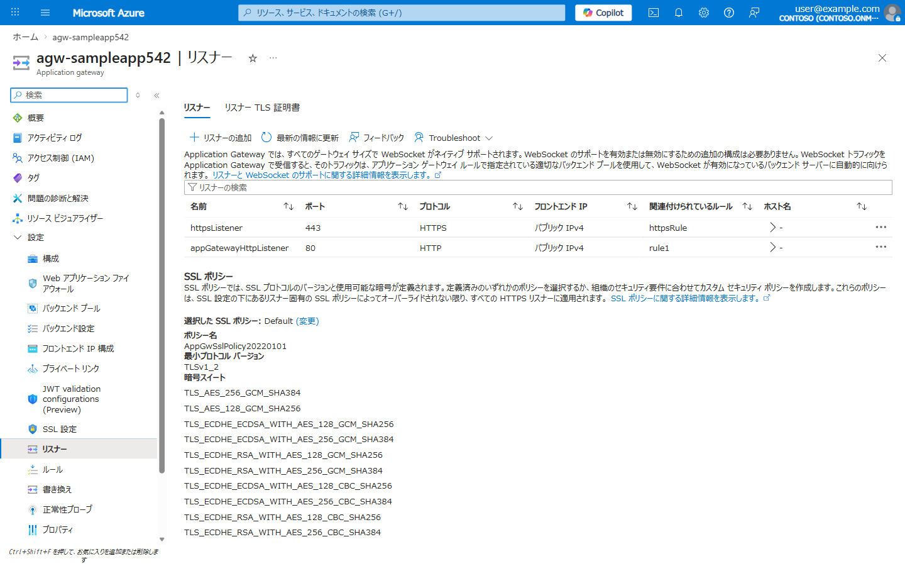

**ルール**: `rule1` (HTTP, 優先度 100) と `httpsRule` (HTTPS, 優先度 200) がそれぞれのリスナーに紐づき、バックエンドプールにルーティングします。

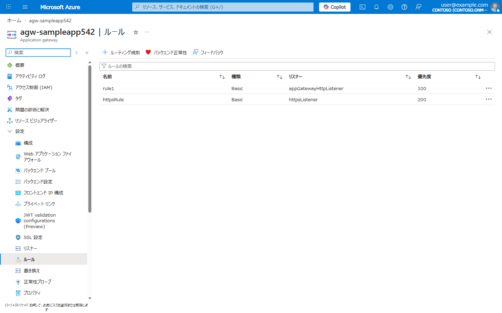

## Step 7: Application Gateway の診断ログ有効化

要件: 「監査ログとして記録・監視」「WAF ログの分析」

```bash
# AppGW のリソース ID を取得
AGW_ID=$(az network application-gateway show \
  --name "agw-${PREFIX}" \
  --resource-group $RG_NAME \
  --query id -o tsv)

# Log Analytics のリソース ID を取得
LAW_RESOURCE_ID=$(az monitor log-analytics workspace show \
  --resource-group $RG_NAME \
  --workspace-name "law-${PREFIX}-dev" \
  --query id -o tsv)

# 診断設定を有効化 (WAF ログ + アクセスログ + メトリクス)
az monitor diagnostic-settings create \
  --name "agw-diagnostics" \
  --resource "$AGW_ID" \
  --workspace "$LAW_RESOURCE_ID" \
  --logs '[
    {"category":"ApplicationGatewayAccessLog","enabled":true},
    {"category":"ApplicationGatewayFirewallLog","enabled":true},
    {"category":"ApplicationGatewayPerformanceLog","enabled":true}
  ]' \
  --metrics '[{"category":"AllMetrics","enabled":true}]'
```

**Azure Portal での確認**: AppGW の診断設定画面でログが Log Analytics に送信される設定を確認します。

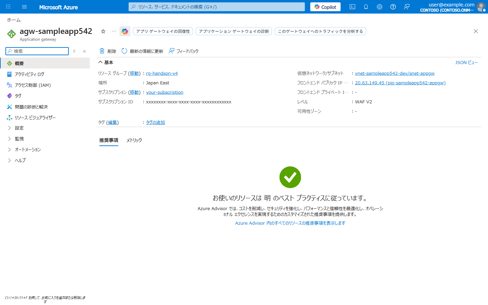

## Step 8: WAF ルールと Private Endpoint のテスト

```bash
# AppGW の FQDN を設定
AGW_FQDN="${PREFIX}.japaneast.cloudapp.azure.com"

echo "Application Gateway FQDN: $AGW_FQDN"

# --- AppGW 経由のアクセス (正常: HTTP) ---
curl -s "http://${AGW_FQDN}/" -o /dev/null -w "AppGW HTTP:  HTTP %{http_code}\n"
# → 200 OK が返れば AppGW → PE → SWA の経路が正常

# --- AppGW 経由のアクセス (正常: HTTPS) ---
# -k: 自己署名証明書のため証明書検証をスキップ
curl -sk "https://${AGW_FQDN}/" -o /dev/null -w "AppGW HTTPS: HTTP %{http_code}\n"
# → 200 OK が返れば SSL 終端が正常に動作

# --- SQLi テスト (WAF でブロックされるべき) ---
curl -sk "https://${AGW_FQDN}/?id=1%20OR%201=1" -o /dev/null -w "SQLi テスト:  HTTP %{http_code}\n"
# → 403 Forbidden が返れば WAF が正常に動作

# --- XSS テスト ---
curl -sk "https://${AGW_FQDN}/?q=<script>alert(1)</script>" -o /dev/null -w "XSS テスト:   HTTP %{http_code}\n"
# → 403 Forbidden が返れば WAF が正常に動作

# --- SWA への直接アクセス (Private Endpoint で遮断) ---
SWA_HOSTNAME=$(az staticwebapp show \
  --name "swa-${PREFIX}" \
  --resource-group $RG_NAME \
  --query "defaultHostname" -o tsv)

curl -s "https://${SWA_HOSTNAME}/" -o /dev/null -w "SWA 直接アクセス: HTTP %{http_code}\n"
# → 403 Forbidden が返れば Private Endpoint が正常に動作
# (パブリックインターネットからの直接アクセスは遮断)
```

期待される結果:

| テスト | 経路 | 期待値 | 説明 |
|------|------|--------|------|
| 正常 (HTTP) | AppGW → PE → SWA | **200** | WAF 通過、PE 経由で SWA に到達 |
| 正常 (HTTPS) | AppGW (SSL終端) → PE → SWA | **200** | SSL 終端 + PE 経由 |
| SQLi | AppGW (WAF) | **403** | WAF がブロック |
| XSS | AppGW (WAF) | **403** | WAF がブロック |
| 直接アクセス | インターネット → SWA | **403** | PE 有効化でパブリック遮断 |

## Step 9: WAF ログの確認

Step 8 のテストで WAF がブロックしたリクエストが Log Analytics に記録されています。KQL でクエリして確認します。

> **注意**: 診断ログが Log Analytics に反映されるまで**数分～10分程度**かかる場合があります。

Azure Portal → **Log Analytics ワークスペース** (`law-${PREFIX}-dev`) → 左メニュー「**ログ**」 → 右上のドロップダウンを **KQL モード** に切り替えてから、以下のクエリをコピー & 実行してください。

### クエリ 1: WAF ブロックログ一覧

```kql
AzureDiagnostics
| where ResourceType == "APPLICATIONGATEWAYS"
| where Category == "ApplicationGatewayFirewallLog"
| where action_s == "Blocked"
| project TimeGenerated, clientIp_s, requestUri_s, ruleId_s, details_message_s, action_s
| order by TimeGenerated desc
| take 50
```

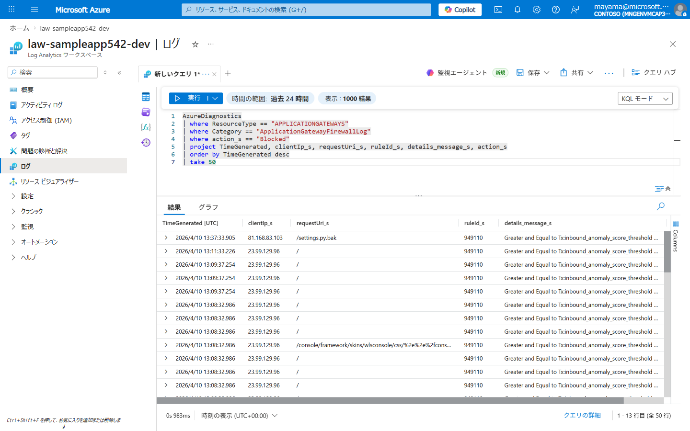

**結果の見方**:

| カラム | 説明 |
| --- | --- |
| `TimeGenerated` | ブロックされた日時 (UTC) |
| `clientIp_s` | 攻撃元の IP アドレス |
| `requestUri_s` | アクセス先 URL。`/settings.py.bak` や `/console/...` など脆弱性スキャンのパスが見られる |
| `ruleId_s` | WAF ルール ID。`949110` は異常スコア超過による最終ブロック判定 |
| `details_message_s` | ブロック理由の詳細メッセージ |
| `action_s` | 常に `Blocked` (Prevention モードの場合) |

> **ポイント**: Step 8 で実行した SQLi / XSS テストだけでなく、インターネット上のボットによる自動スキャン (WebLogic 脆弱性, パストラバーサル等) も WAF がリアルタイムでブロックしていることが確認できます。

### クエリ 2: ルールグループ別ブロック件数

```kql
AzureDiagnostics
| where Category == "ApplicationGatewayFirewallLog"
| where action_s in ("Blocked", "Matched")
| where ruleGroup_s != "BLOCKING-EVALUATION" and ruleGroup_s != ""
| summarize count() by ruleGroup_s
| order by count_ desc
```

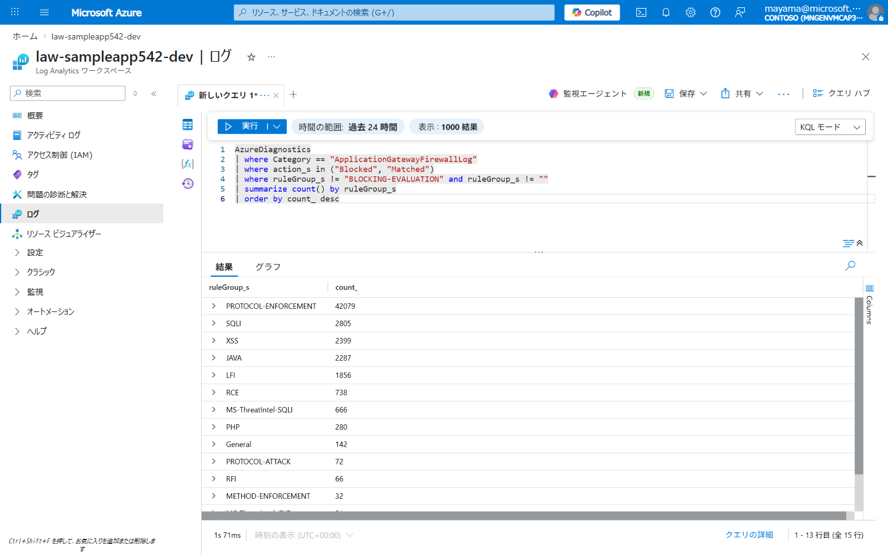

**結果の見方**:

| ルールグループ | 攻撃カテゴリ | 説明 |
| --- | --- | --- |
| `PROTOCOL-ENFORCEMENT` | プロトコル違反 | Host ヘッダーなし、User-Agent なし等の不正リクエスト |
| `SQLI` | SQL インジェクション | `OR 1=1` 等の SQL 構文を含むリクエスト |
| `XSS` | クロスサイトスクリプティング | `<script>` タグ等を含むリクエスト |
| `JAVA` | Java 脆弱性 | Log4Shell (JNDI) 等の Java 固有の攻撃 |
| `LFI` | ローカルファイルインクルージョン | `../../etc/passwd` 等のパストラバーサル |
| `RCE` | リモートコード実行 | Unix シェルコマンドの注入 |
| `MS-ThreatIntel-SQLI` | Microsoft 脅威インテル | Microsoft 独自の SQLi 検知ルール |
| `PHP` | PHP 脆弱性 | PHP 固有の攻撃 |

> **確認ポイント**: WAF を公開してわずかな時間でも、インターネット上のボットが自動的に攻撃スキャンを行っていることがわかります。WAF がなければこれらのリクエストがアプリケーションに直接到達していたことになります。

### (参考) CLI から確認する場合

```bash
LAW_ID=$(az monitor log-analytics workspace show \
  --resource-group $RG_NAME \
  --workspace-name "law-${PREFIX}-dev" \
  --query customerId -o tsv)

az monitor log-analytics query \
  --workspace "$LAW_ID" \
  --analytics-query 'AzureDiagnostics | where Category == "ApplicationGatewayFirewallLog" | where action_s == "Blocked" | project TimeGenerated, clientIp_s, requestUri_s, ruleId_s, ruleGroup_s, details_message_s | order by TimeGenerated desc | take 10' \
  --timespan P1D \
  -o table
```

> **注意**: `--workspace` には **Customer ID** (GUID) を指定します。ワークスペース名ではなく `--query customerId` で取得した値です。

## Step 10: Entra ID カスタム認証の構成 → Lab 08 (オプション) へ移動

PE 有効環境での Entra ID 認証には、カスタム認証プロバイダーの構成や AppGW Rewrite Rule による Location ヘッダー書き換えなど、追加の設定が必要です。この構成は複雑なため、**オプション Lab** として分離しました。

> **認証を試す場合**: [Lab 08: Entra ID 認証 (オプション)](lab08-auth-optional.md) を参照してください。

---

## Part B: Key Vault & シークレット管理

要件: 「暗号化に使用した鍵は保護されたストレージで安全に保管し、定期的なローテーション」

## Step 11: Key Vault の作成

```bash
# Key Vault の作成
# 要件: ソフトウェア方式の認証、RBAC でアクセス制御
az keyvault create \
  --name "kv-${PREFIX}" \
  --resource-group $RG_NAME \
  --location $LOCATION \
  --enable-rbac-authorization true \
  --enable-purge-protection true \
  --retention-days 90 \
  --sku standard

# 確認
az keyvault show --name "kv-${PREFIX}" \
  --query "{name:name, vaultUri:properties.vaultUri, rbac:properties.enableRbacAuthorization}" \
  -o json
```

**Azure Portal での確認**: Key Vault の概要画面で RBAC が有効化されていることを確認します。

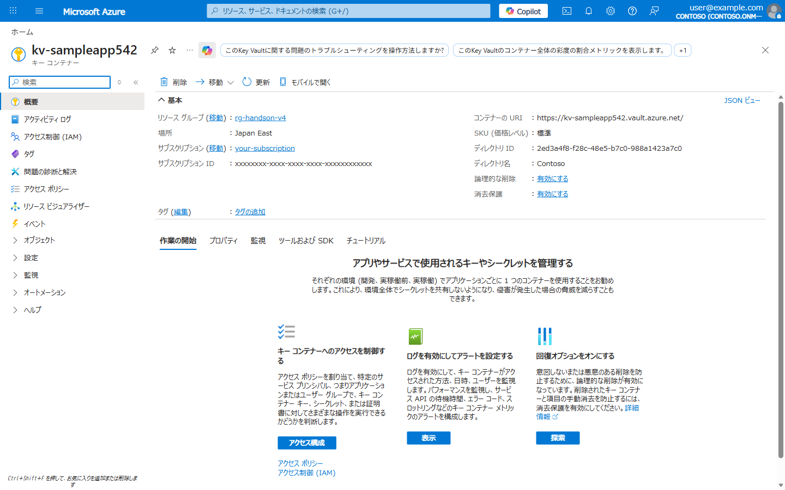

**ポイント**:
- `--enable-rbac-authorization true`: Azure RBAC でアクセス制御 (要件: ロールベースアクセス制御)
- `--enable-purge-protection true`: 削除からの保護 (要件: データの減失防止)

## Step 12: シークレットの保存と RBAC の設定

要件: 「利用者の職務に応じてアクセス権を制御する機能」「最小特権の原則」

```bash
# 現在のユーザーの Object ID を取得
USER_OBJECT_ID=$(az ad signed-in-user show --query id -o tsv)

# Key Vault Secrets Officer ロールを付与 (シークレットの読み書き)
az role assignment create \
  --role "Key Vault Secrets Officer" \
  --assignee "$USER_OBJECT_ID" \
  --scope "/subscriptions/$(az account show --query id -o tsv)/resourceGroups/${RG_NAME}/providers/Microsoft.KeyVault/vaults/kv-${PREFIX}"

# データベース接続文字列をシークレットとして保存
# 要件: 保護すべき情報を暗号化して保存
az keyvault secret set \
  --vault-name "kv-${PREFIX}" \
  --name "db-connection-string" \
  --value "Host=pgserver.postgres.database.azure.com;Database=sampledb;Username=appuser" \
  --content-type "text/plain"

# シークレットの取得確認
az keyvault secret show \
  --vault-name "kv-${PREFIX}" \
  --name "db-connection-string" \
  --query "{name:name, created:attributes.created}" -o json
```

**Azure Portal での確認**: Key Vault のシークレット画面で `db-connection-string` が保存されていることを確認します。

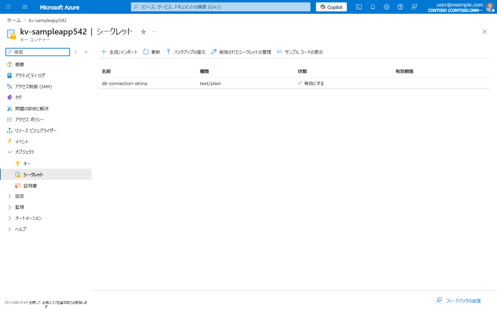

## Step 13: RBAC ロールの確認と最小特権の原則

```bash
# Key Vault に定義済みのビルトインロール一覧
az role definition list \
  --query "[?contains(roleName, 'Key Vault')].{roleName:roleName, description:description}" \
  -o table

# 現在のロール割り当ての確認
az role assignment list \
  --scope "/subscriptions/$(az account show --query id -o tsv)/resourceGroups/${RG_NAME}/providers/Microsoft.KeyVault/vaults/kv-${PREFIX}" \
  --query "[].{principalName:principalName, roleDefinitionName:roleDefinitionName}" \
  -o table
```

### 要件対応: 主なロールと権限の対応

| 役割 (要件定義) | Azure RBAC ロール | 権限 |
|----------------|-------------------|------|
| システム管理者 | Key Vault Administrator | 鍵/シークレット/証明書の完全管理 |
| アプリケーション | Key Vault Secrets User | シークレットの読み取りのみ |
| 運用保守事業者 | Key Vault Secrets Officer | シークレットの読み書き |
| 監査担当 | Key Vault Reader | メタデータの読み取りのみ |

**Azure Portal での確認**: Key Vault のアクセス制御 (IAM) 画面でロール割り当てを確認します。

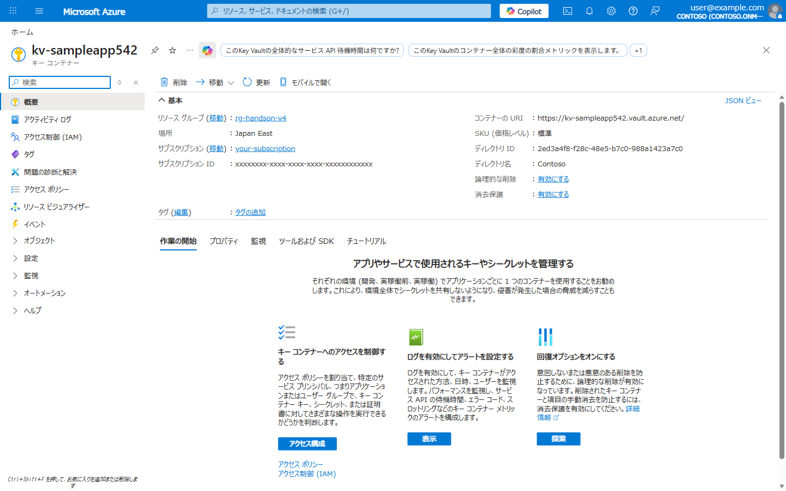

## Step 14: マネージド ID でアプリからシークレットにアクセス

要件: 「マネージドサービスを最大限活用」「最小特権の原則」

Lab02 で作成した単体 Functions App (Linked Backend) のマネージド ID を使って、Key Vault にパスワードレスでアクセスします。

```bash
# Lab02 で作成した Functions App のマネージド ID の Object ID を取得
APP_IDENTITY=$(az functionapp identity show \
  --name "func-${PREFIX}-api" \
  --resource-group $RG_NAME \
  --query "principalId" -o tsv)

echo "Functions App マネージド ID: $APP_IDENTITY"

# Key Vault Secrets User ロールを付与 (読み取りのみ = 最小特権)
az role assignment create \
  --role "Key Vault Secrets User" \
  --assignee "$APP_IDENTITY" \
  --scope "/subscriptions/$(az account show --query id -o tsv)/resourceGroups/${RG_NAME}/providers/Microsoft.KeyVault/vaults/kv-${PREFIX}"

echo "マネージド ID に Key Vault の読み取り権限を付与しました"
```

**Azure Portal での確認**: Functions App の ID ブレードでシステム割り当てマネージド ID が「オン」になっていることを確認します。

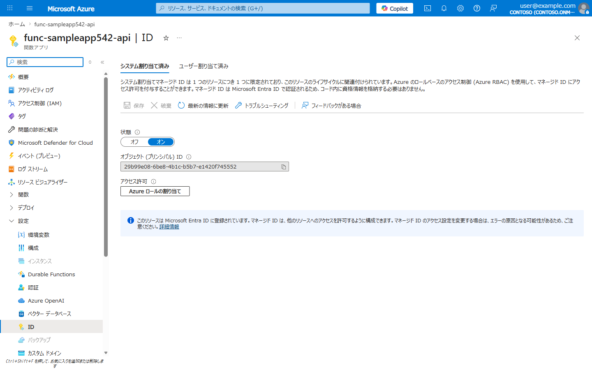

**追加確認 (推奨)**: Key Vault のアクセス制御 (IAM) → **ロールの割り当て** で、Functions App のマネージド ID に **Key Vault Secrets User** が付与されていることを確認します。

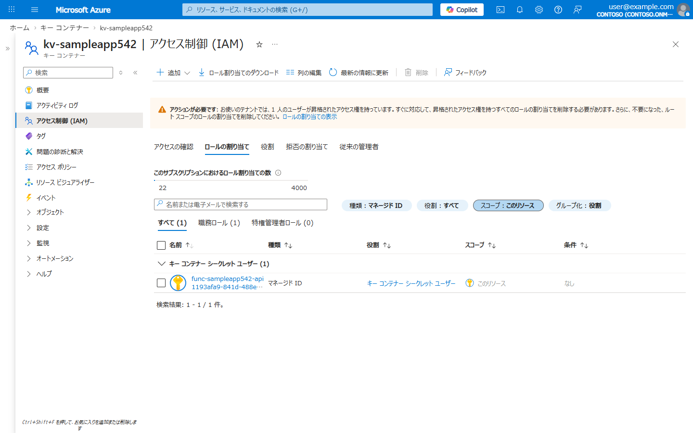

**Linked Backend 構成のメリット**: この Functions App は SWA の `/api/*` として Linked Backend 経由でアクセスされます。マネージド ID は Key Vault だけでなく、PostgreSQL や Blob Storage へのパスワードレス接続にも活用できます。

```
SWA (/api/*) → Functions App (マネージド ID) → Key Vault   ✓
                                              → PostgreSQL ✓
                                              → Blob Storage ✓
```

## Step 15: Key Vault の診断ログ有効化

要件: 「利用記録、例外的事象のログを蓄積し3年間保管」「監査ログとして記録・監視」

```bash
# Key Vault のリソース ID を取得
KV_ID=$(az keyvault show --name "kv-${PREFIX}" --query id -o tsv)

# Log Analytics のリソース ID を取得
LAW_RESOURCE_ID=$(az monitor log-analytics workspace show \
  --resource-group $RG_NAME \
  --workspace-name "law-${PREFIX}-dev" \
  --query id -o tsv)

# 診断設定を有効化 (監査ログ + メトリクス)
az monitor diagnostic-settings create \
  --name "kv-diagnostics" \
  --resource "$KV_ID" \
  --workspace "$LAW_RESOURCE_ID" \
  --logs '[{"category":"AuditEvent","enabled":true}]' \
  --metrics '[{"category":"AllMetrics","enabled":true}]'
```

**Azure Portal での確認**: Key Vault の診断設定画面で監査ログが Log Analytics に送信されることを確認します。


## Step 16: Microsoft Defender for Cloud の確認

要件: 「脆弱性の有無を確認」「自動化された脆弱性スキャン」

```bash
# Defender for Cloud の状態を確認
az security pricing list \
  --query "[].{name:name, pricingTier:pricingTier}" -o table

# セキュリティ推奨事項の確認 (既存のものがあれば)
az security assessment list \
  --query "[?resourceDetails.source=='Azure'].{name:displayName, status:status.code}" \
  -o table 2>/dev/null || echo "推奨事項はポータルで確認してください"
```

**Azure Portal での確認**: Microsoft Defender for Cloud の環境設定画面を確認します。

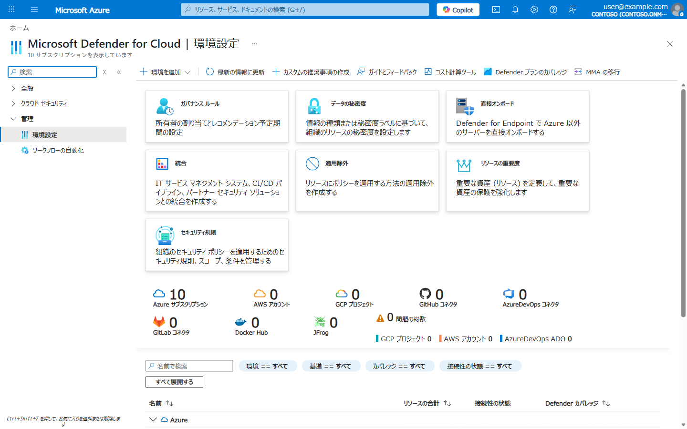

> **ポータル確認**: Azure Portal → Microsoft Defender for Cloud → 推奨事項  
> Key Vault、ストレージ、Static Web Apps 等のセキュリティ推奨事項が表示されます。

## Step 17: ネットワークセキュリティの確認

要件: 「通信回線を暗号化する機能」「不正アクセス対策」

Step 1～9 では、**Application Gateway + WAF**、**Private Endpoint**、**HTTPS/TLS 終端** により、Web フロント経路のネットワークセキュリティを確認しました。ここでは追加で、**Key Vault 側のネットワーク公開範囲** と **データ層サブネットの NSG** を確認します。

```bash
# Key Vault のネットワーク設定確認
az keyvault show --name "kv-${PREFIX}" \
  --query "{publicNetworkAccess:properties.publicNetworkAccess, networkAcls:properties.networkAcls}" \
  -o json

# (任意) Key Vault を Private Endpoint 経由のみに制限
# これにより、VNet 外からのアクセスが遮断される
# az keyvault update --name "kv-${PREFIX}" --default-action Deny

# NSG ルールの確認 (Lab01 で作成済み)
az network nsg rule list \
  --resource-group $RG_NAME \
  --nsg-name "nsg-${PREFIX}-data-dev" \
  -o table
```

**Azure Portal での確認**: NSG のセキュリティルール画面で、データ層サブネットへのアクセス制御を確認します。

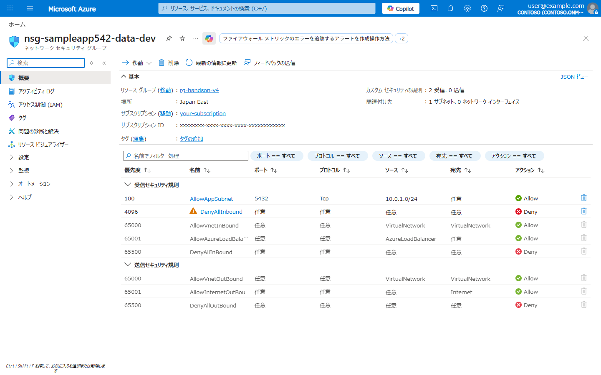

---

## 補足: JIT 権限付与の概念

要件: 「JIT（ジャストインタイム）権限付与で一時的な昇格、ワークフロー承認必須」

Azure では **Microsoft Entra Privileged Identity Management (PIM)** でこれを実現します:

```
通常時                    JIT 昇格時
┌────────────┐           ┌────────────┐
│ ユーザー    │  承認要求  │ ユーザー    │
│ (閲覧権限)  │ ────────▶ │ (管理権限)  │ ← 時限付き (例: 8時間)
└────────────┘  承認者が   └────────────┘
                 承認
```

> PIM は Entra ID P2 ライセンスが必要なため、本ハンズオンでは概念説明のみとします。

---

## 理解度チェック

- [ ] SWA の Private Endpoint を作成し、パブリックアクセスが遮断されることを確認した
- [ ] Application Gateway + WAF を作成し、バックエンドに SWA PE を設定した
- [ ] WAF が SQLi / XSS をブロックすることを確認した
- [ ] Key Vault を作成しシークレットを保存できた
- [ ] RBAC でロールを割り当て、最小特権の原則を体験した
- [ ] マネージド ID でパスワードレスなアクセスを設定した
- [ ] 診断ログを Log Analytics に送信する設定を行った

### 要件 → Azure 実装の対応表

| 要件定義書の記載 | Azure での実装 |
|------------------|---------------|
| L3～L7 層での攻撃対策 | Application Gateway v2 + WAF (DRS 2.1) |
| DDoS / サービス不能化防止 | WAF レートリミットルール |
| Web 特有の攻撃対策 | WAF マネージドルール (SQLi, XSS) |
| 暗号鍵の安全な保管 | Azure Key Vault (purge protection 有効) |
| RBAC / 最小特権 | Azure RBAC ビルトインロール |
| 認証はクラウド機能を活用 | マネージド ID (パスワードレス) + SWA Easy Auth (カスタム Entra ID) → [Lab08](lab08-auth-optional.md) で構成 |
| JIT 権限付与 | Microsoft Entra PIM |
| 監査ログの蓄積 | 診断設定 → Log Analytics |
| 脆弱性スキャン | Microsoft Defender for Cloud |
| パブリックアクセス遮断 | SWA Private Endpoint + networking.allowedIpRanges |
| 通信経路の暗号化 | TLS 1.2+ (AppGW SSL 終端), Private Endpoint |
| SIEM | Microsoft Sentinel (Log Analytics 連携) |

---

**次のステップ**: [Lab 04: 監視・可用性・自動復旧](lab04-monitoring.md)
