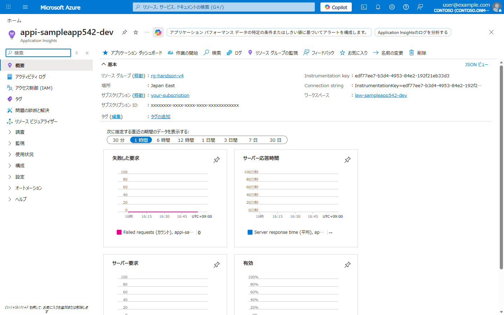
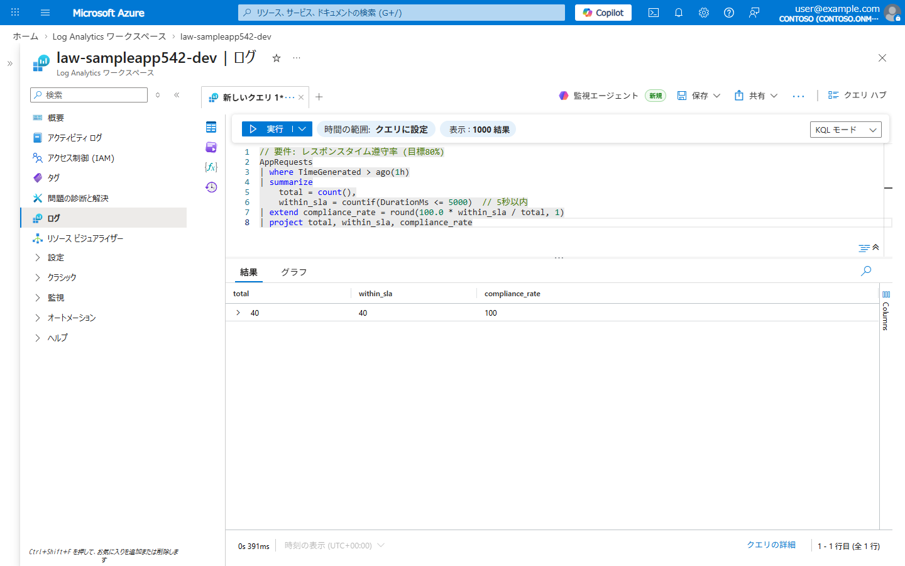
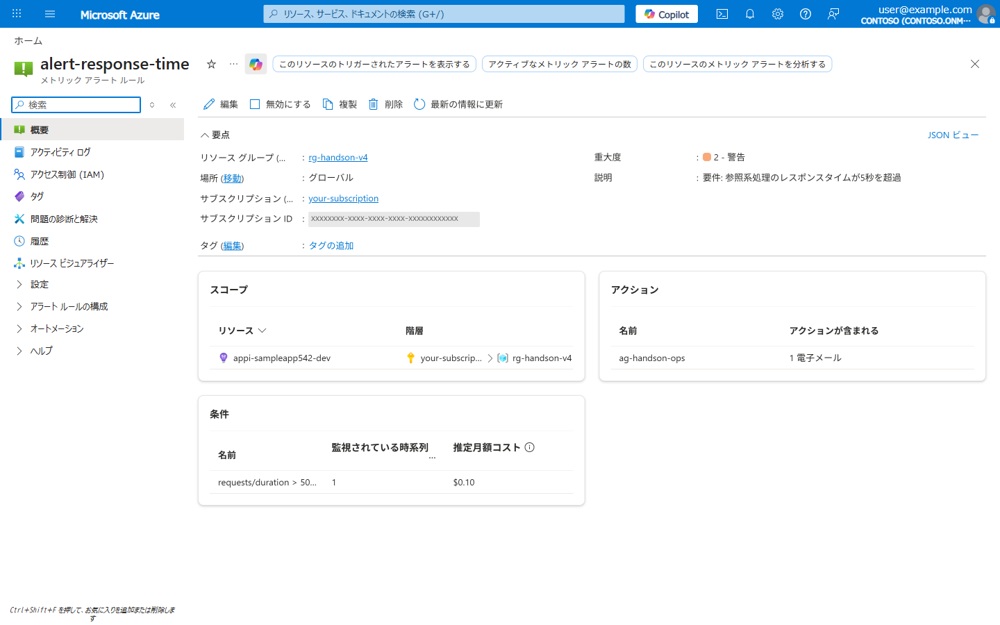
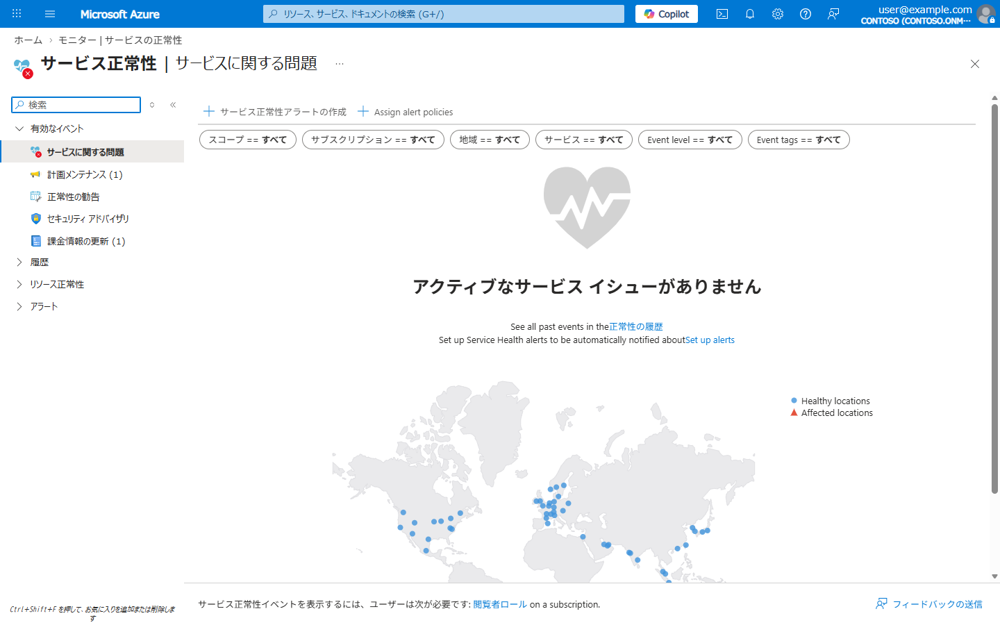
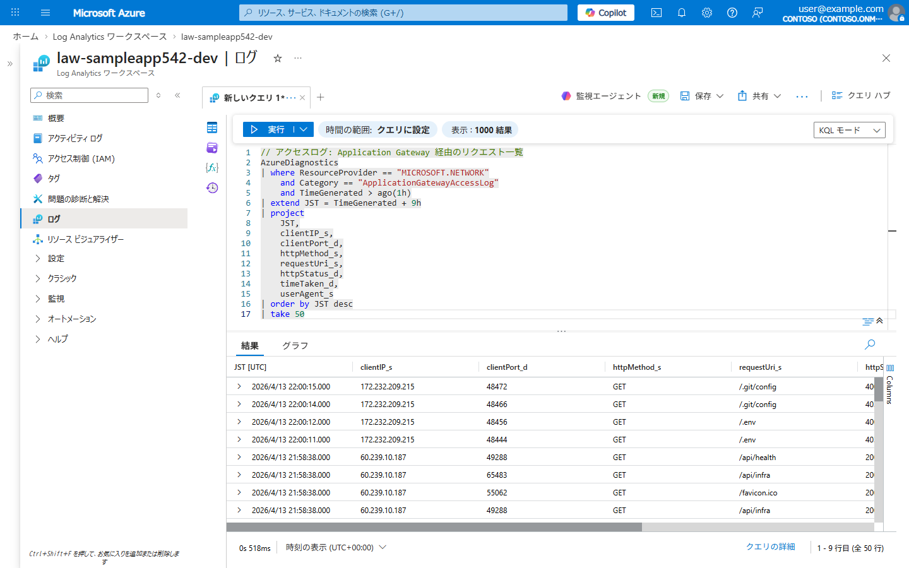
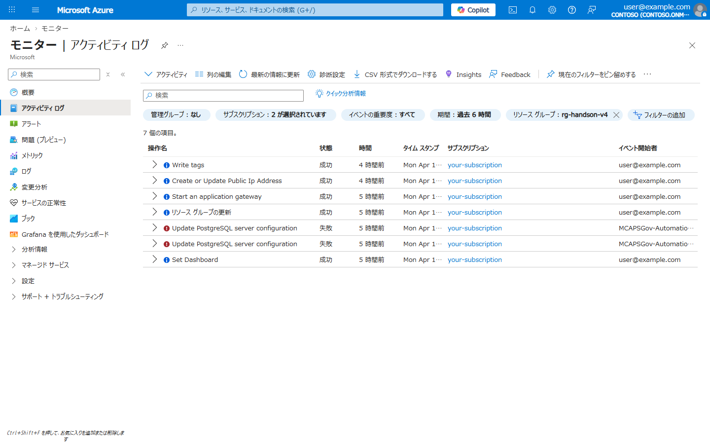
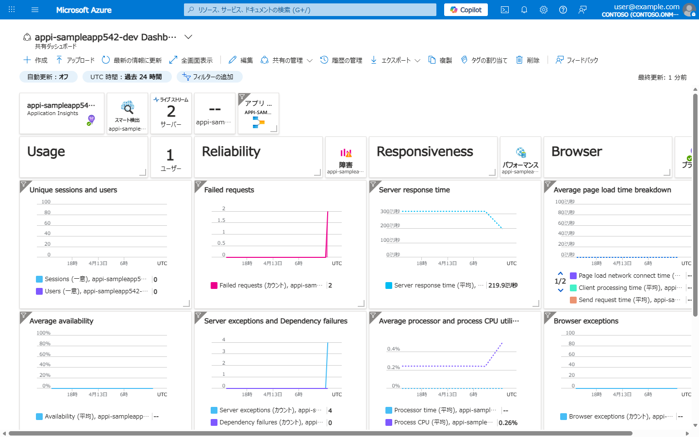
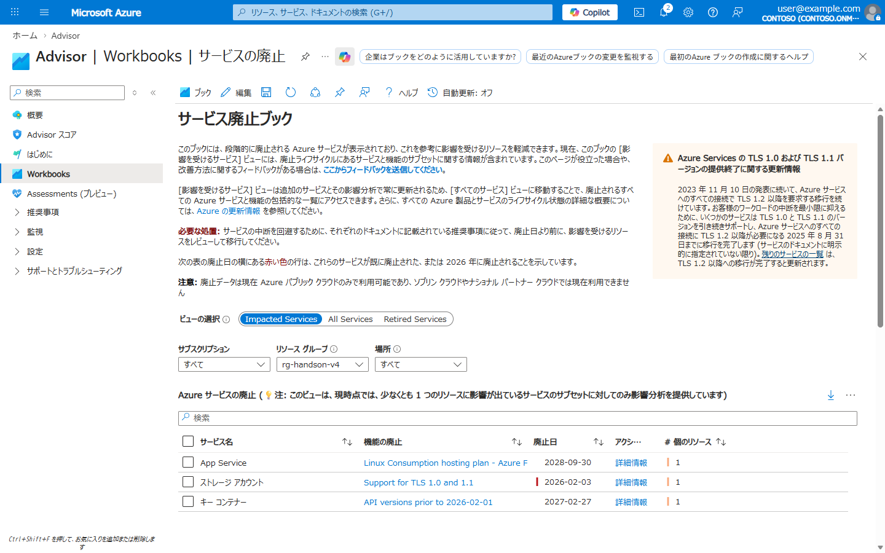

# Lab 04: 監視・可用性・自動復旧

> **所要時間**: 45分  
> **対応する要件**: 3.5 信頼性, 3.4 性能, 3.9 継続性  
> **前提**: Lab 03 完了済み

---

## この Lab で学ぶこと

| 要件定義書の記載 | Azure での実装 |
|------------------|---------------|
| 稼働率 99.5% | **SWA グローバル分散 + Functions 自動スケール** |
| 24時間365日監視 | **Azure Monitor + Log Analytics** |
| 障害やアラートを検知し自動通知 | **Azure Monitor アラートルール** |
| ダッシュボード等による状況の可視化 | **Azure ダッシュボード + ブック** |
| 参照系 5秒以内 / 更新系 7秒以内 | **Application Insights のパフォーマンス監視** |
| 障害が発生したコンポーネントを切り離しシステム全体を停止させない | **SWA グローバル CDN + Functions 自動復旧** |

---

## アジェンダ

- [Step 1: Application Insights でパフォーマンス監視を設定](#step-1-application-insights-でパフォーマンス監視を設定)
- [Step 2: アラートルールの作成](#step-2-アラートルールの作成)
- [Step 3: SWA の可用性確認](#step-3-swa-の可用性確認)
- [Step 4: Log Analytics でクエリを実行](#step-4-log-analytics-でクエリを実行)
- [Step 5: Azure ダッシュボードの確認](#step-5-azure-ダッシュボードの確認)
- [Step 6: Advisor サービス廃止ブックの確認](#step-6-advisor-サービス廃止ブックの確認)
- [理解度チェック](#理解度チェック)

---

## Step 1: Application Insights でパフォーマンス監視を設定

要件: 「レスポンスタイムの遵守率80%以上」

> **注意**: `az monitor app-insights` コマンドの初回実行時に `application-insights` 拡張のインストールを求められます。`Y` を入力してインストールしてください。
> 事前にインストールする場合: `az extension add --name application-insights`

```bash
# Application Insights の接続文字列を取得
APPI_CONN=$(az monitor app-insights component show \
  --app "appi-${PREFIX}-dev" \
  --resource-group $RG_NAME \
  --query "connectionString" -o tsv)

# Static Web Apps の Managed Functions に Application Insights を設定
az staticwebapp appsettings set \
  --name "swa-${PREFIX}" \
  --resource-group $RG_NAME \
  --setting-names "APPLICATIONINSIGHTS_CONNECTION_STRING=$APPI_CONN"

echo "Application Insights の接続文字列を SWA に設定しました"
```

**確認 1**: Azure Portal で Application Insights の概要を確認できます。



**確認 2**: Azure Portal の **Log Analytics ワークスペース** (`law-${PREFIX}-dev`) → **ログ** で以下の KQL を実行し、`compliance_rate` が **80以上** であることを確認します。

> **補足**: データが少ない場合は、先にアプリへ数回アクセスしてリクエストを発生させてから実行してください。

```kql
// 要件: レスポンスタイム遵守率 (目標80%)
AppRequests
| where TimeGenerated > ago(1h)
| summarize
    total = count(),
    within_sla = countif(DurationMs <= 5000)  // 5秒以内
| extend compliance_rate = round(100.0 * within_sla / total, 1)
| project total, within_sla, compliance_rate
```

**期待値**: `compliance_rate >= 80`



> **補足: 2つの Application Insights リソースについて**  
> リソースグループには `appi-${PREFIX}-dev` と `func-${PREFIX}-api` の 2 つの Application Insights が存在します。
>
> - **`appi-${PREFIX}-dev`**: Lab 01 の Bicep (IaC) で明示的に作成したもの。SWA の Managed Functions に接続文字列を設定し、アプリ全体の監視に使用します。
> - **`func-${PREFIX}-api`**: Azure Functions をデプロイした際に Azure が**自動生成**したもの。Functions ランタイム自体のテレメトリが記録されます。
>
> 本ハンズオンでは **`appi-${PREFIX}-dev`** を使用します。

## Step 2: アラートルールの作成

要件: 「障害やアラートを検知し、重要性等で分類した上で自動で通知する仕組み」

### アラート: レスポンスタイム超過

```bash
# アクショングループの作成 (通知先)
az monitor action-group create \
  --name "ag-handson-ops" \
  --resource-group $RG_NAME \
  --short-name "ops-team" \
  --action email ops-team ops@example.com

# レスポンスタイムアラート (要件: 5秒以内)
APPI_ID=$(az monitor app-insights component show \
  --app "appi-${PREFIX}-dev" \
  --resource-group $RG_NAME \
  --query id -o tsv)

# Git Bash の場合、--scopes のパスが変換されるため MSYS_NO_PATHCONV=1 を付与
MSYS_NO_PATHCONV=1 az monitor metrics alert create \
  --name "alert-response-time" \
  --resource-group $RG_NAME \
  --scopes "$APPI_ID" \
  --condition "avg requests/duration > 5000" \
  --window-size 5m \
  --evaluation-frequency 1m \
  --severity 2 \
  --description "要件: 参照系処理のレスポンスタイムが5秒を超過" \
  --action "ag-handson-ops"
```

**確認**: アラートルールが正しく作成されたことをポータルで確認できます。



### アラート: エラー率上昇

```bash
# HTTP 5xx エラー率アラート
MSYS_NO_PATHCONV=1 az monitor metrics alert create \
  --name "alert-error-rate" \
  --resource-group $RG_NAME \
  --scopes "$APPI_ID" \
  --condition "count requests/failed > 10" \
  --window-size 5m \
  --evaluation-frequency 1m \
  --severity 1 \
  --description "5分間で10件以上のHTTPエラーが発生" \
  --action "ag-handson-ops"
```

## Step 3: SWA の可用性確認

要件: 「SPOF を極力排除」「障害が発生したコンポーネントを切り離し」

> **ポイント**: SWA はグローバルに分散された CDN でホスティングされ、単一障害点が排除されています。  
> Functions もマネージド環境で自動的に復旧されます。  

### Azure サービス正常性の確認

要件: 「クラウドサービスの機能や性能に変更が発生した場合、影響を確認」

可用性はアプリ側だけでなく、**基盤となる Azure サービス自体の正常性**も確認する必要があります。

```bash
# 利用中のサービス (Static Web Apps, Functions, Application Gateway) に
# 現在アクティブなインシデントやメンテナンスがないか確認
az rest --method GET \
  --url "https://management.azure.com/subscriptions/$(az account show --query id -o tsv)/providers/Microsoft.ResourceHealth/events?api-version=2024-02-01&\$filter=eventType eq 'ServiceIssue' or eventType eq 'PlannedMaintenance'" \
  --query "value[?status.value=='Active'].[eventType, title, summary, status.value]" \
  -o table 2>/dev/null || echo "現在アクティブなサービス正常性イベントはありません"
```

**確認**: Azure Portal → **[サービス正常性](https://portal.azure.com/#blade/Microsoft_Azure_Health/AzureHealthBrowseBlade/serviceIssues)** でも同様の情報を確認できます。



> **ポイント**: サービス正常性の確認は障害発生時の初動対応として重要です。  
> アプリのエラーが Azure 側の障害に起因するかを切り分ける際に活用します。  
> Step 6 では、これを**自動通知**するアラートを設定します。

## Step 4: Log Analytics でクエリを実行

要件: 「操作ログやアクセスログ等のシステムログを取得・保管し出力可能」

```bash
# SWA / Functions のログをクエリ (直近30分)
az monitor log-analytics query \
  --workspace "law-${PREFIX}-dev" \
  --analytics-query "AppRequests | where TimeGenerated > ago(30m) | project TimeGenerated, Name, DurationMs, ResultCode | take 20" \
  --timespan PT30M \
  -o table 2>/dev/null || echo "ログが蓄積されるまで数分かかります"
```

### KQL クエリ例: アクセスログと操作ログの確認

Azure Portal の Log Analytics で以下のクエリを実行してみてください:

```kql
// アクセスログ: Application Gateway 経由のリクエスト一覧
AzureDiagnostics
| where ResourceProvider == "MICROSOFT.NETWORK"
    and Category == "ApplicationGatewayAccessLog"
    and TimeGenerated > ago(1h)
| extend JST = TimeGenerated + 9h
| project
    JST,
    clientIP_s,
    clientPort_d,
    httpMethod_s,
    requestUri_s,
    httpStatus_d,
    timeTaken_d,
    userAgent_s
| order by JST desc
| take 50
```



### アクティビティログ（操作ログ）の確認

要件定義の「操作ログ」に対応するのが **アクティビティログ** です。リソースの作成・変更・削除などの管理操作が自動的に記録されます。

1. Azure Portal → **モニター** → **アクティビティ ログ** を開く
2. リソースグループ `rg-handson-v4` でフィルタリング
3. 「操作名」「状態」「イベント開始者」などの列で、誰がいつ何を操作したかを確認



> **ポイント**: アクティビティログは Azure が自動的に記録し、**90 日間**保持されます。  
> Log Analytics ワークスペースに転送する設定 (診断設定) を行えば、KQL でクエリしたり、より長期間の保持も可能です。  
> アクセスログ (`AzureDiagnostics`)、アプリケーションログ (`AppRequests`, `AppTraces`)、操作ログ (アクティビティログ) を組み合わせることで、要件定義の「システムログを取得・保管し出力可能」を実現しています。

## Step 5: Azure ダッシュボードの確認

要件: 「ダッシュボード等による状況の可視化」

Application Insights を作成すると、Azure が自動的に **概要ダッシュボード** (`appi-${PREFIX}-dev Dashboard`) を生成します。  
ここでは既存のダッシュボードを開き、可視化の内容を確認します。

### ダッシュボードの確認手順

1. Azure Portal → **[ダッシュボード](https://portal.azure.com/#dashboard)** を開く
2. ダッシュボード名のドロップダウンから **「appi-${PREFIX}-dev Dashboard」** を選択
3. 以下のタイルが自動的に配置されていることを確認:
   - **Usage** — ユーザー数・セッション数
   - **Reliability** — 失敗したリクエスト数
   - **Responsiveness** — サーバーレスポンスタイム
   - **Browser** — ページ読み込み時間
   - **Average availability** — 可用性
   - **Server exceptions and Dependency failures** — 例外・依存関係の障害



> **ポイント**: Application Insights の概要ダッシュボードは自動生成されますが、必要に応じて「編集」からタイルの追加・削除・配置変更が可能です。  
> 運用チーム向けに Log Analytics クエリ結果やリソースグループ一覧を追加するなど、カスタマイズも行えます。

## Step 6: Advisor サービス廃止ブックの確認

要件: 「クラウドサービスの機能や性能に変更が発生した場合、影響を確認」

Azure サービスは段階的に廃止・移行されることがあります。**Advisor のサービス廃止ブック**で、利用中のリソースに影響する廃止予定を事前に把握できます。

### 確認手順

1. Azure Portal → **[Advisor](https://portal.azure.com/#blade/Microsoft_Azure_Expert/AdvisorMenuBlade/overview)** を開く
2. 左メニューの **「Workbooks」** をクリック
3. **「サービス廃止ブック」** (Service Retirement) を選択
4. ビューの選択で **「Impacted Services」** タブを確認
5. サブスクリプション・リソースグループ・場所でフィルタリングし、影響を受けるサービスを特定

**確認**: 廃止予定のサービスと影響を受けるリソース数が一覧表示されます。



> **ポイント**: 廃止日の横にある赤い色のアイコンは、既に廃止済みまたは廃止が間近であることを示します。  
> 「アクション」列の「詳細情報」リンクから、移行手順のドキュメントを確認できます。  
> このブックを定期的に確認することで、廃止に伴うサービス中断を未然に防げます。

---

## 理解度チェック

- [ ] Application Insights をアプリに接続した
- [ ] レスポンスタイム超過のアラートルールを作成した
- [ ] Log Analytics で KQL クエリを実行しログを分析した
- [ ] 要件定義の「稼働率」「レスポンスタイム」がどう監視されるか理解した
- [ ] SWA のグローバル分散による可用性確保の仕組みを理解した
- [ ] Advisor サービス廃止ブックで影響のあるサービスを確認した

### 要件 → Azure 実装の対応表

| 要件定義書の記載 | Azure での実装 |
|------------------|---------------|
| 稼働率 99.5% | SWA グローバル CDN + Functions 自動復旧 + アラート |
| 24時間365日監視 | Azure Monitor + Log Analytics (常時収集) |
| レスポンスタイム監視 | Application Insights + メトリクスアラート |
| ダッシュボード可視化 | Azure ダッシュボード + Application Insights |
| 障害検知と自動通知 | アラートルール + アクショングループ |
| SPOF 排除 | SWA グローバル CDN + Functions 自動復旧 |
| クラウドサービス変更の検知 | Advisor サービス廃止ブック + サービス正常性 |

---

**次のステップ**: [Lab 05: SWA 組込み CI/CD](lab05-cicd.md)
