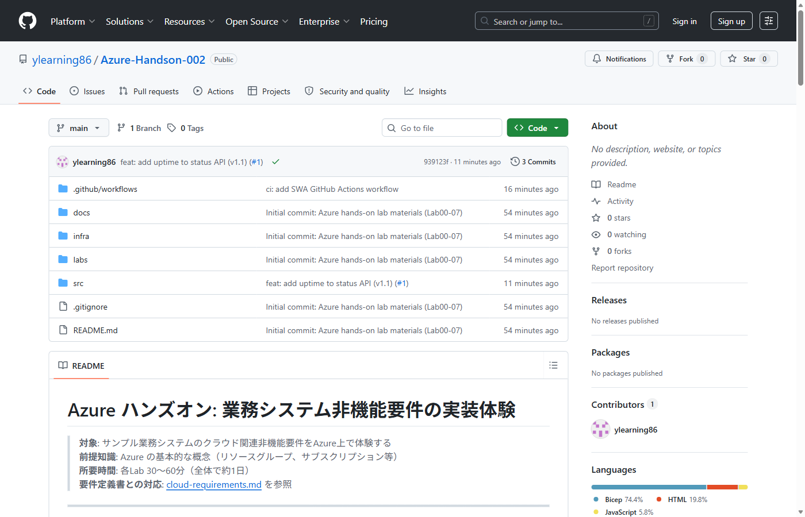
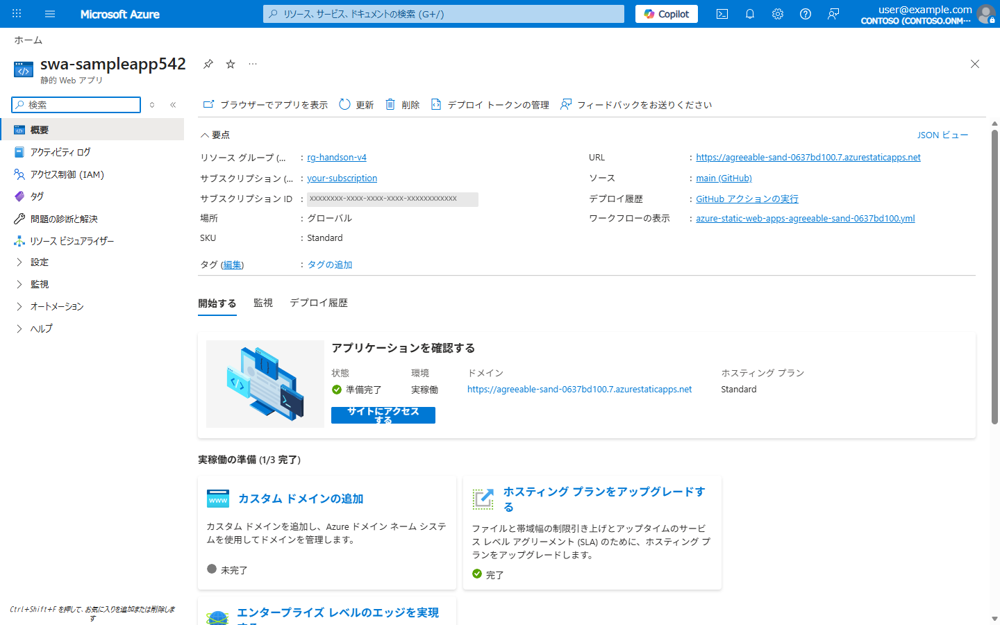
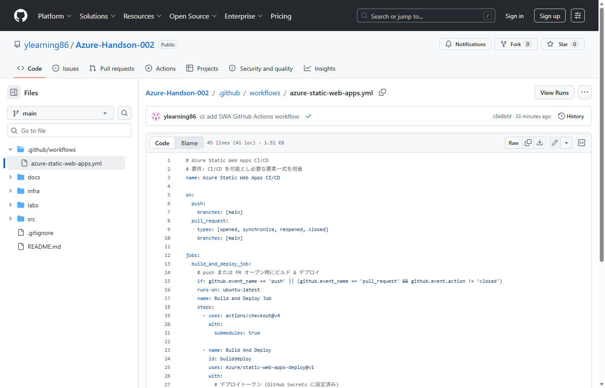
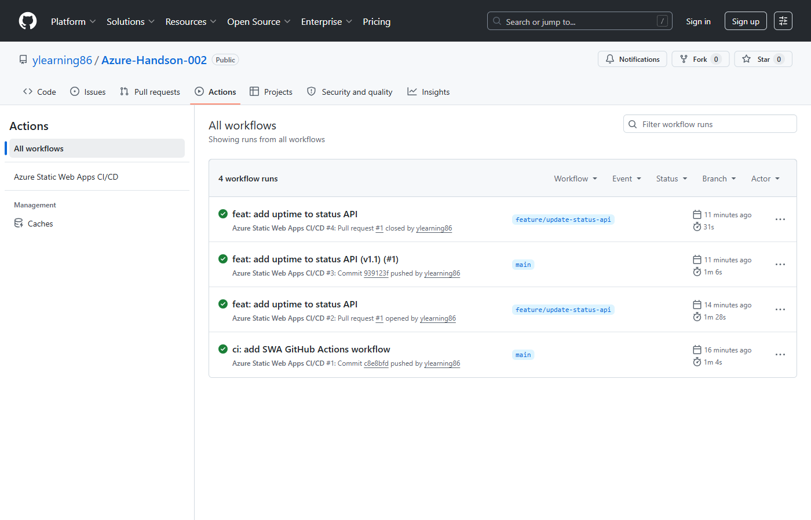
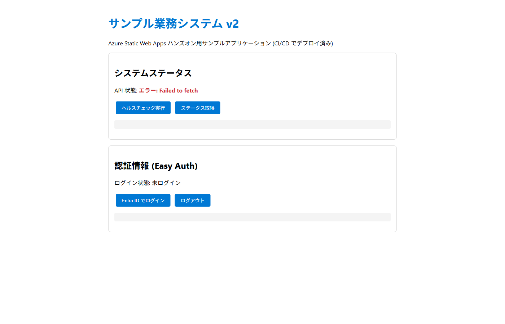
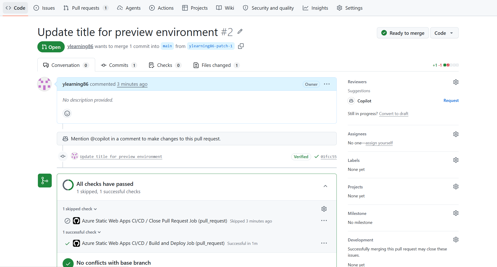
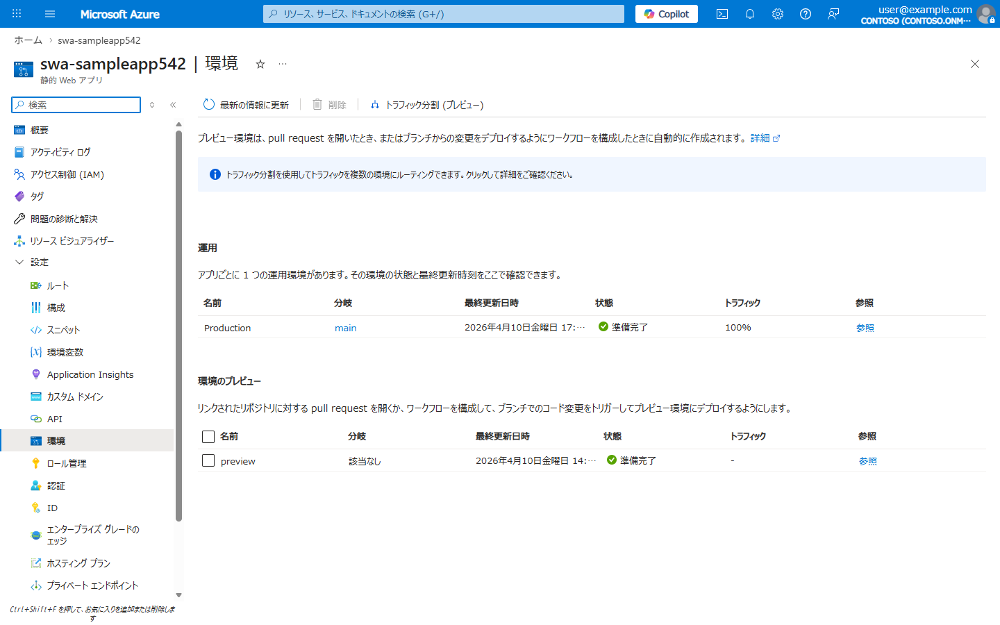
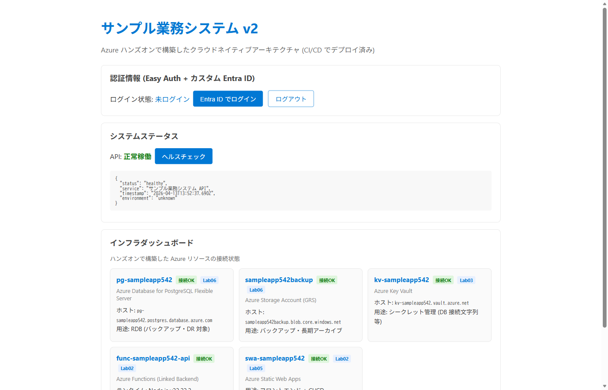

# Lab 05: SWA 組込み CI/CD

> **所要時間**: 30分  
> **対応する要件**: 3.2 開発方式 (CI/CD)  
> **前提**: Lab 02 完了済み、GitHub アカウント

---

## この Lab で学ぶこと

| 要件定義書の記載 | Azure での実装 |
|------------------|---------------|
| CI/CD を可能とし必要な要素一式を用意 | **SWA 組込み GitHub Actions** |
| CI/CD パイプラインにおけるセキュリティの留意点 | デプロイトークン (自動管理) |
| クラウド提供の CI/CD パイプラインと連携 | SWA が GitHub Actions ワークフローを**自動生成** |
| テスト環境で事前検証後に本番環境にリリース | SWA **プレビュー環境** (Pull Request 連携) |

---

## アジェンダ

- [SWA の CI/CD の特長](#swa-の-cicd-の特長)
- [Step 1: GitHub リポジトリの準備](#step-1-github-リポジトリの準備)
- [Step 2: SWA と GitHub リポジトリを連携](#step-2-swa-と-github-リポジトリを連携)
- [Step 3: GitHub Actions ワークフローの作成](#step-3-github-actions-ワークフローの作成)
- [Step 4: CI/CD パイプラインのテスト](#step-4-cicd-パイプラインのテスト)
- [Step 5: プレビュー環境 (Pull Request 連携)](#step-5-プレビュー環境-pull-request-連携)
- [セキュリティ補足: CI/CD パイプラインのセキュリティ](#セキュリティ補足-cicd-パイプラインのセキュリティ)
- [理解度チェック](#理解度チェック)

---

## SWA の CI/CD の特長

Static Web Apps は GitHub/Azure DevOps との**組込み CI/CD**を提供します。これは要件の「クラウド提供の CI/CD パイプラインもしくはマネージドサービスと連携」に直接対応します。

```
従来の構成 (ACA):
  コード → Docker Build → ACR Push → ACA デプロイ (すべて自前構築)

SWA の場合:
  コード → GitHub Push → SWA が自動ビルド&デプロイ (組込み)
  + PR ごとにプレビュー環境を自動作成
```

---

## Step 1: GitHub リポジトリの準備

```bash
# リポジトリを GitHub に作成・プッシュ (まだの場合)
cd /c/git/Azure-Handson-002
git init 2>/dev/null
git add .
git commit -m "handson: SWA + serverless API" 2>/dev/null

# GitHub CLI でリモートを追加 (またはブラウザで作成)
# gh repo create Azure-Handson-002 --public --source=. --remote=origin --push
```

**確認**: GitHub リポジトリにコードがプッシュされていることを確認します。



## Step 2: SWA と GitHub リポジトリを連携

### 方法 A: Azure CLI + GitHub CLI で連携

```bash
# 1. SWA と GitHub リポジトリを接続
GH_TOKEN=$(gh auth token)

az staticwebapp update \
  --name "swa-${PREFIX}" \
  --resource-group $RG_NAME \
  --source "https://github.com/<your-username>/Azure-Handson-002" \
  --branch main \
  --token "$GH_TOKEN"

# 2. SWA のデプロイトークンを GitHub Secrets に登録
SWA_TOKEN=$(az staticwebapp secrets list \
  --name "swa-${PREFIX}" \
  --resource-group $RG_NAME \
  --query "properties.apiKey" -o tsv)

gh secret set AZURE_STATIC_WEB_APPS_API_TOKEN \
  --body "$SWA_TOKEN" \
  --repo <your-username>/Azure-Handson-002

# 3. Secrets が登録されたことを確認
gh secret list --repo <your-username>/Azure-Handson-002
```

> **確認**: `gh secret list` で `AZURE_STATIC_WEB_APPS_API_TOKEN` が表示されれば OK です。
> GitHub の Settings → Secrets and variables → Actions ページでも確認できます。

> **注意**: `az staticwebapp update` の `--app-location` / `--api-location` パラメータは CLI ではサポートされません。ビルド設定はワークフロー YAML で指定します。

### 方法 B: Azure Portal で連携 (推奨)

1. Azure Portal → Static Web Apps → `swa-${PREFIX}`
2. **デプロイの管理** → **GitHub**
3. 以下を設定:
   - リポジトリ: `<your-username>/Azure-Handson-002`
   - ブランチ: `main`
   - ビルドプリセット: **Custom**
   - アプリの場所: `src/web`
   - API の場所: (空白)
   - 出力の場所: (空白)
4. **保存** → GitHub Actions ワークフローが自動生成される

**確認**: SWA 概要ページで「ソース: main (GitHub)」と表示されていれば連携成功です。



## Step 3: GitHub Actions ワークフローの作成

> **注意**: Portal から GitHub 連携した場合はワークフローが自動生成されますが、CLI で連携した場合や既存 SWA の場合は手動作成が必要です。

`.github/workflows/azure-static-web-apps.yml` を作成します:

```yaml
# .github/workflows/azure-static-web-apps-<random>.yml (自動生成)
# 要件: CI/CD を可能とし必要な要素一式を用意
name: Azure Static Web Apps CI/CD

on:
  push:
    branches: [main]
  pull_request:
    types: [opened, synchronize, reopened, closed]
    branches: [main]

jobs:
  build_and_deploy_job:
    if: github.event_name == 'push' || (github.event_name == 'pull_request' && github.event.action != 'closed')
    runs-on: ubuntu-latest
    name: Build and Deploy Job
    steps:
      - uses: actions/checkout@v4
        with:
          submodules: true

      - name: Build And Deploy
        id: builddeploy
        uses: Azure/static-web-apps-deploy@v1
        with:
          # デプロイトークン (GitHub Secrets に自動設定される)
          azure_static_web_apps_api_token: ${{ secrets.AZURE_STATIC_WEB_APPS_API_TOKEN }}
          repo_token: ${{ secrets.GITHUB_TOKEN }}
          action: "upload"
          app_location: "src/web"     # フロントエンド
          api_location: ""              # API は Linked Backend なので空 (重要)
          output_location: ""

  # PR クローズ時にプレビュー環境を自動削除
  close_pull_request_job:
    if: github.event_name == 'pull_request' && github.event.action == 'closed'
    runs-on: ubuntu-latest
    name: Close Pull Request Job
    steps:
      - name: Close Pull Request
        uses: Azure/static-web-apps-deploy@v1
        with:
          azure_static_web_apps_api_token: ${{ secrets.AZURE_STATIC_WEB_APPS_API_TOKEN }}
          action: "close"
```

**ポイント**:
- `AZURE_STATIC_WEB_APPS_API_TOKEN` は SWA が GitHub Secrets に**自動設定**
- OIDC のような追加認証設定が**不要**
- Push と Pull Request の両方に対応
- `api_location` は**空**にしてください。Lab02 で Linked Backend を構成しているため、API は単体 Functions App が処理します。`api_location` に `src/api` を指定すると SWA の Managed Functions としてデプロイされ、Linked Backend と競合します

**確認**: GitHub リポジトリの `.github/workflows/` にワークフロー YAML が登録されていることを確認します。



## Step 4: CI/CD パイプラインのテスト

まず、FQDN 経由でブラウザからアプリの現在の状態を確認しておきます。

**変更前のアプリ画面:**


次に、ソースコードに変更を加えて push します。

```bash
cd src/web

# index.html のタイトルと説明文を変更
sed -i 's/サンプル業務システム (ハンズオン)/サンプル業務システム v2 (ハンズオン)/' index.html
sed -i 's/<h1>サンプル業務システム</<h1>サンプル業務システム v2</' index.html
sed -i 's/ハンズオン用サンプルアプリケーション/ハンズオン用サンプルアプリケーション (CI\/CD でデプロイ済み)/' index.html

git add .
git commit -m "feat: update title to v2 for CI/CD demo"
git push origin main
```

GitHub Actions タブでワークフローの実行を確認してください。



ワークフロー完了後、ブラウザで再度アクセスし、変更が反映されていることを確認します。

**変更後のアプリ画面:**



> **ポイント**: `git push` するだけで、ビルド・デプロイが自動実行され、数分後にはブラウザで変更を確認できます。これが SWA の組込み CI/CD の利便性です。

## Step 5: プレビュー環境 (Pull Request 連携)

要件: 「テスト環境で事前検証後に本番環境にリリース」

SWA は Pull Request ごとに**プレビュー環境を自動作成**します。

```bash
# 新しいブランチで変更
git checkout -b feature/update-status-api

# src/api/status/index.js を変更
# git add . && git commit -m "feat: add uptime to status API"
# git push origin feature/update-status-api

# GitHub で Pull Request を作成
# → SWA がプレビュー環境を自動作成
# → PR コメントにプレビュー URL が投稿される
```

```
main ブランチ  → https://xxx.azurestaticapps.net/         (本番)
PR #1         → https://xxx-1.azurestaticapps.net/        (プレビュー)
PR #2         → https://xxx-2.azurestaticapps.net/        (プレビュー)
```

- レビュアーが**プレビュー URL で動作確認**してからマージ
- PR をクローズすると**プレビュー環境が自動削除**
- これが要件の「テスト環境で事前検証後に本番環境にリリース」に対応

**GitHub PR 画面:**



**Azure Portal の SWA 環境ブレード (Production + プレビュー環境):**



**プレビュー環境のブラウザ表示:**



> **注意**: Lab 03 で Private Endpoint を設定済みの場合、プレビュー環境への直接アクセスは 403 になります。
> プレビュー環境の動作確認は Application Gateway 経由、または Private Endpoint を一時的に無効化して行います。

### プレビュー環境に直接アクセスする場合 (Private Endpoint の一時無効化)

```bash
# 1. Private Endpoint を一時的に削除
az network private-endpoint delete \
  --name "pe-${PREFIX}-swa" \
  --resource-group $RG_NAME

# 2. プレビュー環境の URL を確認
az staticwebapp environment list \
  --name "swa-${PREFIX}" \
  --resource-group $RG_NAME \
  --query "[].{name:buildId, hostname:hostname}" -o table

# 3. ブラウザでプレビュー URL にアクセスして動作確認
#    例: https://xxx-2.eastasia.7.azurestaticapps.net/

# 4. 確認が終わったら Private Endpoint を再作成
MSYS_NO_PATHCONV=1 az network private-endpoint create \
  --name "pe-${PREFIX}-swa" \
  --resource-group $RG_NAME \
  --vnet-name "vnet-${PREFIX}-dev" \
  --subnet snet-pe \
  --private-connection-resource-id "$(az staticwebapp show \
    --name "swa-${PREFIX}" \
    --resource-group $RG_NAME \
    --query id -o tsv)" \
  --group-ids staticSites \
  --connection-name swa-pe-connection

# 5. AGW 経由のアクセスが復旧したことを確認
curl -sk -o /dev/null -w "HTTP Status: %{http_code}\n" \
  "https://${PREFIX}.japaneast.cloudapp.azure.com/"
```

> **注意**: Private Endpoint 削除中は SWA にパブリックからも直接アクセス可能になります。確認後は速やかに再作成してください。

---

## セキュリティ補足: CI/CD パイプラインのセキュリティ

要件: 「CI/CD パイプラインにおけるセキュリティの留意点に関する技術レポート」(DS-202)

| 観点 | SWA での対応 |
|------|-------------|
| シークレット管理 | デプロイトークンは GitHub Secrets に自動格納 |
| 最小特権 | デプロイトークンは SWA リソースのみに限定 |
| 依存部品の脆弱性 | GitHub Dependabot と連携可能 |
| ビルド環境の隔離 | GitHub Actions のエフェメラルランナーを使用 |
| 監査ログ | GitHub Actions のワークフロー実行履歴 |

---

## 理解度チェック

- [ ] SWA と GitHub リポジトリを連携した
- [ ] コードプッシュで自動ビルド・デプロイが実行されることを確認した
- [ ] Pull Request でプレビュー環境が作成される仕組みを理解した
- [ ] SWA の組込み CI/CD のセキュリティ面を理解した

### 要件 → Azure 実装の対応表

| 要件定義書の記載 | Azure での実装 |
|------------------|---------------|
| CI/CD を実現 | SWA 組込み GitHub Actions (自動生成) |
| CI/CD のセキュリティ | デプロイトークン (自動管理) |
| テスト環境で事前検証 | SWA プレビュー環境 (PR 連携) |
| クラウド提供の CI/CD と連携 | SWA ↔ GitHub 組込み連携 |
| 運用保守事業者に引継可能 | ワークフロー YAML は Git 管理 |

---

**次のステップ**: [Lab 06: バックアップ & DR](lab06-backup-dr.md)
