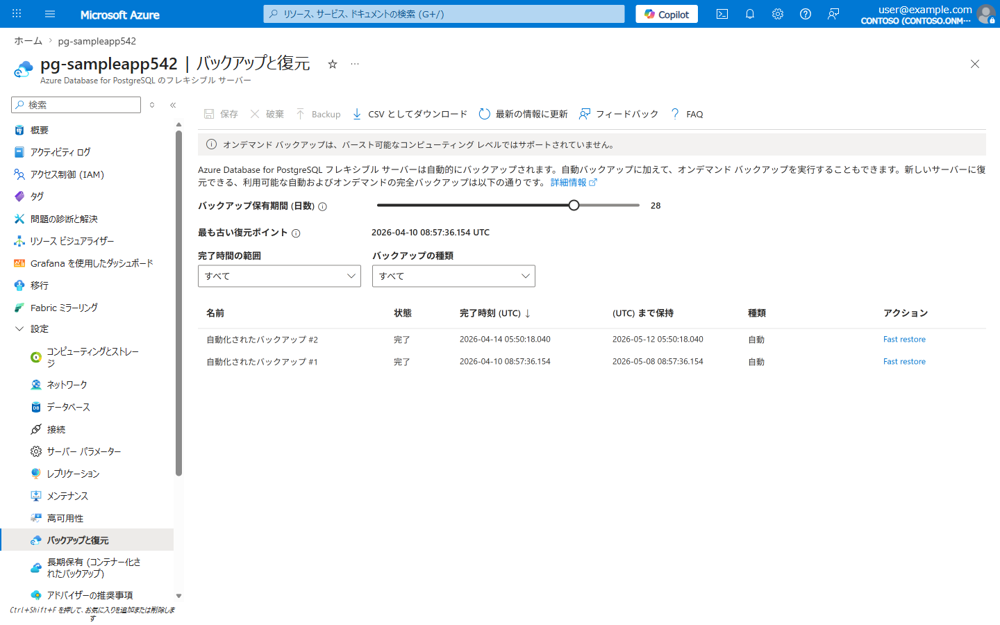
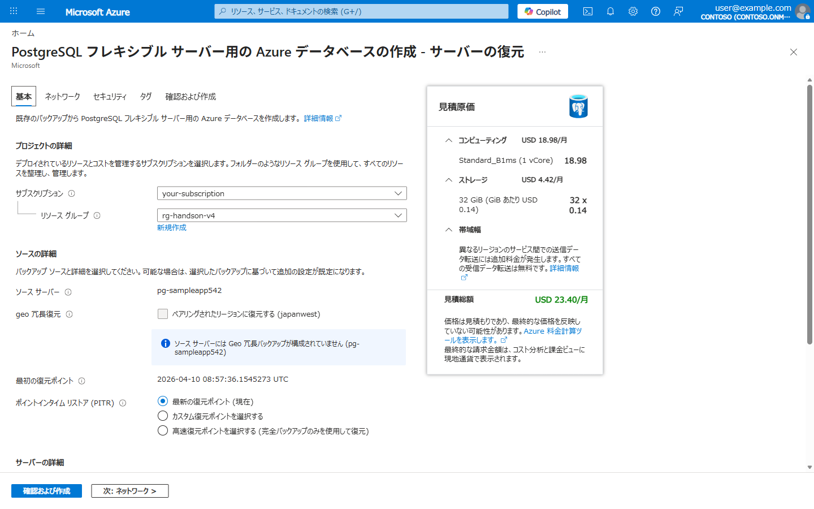
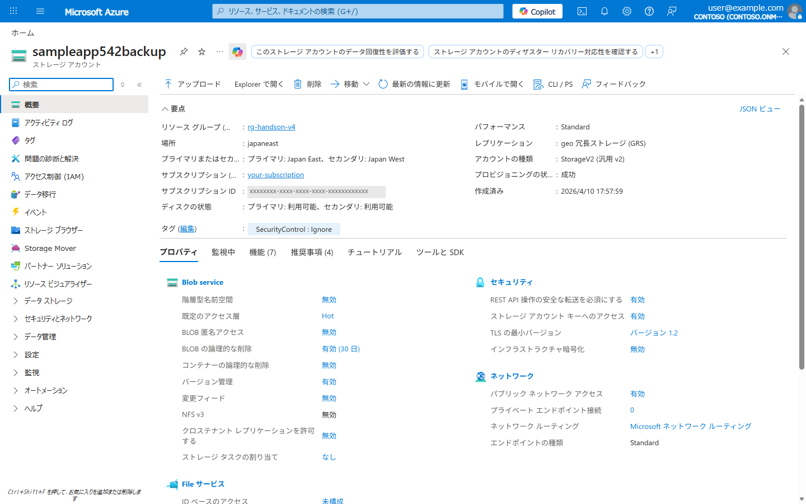
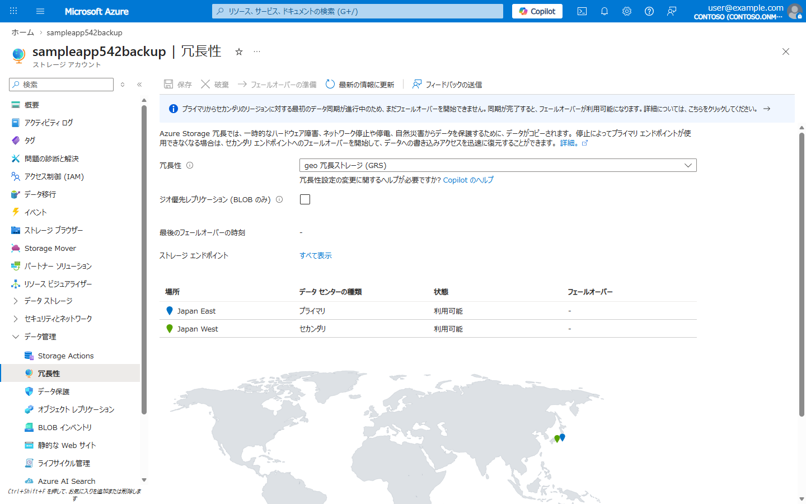

# Lab 06: バックアップ & DR (災害復旧)

> **所要時間**: 45分  
> **対応する要件**: 3.9 継続性に関する事項  
> **前提**: Lab 01 完了済み

---

## この Lab で学ぶこと

| 要件定義書の記載 | Azure での実装 |
|------------------|---------------|
| RTO: 1営業日以内 | **ゾーン冗長 + PITR** |
| RPO: 最新バックアップ / 障害時点 | **PITR (Point-in-Time Restore)** |
| バックアップ頻度: 日次 | **PostgreSQL 自動バックアップ** |
| 3-2-1 ルール、別リージョン隔地保管 | **GRS (Geo-Redundant Storage)**、**Geo-backup** |
| バックアップ保持期間: 4週間 | **バックアップリテンション設定** |
| ログ保管期間: 3年 | **Storage Account への長期アーカイブ** |
| マルチAZ冗長化 | **ゾーン冗長デプロイ** |

---

## アジェンダ

- [Step 1: Azure Database for PostgreSQL Flexible Server の作成](#step-1-azure-database-for-postgresql-flexible-server-の作成)
- [Step 2: バックアップ設定の確認](#step-2-バックアップ設定の確認)
- [Step 3: PITR (Point-in-Time Restore) の体験](#step-3-pitr-point-in-time-restore-の体験)
- [Step 4: Blob Storage のバックアップ (長期アーカイブ)](#step-4-blob-storage-のバックアップ-長期アーカイブ)
- [Step 5: ライフサイクル管理ポリシー](#step-5-ライフサイクル管理ポリシー)
- [Step 6: レプリケーション状態の確認](#step-6-レプリケーション状態の確認)
- [理解度チェック](#理解度チェック)

---

## Step 1: Azure Database for PostgreSQL Flexible Server の作成

要件: 「マネージドサービスを最大限活用」「ゾーン冗長でSPOF排除」

```bash
# PostgreSQL Flexible Server の作成
# 要件: マルチAZ冗長化、日本国内リージョン
az postgres flexible-server create \
  --name "pg-${PREFIX}" \
  --resource-group $RG_NAME \
  --location $LOCATION \
  --admin-user pgadmin \
  --admin-password "H@ndson2026!" \
  --sku-name Standard_B1ms \
  --tier Burstable \
  --storage-size 32 \
  --version 16 \
  --high-availability Disabled \
  --backup-retention 28 \
  --geo-redundant-backup Disabled \
  --yes

# ※ --high-availability は非推奨です。将来は --zonal-resiliency を使用してください
# ※ ハンズオン環境ではコスト節約のため HA と Geo-backup を Disabled にしています
# 本番環境では以下のように設定します:
#   --high-availability ZoneRedundant   (要件: マルチAZ)
#   --geo-redundant-backup Enabled       (要件: 別リージョン隔地保管)
#   --backup-retention 35               (要件: 4週間+α)
```

> **本番構成との対比**:
> | 設定 | ハンズオン | 本番 (要件準拠) |
> |------|-----------|---------------|
> | SKU | Burstable B1ms (1 vCore / 2 GB) | General Purpose D4s+ (4 vCore / 16 GB) |
> | 月額概算 | 約 3,040 円 ($0.026/hr) | 約 57,050 円 ($0.488/hr) |
> | ネットワーク | パブリックアクセス | VNet 統合 (delegated subnet) |
> | HA | Disabled | ZoneRedundant |
> | Geo-backup | Disabled | Enabled |
> | Retention | 28日 | 35日 |

**作成結果 (Azure Portal)**:


## Step 2: バックアップ設定の確認

要件: 「バックアップ頻度は原則日次」「4週間程度のデータをバックアップとして保持」

```bash
# バックアップ設定の確認
az postgres flexible-server show \
  --name "pg-${PREFIX}" \
  --resource-group $RG_NAME \
  --query "{
    name:name,
    backupRetentionDays:backup.backupRetentionDays,
    geoRedundantBackup:backup.geoRedundantBackup,
    earliestRestoreDate:backup.earliestRestoreDate
  }" -o json
```

**PostgreSQL Flexible Server のバックアップ仕様**:
- **自動バックアップ**: フルバックアップ (週次) + 差分スナップショット (日次) + WAL アーカイブ (継続的・数分間隔)
- **要件充足**: 「日次バックアップ」要件は差分スナップショット + WAL の継続アーカイブにより満たされます
- **PITR**: 直近5分前まで任意の時点に復旧可能 (要件: 「障害発生時点への復旧を可能とする」)
- **保持期間**: 7～35日 (要件: 4週間 = 28日)

**バックアップと復元 (Azure Portal)**:



*バックアップ保有期間 (28日)、最も古い復元ポイント、自動バックアップ一覧と Fast restore リンクが確認できます*

## Step 3: PITR (Point-in-Time Restore) の体験

要件: 「障害発生時点への復旧を可能とする」

### 3-1. Portal で PITR を確認

1. Azure Portal で PostgreSQL サーバー (`pg-${PREFIX}`) を開く
2. ツールバーの「**復元**」ボタンをクリック
3. 復元画面で PITR の選択肢を確認:
   - **最新の復元ポイント (現在)**: 直近の時点に復元
   - **カスタム復元ポイントを選択する**: 任意の時点を秒単位で指定 (earliestRestoreDate 〜 直近5分前)
   - **高速復元ポイントを選択する**: 完全バックアップのみを使用して素早く復元 (スナップショット時点に限定)



> **復元方式の違い**:
> | | 高速復元ポイント | カスタム復元ポイント |
> |---|---|---|
> | 復元時点 | スナップショット時点のみ | 任意の時点 (秒単位) |
> | 速度 | 速い (WAL リプレイ不要) | スナップショット → WAL リプレイで遅め |
> | 用途 | 大まかな復旧で十分な場合 | 障害直前など正確な時点に戻したい場合 |

### 3-2. リストア方式の理解

Azure は内部で「フルスナップショット → 差分適用 → WAL リプレイ」を自動実行し、指定時点のデータ状態を再構築します。

```
フルスナップショット (週次)  →  差分スナップショット (日次)  →  WAL (継続的)
         ↓                           ↓                          ↓
    最寄りの基点        ──→      差分を適用       ──→   WAL でロールフォワード
                                                          ↓
                                                  指定時点のデータ状態
```

> **WAL (Write-Ahead Log) とは?**
> データベースへの変更内容を、実データに反映する前に記録するログです。
> SQL Server のトランザクションログ (.ldf) や Oracle の REDO ログに相当します。
> INSERT / UPDATE / DELETE などの操作が発生するたびに WAL に書き込まれるため、
> WAL を順に再生 (リプレイ) すれば、任意の時点のデータ状態を再現できます。
> PostgreSQL Flexible Server では WAL が数分間隔で継続的にアーカイブされており、
> これが PITR で「直近5分前まで秒単位で復元できる」仕組みの根拠です。

> **注意**: リストアは元のサーバーを上書きするのではなく、**新しいサーバーとして作成**されます。
> リストア後、アプリケーションの接続先を新サーバーに切り替える運用になります。

### 3-3. CLI でのリストア (参考)

```bash
# PITR でリストア先サーバーを作成
# ※ ハンズオンでは実行をスキップしても構いません (10-20分かかります)
az postgres flexible-server restore \
  --name "pg-${PREFIX}-restore" \
  --resource-group $RG_NAME \
  --source-server "pg-${PREFIX}" \
  --restore-time "$(date -u +"%Y-%m-%dT%H:%M:%SZ")"
```

## Step 4: Blob Storage のバックアップ (長期アーカイブ)

要件: 「文書管理規定に基づくデータは保管期間5年」「3-2-1ルール」

> **3-2-1 ルールとは?**
> データ保護のベストプラクティスで、以下の3条件を満たすことを求めます。
>
> | ルール | 意味 | この構成での実現方法 |
> |--------|------|---------------------|
> | **3** コピー | データを3つ以上保持 | Azure Storage は LRS でも同一 DC 内で3重複製。GRS ならプライマリ3 + セカンダリ3 = 計6コピー |
> | **2** 種類のメディア | 異なる2種類以上の媒体に保存 | Blob Storage (オブジェクトストレージ) + PostgreSQL (マネージド DB の自動バックアップ) |
> | **1** つはオフサイト | 少なくとも1つは別拠点に保管 | GRS により Japan West に自動レプリケーション |

```bash
# ストレージアカウントの作成
# 要件: GRS (Geo-Redundant Storage) で別リージョンにレプリケーション
az storage account create \
  --name "${PREFIX}backup" \
  --resource-group $RG_NAME \
  --location $LOCATION \
  --sku Standard_GRS \
  --kind StorageV2 \
  --min-tls-version TLS1_2 \
  --allow-blob-public-access false

# ※ ハンズオンではパブリックネットワークアクセスを許可しています
# 本番環境では以下のいずれかでネットワークを制限してください:
#   --public-network-access Disabled + Private Endpoint (Lab03 と同様)
#   --default-action Deny + VNet サービスエンドポイント / IP 許可ルール

# バックアップ用コンテナの作成
az storage container create \
  --name "db-backups" \
  --account-name "${PREFIX}backup" \
  --auth-mode login

# アーカイブ用コンテナ (要件: 5年保管)
az storage container create \
  --name "archive" \
  --account-name "${PREFIX}backup" \
  --auth-mode login
```

### 不変ストレージポリシーの設定

要件: 「バックアップデータのバージョニング」「外部からの編集を防止」

```bash
# バージョニングの有効化 (要件: バックアップデータのバージョン管理)
az storage account blob-service-properties update \
  --account-name "${PREFIX}backup" \
  --enable-versioning true

# 論理的な削除の有効化 (要件: データの減失防止)
az storage account blob-service-properties update \
  --account-name "${PREFIX}backup" \
  --enable-delete-retention true \
  --delete-retention-days 30
```

> **注意**: ストレージアカウント作成時に `allowSharedKeyAccess` が `false` になる場合があります (ポリシーによる)。その場合は `az storage account update --name "${PREFIX}backup" --resource-group $RG_NAME --allow-shared-key-access true --tags SecurityControl=Ignore` で有効化してください。

**ストレージアカウント概要 (Azure Portal)**:



*GRS (Japan East → Japan West)、バージョン管理: 有効、論理的な削除: 有効 (30日) が確認できます*

## Step 5: ライフサイクル管理ポリシー

要件: 「ログ保管期間3年」「文書データ保管期間5年」

```bash
# ライフサイクル管理ポリシーの作成
az storage account management-policy create \
  --account-name "${PREFIX}backup" \
  --resource-group $RG_NAME \
  --policy '{
    "rules": [
      {
        "name": "archive-old-backups",
        "type": "Lifecycle",
        "definition": {
          "actions": {
            "baseBlob": {
              "tierToCool": { "daysAfterModificationGreaterThan": 30 },
              "tierToArchive": { "daysAfterModificationGreaterThan": 90 },
              "delete": { "daysAfterModificationGreaterThan": 1825 }
            }
          },
          "filters": {
            "blobTypes": ["blockBlob"],
            "prefixMatch": ["archive/"]
          }
        }
      },
      {
        "name": "delete-old-logs",
        "type": "Lifecycle",
        "definition": {
          "actions": {
            "baseBlob": {
              "tierToCool": { "daysAfterModificationGreaterThan": 30 },
              "delete": { "daysAfterModificationGreaterThan": 1095 }
            }
          },
          "filters": {
            "blobTypes": ["blockBlob"],
            "prefixMatch": ["db-backups/"]
          }
        }
      }
    ]
  }'
```

| ストレージ階層 | 期間 | コスト | 用途 |
|--------------|------|--------|------|
| Hot | 0～30日 | 高 | 直近のバックアップ |
| Cool | 30～90日 | 中 | 過去1-3か月分 |
| Archive | 90日～5年 | 低 | 長期保管 (要件: 5年) |
| 削除 | 5年超 | - | 自動削除 |

**ライフサイクル管理 (Azure Portal)**:


*archive-old-backups (アーカイブコンテナ用) と delete-old-logs (DB バックアップ用) の2つのルールが確認できます*

> **参考: Smart 層 (2026年 GA)**
> Azure Blob Storage に新しく追加された **Smart 層** を使うと、ライフサイクル管理ポリシーを自分で設計しなくても、アクセスパターンに基づいて Hot → Cool → Cold を自動で移行してくれます。
>
> - **30日間** アクセスなし → 自動で Cool へ
> - **さらに60日間** アクセスなし → 自動で Cold へ
> - アクセスされると即座に Hot に戻る
> - 階層遷移・早期削除・データ取得の追加料金なし
>
> ただし **ZRS / GZRS / RA-GZRS が必須** (GRS / LRS では利用不可) で、**Archive 層は対象外** です。
> 今回のハンズオンでは GRS + Archive の長期保管が必要なためライフサイクル管理ポリシーを使用していますが、Archive が不要なユースケースでは Smart 層の方がシンプルです。
> 詳細: [スマート層を使用して Azure Blob Storage コストを最適化する](https://learn.microsoft.com/ja-jp/azure/storage/blobs/access-tiers-smart)

## Step 6: レプリケーション状態の確認

要件: 「遠隔地に転送したバックアップデータ」

```bash
# GRS レプリケーション状態の確認
az storage account show \
  --name "${PREFIX}backup" \
  --resource-group $RG_NAME \
  --query "{
    name:name,
    primaryLocation:primaryLocation,
    secondaryLocation:secondaryLocation,
    replication:sku.name,
    statusOfSecondary:statusOfSecondary
  }" -o json
```

出力例:
```json
{
  "name": "sampleapp123backup",
  "primaryLocation": "japaneast",
  "secondaryLocation": "japanwest",     // ← 別リージョン (要件対応)
  "replication": "Standard_GRS",
  "statusOfSecondary": "available"
}
```

**冗長性 (Azure Portal)**:



*geo 冗長ストレージ (GRS) で Japan East (プライマリ) → Japan West (セカンダリ) にレプリケーションされていることが確認できます*

---

## 理解度チェック

- [ ] PostgreSQL Flexible Server のバックアップ設定を確認した
- [ ] PITR (Point-in-Time Restore) の仕組みを理解した
- [ ] GRS による別リージョンレプリケーションを確認した
- [ ] ライフサイクル管理で Hot → Cool → Archive の自動階層化を設定した
- [ ] 要件の RTO/RPO がどのように実現されるか理解した

### 要件 → Azure 実装の対応表

| 要件定義書の記載 | Azure での実装 |
|------------------|---------------|
| RTO: 1営業日以内 | PostgreSQL ゾーン冗長 HA + PITR |
| RPO: 障害発生時点 | PostgreSQL WAL アーカイブ (PITR) |
| バックアップ日次、4週間保持 | PostgreSQL 自動バックアップ (retention=28) |
| 3-2-1 ルール、別リージョン隔地 | GRS (Japan East → Japan West) |
| ログ保管3年 | ライフサイクル管理 (1095日で削除) |
| 文書データ5年保管 | ライフサイクル管理 (Archive 階層 → 1825日で削除) |
| バックアップデータのバージョニング | Blob バージョニング有効化 |
| データ減失防止 | 論理的削除 + 不変ストレージ |

---

**次のステップ**: [Lab 07: コスト管理・最適化](lab07-cost-management.md)
