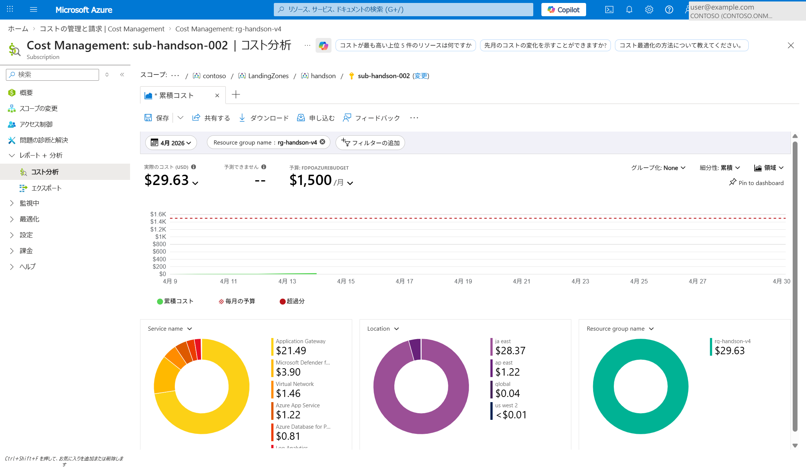
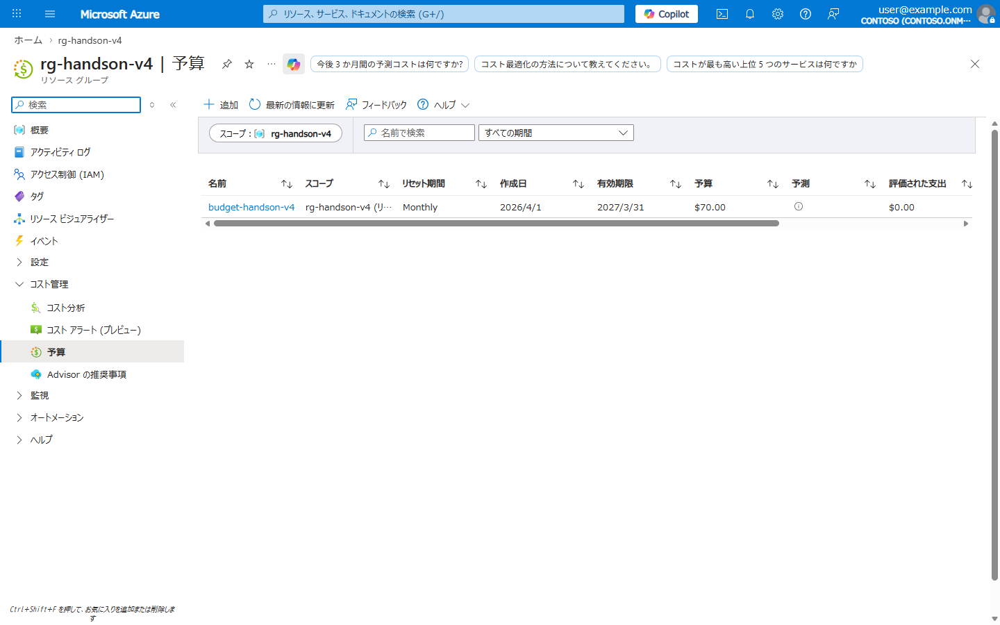
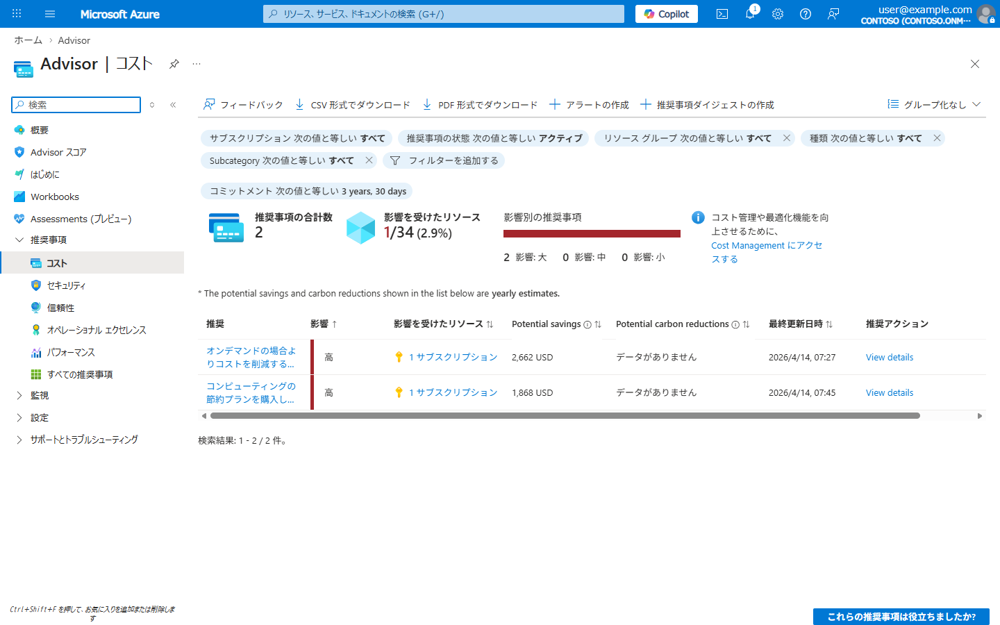
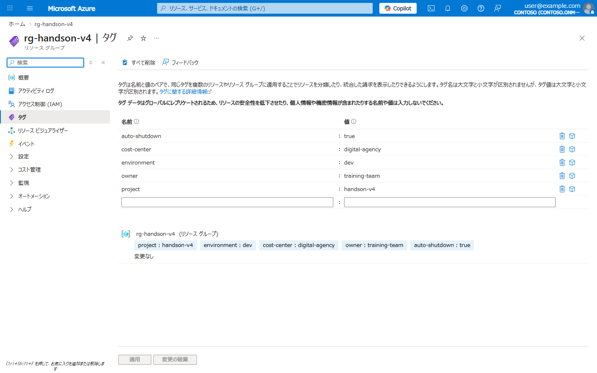
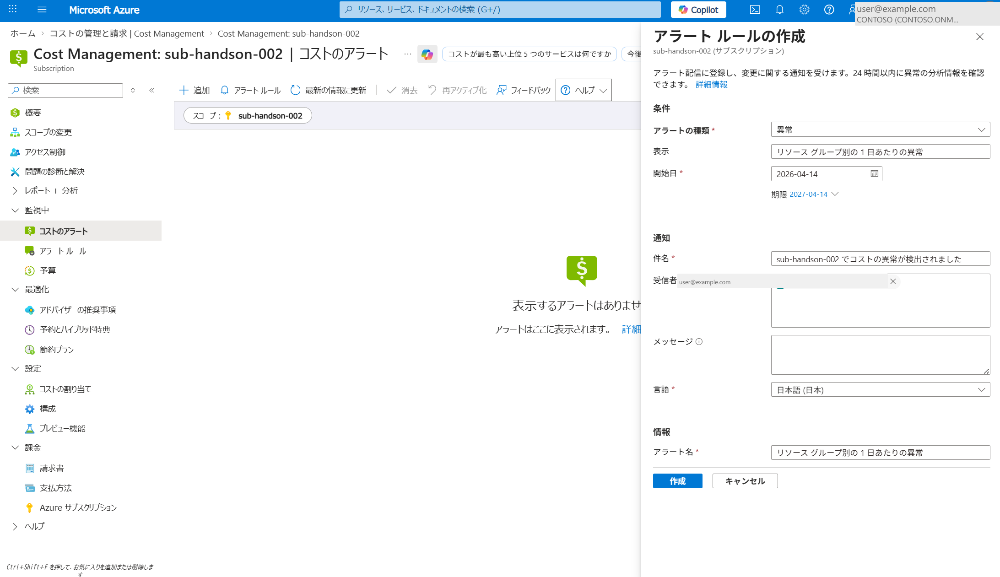

# Lab 07: コスト管理・最適化

> **所要時間**: 30分  
> **対応する要件**: 3.3 システム規模 (コスト管理)  
> **前提**: 各Lab でリソースが作成済み

---

## この Lab で学ぶこと

| 要件定義書の記載 | Azure での実装 |
|------------------|---------------|
| コスト超過を防止する監視・アラートの仕組み | **Azure Cost Management + 予算アラート** |
| ダッシュボード等による状況の可視化 | **コスト分析ビュー** |
| リソース利用状況に基づいたリソース見直し | **Azure Advisor 推奨事項** |
| マネージドサービスを活用しコスト削減を継続的に図る | **サーバレス / 従量課金の活用** |
| リザーブドインスタンス、スポットインスタンス等の検討 | **Azure Reservations / Savings Plans** |

---

## アジェンダ

- [Step 1: 現在のコストを確認](#step-1-現在のコストを確認)
- [Step 2: 予算アラートの設定](#step-2-予算アラートの設定)
- [Step 3: コスト最適化のベストプラクティス確認](#step-3-コスト最適化のベストプラクティス確認)
- [Step 4: リソースのタグ付けによるコスト管理](#step-4-リソースのタグ付けによるコスト管理)
- [Step 5: コスト異常検出の確認](#step-5-コスト異常検出の確認)
- [理解度チェック](#理解度チェック)

---

## Step 1: 現在のコストを確認

1. Azure Portal → **Cost Management** → **コスト分析**
2. スコープ: サブスクリプション (例: `sub-handson-002`)
3. フィルター: **Resource group name = rg-handson-v4** を追加
4. 以下を確認:
   - **累積コスト**: 月初からの合計コスト
   - **毎月の予算**: 予算ライン (赤い点線)
   - **Service name 別**: どのサービスにいくらかかっているか
   - **Location 別**: リージョンごとのコスト
   - **Resource group name 別**: リソースグループ単位のコスト



> **注意**: コストデータは翌日以降に反映されます。リソース作成直後は $0 と表示される場合があります。

## Step 2: 予算アラートの設定

要件: 「コスト超過することがないよう、閾値を超えた場合のアラート処理等の仕組みを設けること」

1. Azure Portal → **Cost Management** → **予算** → **追加**
2. 以下を設定:
   - スコープ: `rg-handson-v4`
   - 予算名: `budget-handson-v4`
   - リセット期間: `月次`
   - 金額: `70 USD` (約10,000円)
3. アラート条件:
   - **実績**が **80%** に達したら通知
   - **予測**が **100%** を超えたら通知
4. 通知先メールアドレスを設定



## Step 3: コスト最適化のベストプラクティス確認

要件: 「リソース利用状況に基づいたリソース見直し」

1. Azure Portal → **Advisor** → **コスト**
2. 推奨事項を確認:
   - **オンデマンドのコスト削減**: 未使用リソースの削除、SKU のダウンサイジング
   - **節約プランの購入**: リザーブドインスタンス、Savings Plans の推奨
3. 影響度 (高/中/低) と削減可能額を確認



> **Advisor が提案する主なコスト最適化**:
>
> - 未使用リソースの削除
> - SKU のダウンサイジング
> - リザーブドインスタンスの推奨
> - 停止可能なリソースの特定
>
> **参考**: [Azure Advisor のコストの推奨事項](https://learn.microsoft.com/ja-jp/azure/advisor/advisor-reference-cost-recommendations)


## Step 4: リソースのタグ付けによるコスト管理

要件: 「運用実績を評価し、コスト削減可能性を検討」

```bash
# リソースグループにコスト管理用タグを追加
az group update \
  --name $RG_NAME \
  --tags \
    "project=handson-v4" \
    "environment=dev" \
    "cost-center=digital-agency" \
    "owner=training-team" \
    "auto-shutdown=true"

# タグの確認
az group show --name $RG_NAME --query tags -o json
```



タグは Cost Management のフィルタに使用でき、プロジェクト別/環境別のコスト分析が可能になります。Step 1 のコスト分析画面で「フィルターの追加」からタグ (`environment=dev` など) で絞り込んでみましょう。

## Step 5: コスト異常検出の確認

要件: 「コスト超過を防止する監視・アラートの仕組み」

Azure Cost Management には、機械学習ベースの**コスト異常検出 (Anomaly Detection)** 機能があります。過去の使用パターンから逸脱する予期しないコスト増加を自動的に検出し、アラートで通知できます。

1. Azure Portal → **Cost Management** → **コスト分析**
2. ビューを「**スマート ビュー**」に切り替え → 異常が検出されている場合はグラフ上にマーク表示
3. **コスト アラート** → **追加** → 「**異常アラート**」を選択して異常検出時の通知を設定



> **ポイント**: 予算アラート (Step 2) は「設定した閾値を超えたら通知」ですが、異常検出は**過去のパターンから逸脱した予期しないコスト増加**を AI が自動判定して通知します。両方を組み合わせることで、想定内の超過と想定外の異常の両方を検知できます。
>
> **参考**: [予期しない料金を分析する - 異常アラートの作成](https://learn.microsoft.com/ja-jp/azure/cost-management-billing/understand/analyze-unexpected-charges#create-an-anomaly-alert)

---

## 理解度チェック

- [ ] 予算アラートの設定方法を理解した
- [ ] Azure Advisor のコスト推奨事項を確認した
- [ ] タグによるコスト分類の仕組みを理解した
- [ ] サーバレス/従量課金によるコスト最適化を理解した
- [ ] ストレージのライフサイクル管理によるコスト削減を理解した

### 要件 → Azure 実装の対応表

| 要件定義書の記載 | Azure での実装 |
|------------------|---------------|
| コスト超過防止のアラート | Azure Budgets + 予算アラート |
| ダッシュボードによる可視化 | Cost Management コスト分析 |
| リソース利用に基づく見直し | Azure Advisor コスト推奨 |
| サーバレス構成 | Functions (Consumption) + SWA (Free/Standard) |
| リザーブドインスタンス | Azure Reservations / Savings Plans |
| ライフサイクルコスト低減 | ストレージ ライフサイクル管理 (Hot→Cool→Archive) |
| コスト削減可能性を定期報告 | Cost Management + タグによる分類 |

---

## 全 Lab 完了

お疲れさまでした! 全7つの Lab を通じて、要件定義書のクラウド関連非機能要件が Azure 上でどのように実装されるかを体験しました。

### クリーンアップ

ハンズオンで作成したリソースを削除する場合:

```bash
# リソースグループごと削除 (全リソースが削除されます)
az group delete --name $RG_NAME --yes --no-wait

# サービスプリンシパルの削除
# az ad app delete --id $APP_ID

echo "リソースの削除を開始しました (完了まで数分かかります)"
```

### まとめ: 要件定義 → Azure サービス マッピング全体図

```
要件定義書                    Azure サービス
──────────────                ──────────────
IaC                      →  Bicep + Git
サーバレス Web           →  Azure Static Web Apps (Standard)
サーバレス API           →  Azure Functions (Linked Backend + マネージド ID)
WAF / L7 ロードバランサー →  Application Gateway v2 + WAF
SWA パブリックアクセス遮断  →  Private Endpoint + allowedIpRanges
マネージドDB               →  Azure Database for PostgreSQL
シークレット管理            →  Azure Key Vault
RBAC / 最小特権            →  Azure RBAC + マネージド ID
暗号化                     →  Key Vault CMK + TLS 1.2+
ネットワーク隔離            →  VNet + NSG + Private Endpoint
監視 (24/365)              →  Azure Monitor + Log Analytics
パフォーマンス監視          →  Application Insights
アラート                   →  Azure Monitor Alerts
SIEM                      →  Microsoft Sentinel
脆弱性スキャン             →  Microsoft Defender for Cloud
CI/CD                     →  SWA 組込み GitHub Actions
バックアップ               →  PostgreSQL 自動バックアップ + PITR
DR (別リージョン)           →  GRS + Geo-redundant backup
コスト管理                 →  Cost Management + Budgets + Advisor
```

**[README に戻る](../README.md)**
