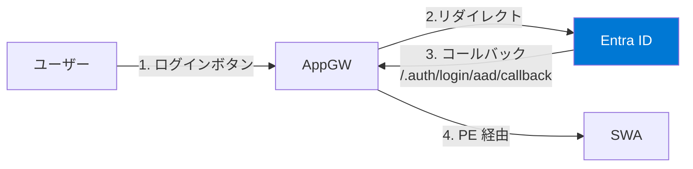

# Lab 08: Entra ID カスタム認証 (オプション)

> **所要時間**: 30分  
> **対応する要件**: 3.10 情報セキュリティに関する事項 (認証)  
> **前提**: Lab 03 完了済み  
> **注意**: この Lab はオプションです。PE 有効環境での認証構成は複雑なため、時間に余裕がある場合に実施してください。

---

## この Lab で学ぶこと

| 要件定義書の記載 | Azure での実装 |
| ---------------- | -------------- |
| 認証はクラウドサービスが提供する機能を最大限活用 | **SWA カスタム認証プロバイダー** (Entra ID) |
| SSO を実現 | **OpenID Connect** による認証フロー |

---

## 背景: PE 有効環境での認証の課題

PE 有効環境では SWA の事前構成済み (managed) Entra ID 認証が動作しません。managed 認証のコールバックは `identity.*.azurestaticapps.net` を経由するため、PE で 403 ブロックされます。**カスタム認証プロバイダー**を構成し、コールバックを AppGW ドメイン経由に変更することで PE 環境でも認証が正常に動作します。



---

## アジェンダ

- [Step 1: Entra ID にアプリ登録](#step-1-entra-id-にアプリ登録)
- [Step 2: クライアントシークレットの作成](#step-2-クライアントシークレットの作成)
- [Step 3: SWA App Settings にシークレットを設定](#step-3-swa-app-settings-にシークレットを設定)
- [Step 4: staticwebapp.config.json にカスタム認証を追加](#step-4-staticwebappconfigjson-にカスタム認証を追加)
- [Step 5: AppGW Rewrite Rule の設定](#step-5-appgw-rewrite-rule-の設定)
- [Step 6: 再デプロイと認証フローのテスト](#step-6-再デプロイと認証フローのテスト)

---

## Step 1: Entra ID にアプリ登録

```bash
# Entra ID にアプリ登録
# redirect_uri を AppGW ドメインに設定 (PE 内にコールバック)
AGW_FQDN="${PREFIX}.japaneast.cloudapp.azure.com"

MSYS_NO_PATHCONV=1 az ad app create \
  --display-name "swa-${PREFIX}-auth" \
  --sign-in-audience AzureADMyOrg \
  --web-redirect-uris "https://${AGW_FQDN}/.auth/login/aad/callback" \
  --query "{appId:appId, id:id}" -o json
```

> **Git Bash の場合**: `MSYS_NO_PATHCONV=1` を先頭に付けないと、`/.auth/...` がローカルパスに変換されてエラーになります。

## Step 2: クライアントシークレットの作成

```bash
# 上記で取得した appId を設定
APP_ID="<上記で取得した appId>"

# クライアントシークレットを作成
MSYS_NO_PATHCONV=1 az ad app credential reset \
  --id "$APP_ID" \
  --display-name "swa-handson" \
  --years 1 \
  --query "{clientId:appId, clientSecret:password, tenant:tenant}" -o json
```

> 出力された `clientSecret` と `tenant` を控えておいてください。

## Step 3: SWA App Settings にシークレットを設定

```bash
# SWA に認証用の環境変数を設定
az staticwebapp appsettings set \
  --name "swa-${PREFIX}" \
  --resource-group $RG_NAME \
  --setting-names \
    "AZURE_CLIENT_ID=${APP_ID}" \
    "AZURE_CLIENT_SECRET=<上記で取得した clientSecret>"
```

## Step 4: staticwebapp.config.json にカスタム認証を追加

`src/web/staticwebapp.config.json` に `auth` セクションを追加します。`<tenant-id>` は Step 2 で取得した `tenant` 値に置き換えてください:

```json
{
  "auth": {
    "identityProviders": {
      "azureActiveDirectory": {
        "registration": {
          "openIdIssuer": "https://login.microsoftonline.com/<tenant-id>/v2.0",
          "clientIdSettingName": "AZURE_CLIENT_ID",
          "clientSecretSettingName": "AZURE_CLIENT_SECRET"
        }
      }
    }
  },
  "networking": {
    "allowedIpRanges": ["10.0.0.0/24"]
  },
  "forwardingGateway": {
    "allowedForwardedHosts": ["${PREFIX}.japaneast.cloudapp.azure.com"]
  },
  "routes": [...]
}
```

> **注意**: `routes`, `navigationFallback`, `networking`, `forwardingGateway` は Lab03 で設定済みのものをそのまま残してください。上記は追加する `auth` セクションのみ抽出しています。また、認証を有効にする場合は以下も追加してください:
>
> - `routes` に `"/api/*"` の `allowedRoles` を `["authenticated"]` に変更（認証必須にする API）
> - `responseOverrides` に `"401": {"redirect": "/.auth/login/aad", "statusCode": 302}` を追加（未認証時のリダイレクト）

## Step 5: AppGW Rewrite Rule の設定

SWA の認証エンドポイント (`/.auth/login/aad`) が返す 302 リダイレクトの Location ヘッダーには SWA 自身のデフォルトホスト名 (`*.azurestaticapps.net`) が含まれます。PE 環境ではこの URL に直接アクセスできないため、AppGW で以下の 2 つの Rewrite Rule を設定します:

1. **X-Forwarded-Host ヘッダーの追加** (リクエスト): SWA に AppGW の FQDN を伝える
2. **Location ヘッダーの書き換え** (レスポンス): SWA の直接 URL を AppGW の FQDN に置換する

```bash
AGW_FQDN="${PREFIX}.japaneast.cloudapp.azure.com"

AGW_ID=$(az network application-gateway show \
  --name "agw-${PREFIX}" \
  --resource-group $RG_NAME \
  --query id -o tsv)

# 現在の AppGW 設定を取得
az rest --method get \
  --url "https://management.azure.com${AGW_ID}?api-version=2024-03-01" \
  -o json > /tmp/agw-config.json

# SWA_HOSTNAME を取得 (Location ヘッダー書き換えに必要)
SWA_HOSTNAME=$(az staticwebapp show \
  --name "swa-${PREFIX}" \
  --resource-group $RG_NAME \
  --query "defaultHostname" -o tsv)

# Python で Rewrite Rule を追加
# (jq がある場合は jq でも可)
python -c "
import json, os
tmpdir = os.environ.get('TEMP', '/tmp')
with open(os.path.join(tmpdir, 'agw-config.json')) as f:
    config = json.load(f)
fqdn = os.environ['AGW_FQDN']
swa = os.environ['SWA_HOSTNAME']
config['properties']['rewriteRuleSets'] = [{
    'name': 'add-forwarded-host',
    'properties': {
        'rewriteRules': [
            {
                'name': 'set-x-forwarded-host',
                'ruleSequence': 100,
                'actionSet': {
                    'requestHeaderConfigurations': [{
                        'headerName': 'X-Forwarded-Host',
                        'headerValue': fqdn
                    }]
                }
            },
            {
                'name': 'rewrite-location-header',
                'ruleSequence': 200,
                'conditions': [{
                    'variable': 'http_resp_Location',
                    'pattern': '(https?)://' + swa.replace('.', '[.]') + '(.*)',
                    'ignoreCase': True
                }],
                'actionSet': {
                    'responseHeaderConfigurations': [{
                        'headerName': 'Location',
                        'headerValue': 'https://' + fqdn + '{http_resp_Location_2}'
                    }]
                }
            }
        ]
    }
}]
for rule in config['properties'].get('requestRoutingRules', []):
    if rule.get('properties', {}).get('httpListener', {}).get('id'):
        base = rule['id'].split('/requestRoutingRules/')[0]
        rule['properties']['rewriteRuleSet'] = {
            'id': base + '/rewriteRuleSets/add-forwarded-host'
        }
with open(os.path.join(tmpdir, 'agw-config-final.json'), 'w') as f:
    json.dump(config, f)
print('Config prepared')
"

# AppGW を更新 (数分かかります)
cat /tmp/agw-config-final.json | az rest --method put \
  --url "https://management.azure.com${AGW_ID}?api-version=2024-03-01" \
  --body @-

echo "AppGW Rewrite Rule を設定しました"

# 一時ファイルの削除
rm -f /tmp/agw-config.json /tmp/agw-config-final.json
```

## Step 6: 再デプロイと認証フローのテスト

```bash
# 設定を反映して再デプロイ
DEPLOY_TOKEN=$(az staticwebapp secrets list \
  --name "swa-${PREFIX}" \
  --query "properties.apiKey" -o tsv)

cd src && swa deploy --app-location web --deployment-token "$DEPLOY_TOKEN" --env production
cd ..
```

**ブラウザでの確認**: `https://${PREFIX}.japaneast.cloudapp.azure.com` に **AppGW 経由**でアクセスし、「Entra ID でログイン」ボタンを押すと Entra ID のサインイン画面にリダイレクトされます。

> **重要**: PE 有効化後は SWA の URL (`*.azurestaticapps.net`) に直接アクセスしても 403 になります。必ず **AppGW の FQDN** (`${PREFIX}.japaneast.cloudapp.azure.com`) 経由でアクセスしてください。

---

## トラブルシューティング

### 認証リダイレクトで 403 エラーになる

**原因**: SWA の `/.auth/login/aad` が SWA 自身のデフォルトホスト名にリダイレクトし、PE により 403 になる。

**確認方法**:

```bash
curl -s -k -w "HTTP_CODE:%{http_code}\nREDIRECT:%{redirect_url}\n" -o /dev/null \
  "https://${PREFIX}.japaneast.cloudapp.azure.com/.auth/login/aad"
```

- `REDIRECT` が `*.azurestaticapps.net` を含む場合: AppGW の Location ヘッダー書き換え Rewrite Rule が正しく動作していません。Step 5 を再確認してください。
- `REDIRECT` が AppGW FQDN を含む場合: Rewrite Rule は正常です。Entra ID アプリ登録のリダイレクト URI が正しいか確認してください。

---

## 理解度チェック

- [ ] PE 環境で managed 認証が動作しない理由を理解した
- [ ] カスタム認証プロバイダーの仕組みを理解した
- [ ] AppGW Rewrite Rule による Location ヘッダー書き換えの必要性を理解した

---

**[Lab 03 に戻る](lab03-security.md)** | **[README に戻る](../README.md)**
